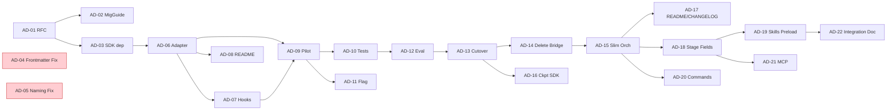

# v0.1 Hybrid Pipeline — Issue Drafts Index

> **RFC**: [`docs/architecture/v0.1-hybrid-pipeline-rfc.md`](../../../docs/architecture/v0.1-hybrid-pipeline-rfc.md)
> **Migration Guide**: [`docs/architecture/v0.1-migration-guide.md`](../../../docs/architecture/v0.1-migration-guide.md)
> **Target branch**: `develop`
> **Total issues**: 20

## 발행 절차 (How to publish)

본 디렉터리의 각 `.md`는 frontmatter + 5W1H 본문 구조로, 그대로 GitHub에 게시 가능합니다.

```bash
cd /project/claude_code_agent

# 단일 게시
gh issue create \
  --title "$(yq '.title' .github/.issue-drafts/v0.1/AD-01.md)" \
  --label "$(yq '.labels | join(\",\")' .github/.issue-drafts/v0.1/AD-01.md)" \
  --body-file .github/.issue-drafts/v0.1/AD-01.md

# 일괄 게시 (예시)
for f in .github/.issue-drafts/v0.1/AD-*.md; do
  gh issue create --body-file "$f" \
    --title "$(awk '/^title:/{print substr($0, 8)}' $f | tr -d '\"')"
done
```

## Phase 0 — Documentation Foundation

| ID | Type | Size | Title | Depends |
|---|---|---|---|---|
| AD-01 | docs | S | RFC: v0.1 Hybrid Pipeline Architecture 게시 | — |
| AD-02 | docs | S | Migration Guide v0.0.1 → v0.1.0 게시 | AD-01 |

## Phase 1 — Foundation

| ID | Type | Size | Title | Depends |
|---|---|---|---|---|
| AD-03 | chore | XS | `@anthropic-ai/claude-agent-sdk` 의존성 추가 | AD-01 |
| AD-04 | fix | XS | `doc-code-comparator.md` frontmatter 추가 (사양 위반 긴급) | — |
| AD-05 | refactor | S | `validation` 에이전트 ↔ `src/validation-agent/` 네이밍 정합화 | — |
| AD-06 | feat | M | `ExecutionAdapter` 인터페이스 + `MockExecutionAdapter` | AD-03 |
| AD-07 | feat | S | Hook pipeline 최소 골격 (PostToolUse → scratchpad) | AD-06 |
| AD-08 | docs | XS | `src/execution/README.md` 작성 | AD-06 |

## Phase 2 — Single Stage Pilot

| ID | Type | Size | Title | Depends |
|---|---|---|---|---|
| AD-09 | feat | M | `worker` stage 파일럿 — `ExecutionAdapter` 경로 도입 | AD-06, AD-07 |
| AD-10 | test | S | `worker` 파일럿 통합 테스트 (mock vs real) | AD-09 |
| AD-11 | feat | XS | Feature flag `AD_SDLC_USE_SDK_FOR_WORKER` | AD-09 |
| AD-12 | docs | S | 파일럿 평가 보고서 | AD-10 |

## Phase 3 — Full Cutover

| ID | Type | Size | Title | Depends |
|---|---|---|---|---|
| AD-13 | refactor | L | 전체 34 stage `ExecutionAdapter` 경유 (5 sub-PR) | AD-12 |
| AD-14 | chore | M | `AgentBridge` / `Dispatcher` / `Registry` 삭제 | AD-13 |
| AD-15 | refactor | M | `AdsdlcOrchestratorAgent` 슬림화 | AD-14 |
| AD-16 | feat | S | `PipelineCheckpointManager`에 SDK `session_id` 매핑 | AD-13 |
| AD-17 | docs | S | README "built with Agent SDK" 진실성 정정 + CHANGELOG | AD-15 |

## Phase 4 — Knowledge Layer

| ID | Type | Size | Title | Depends |
|---|---|---|---|---|
| AD-18 | feat | M | Stage 정의에 `skills` / `mcpServers` 필드 추가 | AD-15 |
| AD-19 | feat | M | `worker`/`pr-reviewer`에 claude-config plugin skill preload | AD-18 |
| AD-20 | feat | M | `.claude/commands/` 추가 (`run-greenfield`/`resume`/`audit-docs`/`status`) | AD-15 |
| AD-21 | feat | S | `.mcp.json` 추가 (github MCP) | AD-18 |
| AD-22 | docs | S | `claude-config/docs/ad-sdlc-integration.md` 갱신 (35 agents, plugin 경로) | AD-19 |

## 의존 그래프



## Phase Gate

| Gate | 통과 조건 |
|---|---|
| P0 → P1 | RFC LGTM ≥ 1, Migration Guide 머지 |
| P1 → P2 | AD-03~08 머지, 기존 테스트 100% + Adapter 단위 테스트 신설 |
| P2 → P3 | AD-09~12 머지, worker stage 산출물 동등성 검증 |
| P3 → P4 | AD-13~17 머지, E2E 3종(Greenfield/Enhancement/Import) 통과, 코드 -2,000 LoC |
| P4 release | AD-18~22 머지, claude-config plugin enable 시나리오 통과 |

## 라벨 정책

| 라벨 | 의미 |
|---|---|
| `phase/0`~`phase/4` | 마이그레이션 단계 |
| `area/execution`, `area/orchestrator`, `area/agents-md`, `area/docs`, `area/knowledge` | 영향 영역 |
| `breaking-change` | 외부 사용자 영향 있음 |
| `priority/high` | 사양 위반 또는 P3 게이트 |
| `size/XS`~`size/L` | 예상 작업량 |
