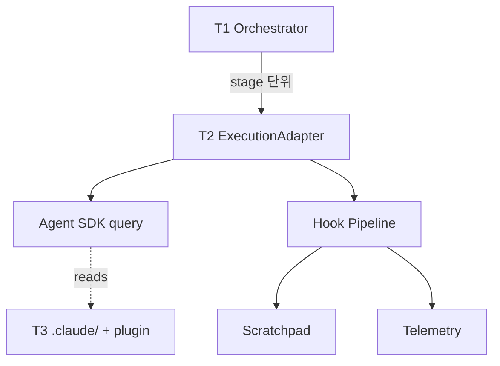

# AD-SDLC: Agent-Driven Software Development Lifecycle

> **Automate your software development from requirements to deployment, built on the [Claude Agent SDK](https://www.npmjs.com/package/@anthropic-ai/claude-agent-sdk).**

[](https://opensource.org/licenses/BSD-3-Clause)
[](https://nodejs.org/)
[](https://www.npmjs.com/package/@anthropic-ai/claude-agent-sdk)

Every agent stage runs through a single Claude Agent SDK entry point (`ExecutionAdapter`). The 35-stage pipeline, V&V gates, and traceability matrix are AD-SDLC's domain layer on top of the SDK; tool use, sub-agent delegation, and session management are handled by the SDK itself.

## Quick Start

Get started in under 5 minutes:

```bash
# 1. Install AD-SDLC
npm install -g ad-sdlc

# 2. Initialize your project
ad-sdlc init my-project
cd my-project

# 3. Start with your requirements
claude "Implement user authentication with OAuth2"
```

That's it! The agents will generate documents, create issues, implement code, and open PRs.

## What is AD-SDLC?

AD-SDLC is an automated software development pipeline that uses **35 specialized Claude agent types** to transform your requirements into production-ready code. It supports three modes:

### Greenfield Pipeline (New Projects)

```
User Input → Mode Detection → Collector → PRD Writer → SRS Writer → SDP Writer
         → Repo Detection → GitHub Repo Setup → SDS Writer
         ─┬─▶ Threat Model Writer ─┐
          ├─▶ Tech Decision Writer ─┤
          └─▶ UI Spec Writer ──────┤
                                    ↓
   Doc Indexing ← PR Reviewer ← Validation ← Worker ← Controller ← SVP Writer ← Issue Generator
```

### Enhancement Pipeline (Existing Projects)

```
Existing Docs + Code → Document Reader → Codebase Analyzer → Code Reader
                                                                  ↓
                                                      Doc-Code Comparator
                                                                  ↓
                                                        Impact Analyzer
                                                                  ↓
                                      PRD Updater → SRS Updater → SDS Updater
                                                                  ↓
                                         Issue Generator + Regression Tester
                                                                  ↓
                            Controller → Worker → Validation → PR Reviewer
                                                                      ↓
                                                    Doc Indexing + CI Fix (on failure)
```

### Import Pipeline (Existing GitHub Issues)

```
GitHub Issues → Issue Reader → Controller → Worker → Validation → PR Reviewer
                                                                       ↓
                                                               Doc Indexing + CI Fix (on failure)
```

### Agent Pipeline (35 Agent Types)

| Phase             | Agent                 | Role                                                                                                |
| ----------------- | --------------------- | --------------------------------------------------------------------------------------------------- |
| **Orchestration** | AD-SDLC Orchestrator  | Coordinates the full pipeline lifecycle                                                             |
|                   | Analysis Orchestrator | Coordinates the analysis sub-pipeline                                                               |
| **Setup**         | Mode Detector         | Detects Greenfield vs Enhancement vs Import mode                                                    |
|                   | Project Initializer   | Creates `.ad-sdlc` directory structure and config                                                   |
|                   | Repo Detector         | Determines if existing repo or new setup needed                                                     |
|                   | GitHub Repo Setup     | Creates and initializes GitHub repository                                                           |
| **Collection**    | Collector             | Gathers requirements from text, files, and URLs                                                     |
|                   | Issue Reader          | Imports existing GitHub Issues for Import pipeline                                                  |
| **Documentation** | PRD Writer            | Generates Product Requirements Document                                                             |
|                   | SRS Writer            | Generates Software Requirements Specification                                                       |
|                   | SDP Writer            | Generates Software Development Plan from PRD and SRS                                                |
|                   | SDS Writer            | Generates Software Design Specification (SDS) and a separate Database Schema Specification (DBS)    |
|                   | Threat Model Writer   | Generates STRIDE/DREAD Threat Model from SDS                                                        |
|                   | Tech Decision Writer  | Generates Technology Decision documents with alternatives analysis from the SDS technology stack    |
|                   | UI Spec Writer        | Generates UI screen specifications, user flow documents, and design system references from SRS      |
|                   | Doc Index Generator   | Generates structured documentation index (manifest, bundles, graph, router) from pipeline artifacts |
| **Planning**      | Issue Generator       | Creates GitHub Issues from SDS components                                                           |
|                   | SVP Writer            | Generates Software Verification Plan with test cases from SRS and issues                            |
| **Execution**     | Controller            | Orchestrates work distribution and monitors progress                                                |
|                   | Worker                | Implements code based on assigned issues                                                            |
|                   | Local Reviewer        | Local-mode PR review variant (no GitHub dependency)                                                 |
| **Quality**       | PR Reviewer           | Creates PRs and performs automated code review                                                      |
|                   | CI Fixer              | Automatically diagnoses and fixes CI failures                                                       |
|                   | Regression Tester     | Validates existing functionality after changes                                                      |
| **V&V**           | Stage Verifier        | Verifies pipeline stage outputs for content completeness and traceability                           |
|                   | RTM Builder           | Builds Requirements Traceability Matrix from requirements to implementation                         |
|                   | Validation Agent      | Validates final implementation against requirements and acceptance criteria                         |
| **Enhancement**   | Document Reader       | Parses existing PRD/SRS/SDS documents                                                               |
|                   | Code Reader           | Extracts source code structure and dependencies                                                     |
|                   | Codebase Analyzer     | Analyzes current architecture and code structure                                                    |
|                   | Doc-Code Comparator   | Detects gaps between documentation and code                                                         |
|                   | Impact Analyzer       | Assesses change implications and risks                                                              |
|                   | PRD Updater           | Incremental PRD updates (delta changes)                                                             |
|                   | SRS Updater           | Incremental SRS updates (delta changes)                                                             |
|                   | SDS Updater           | Incremental SDS updates (delta changes)                                                             |

> **Note**: Local mode agents (`local-issue-reader`, `local-reviewer`) share their GitHub counterparts' implementations and are used automatically with the `--local` flag.

## How it Works

### 3-Tier Architecture

AD-SDLC is structured as three cooperating tiers. The orchestrator owns the pipeline DAG and V&V gates, the execution layer is a single Claude Agent SDK entry point, and the knowledge layer (`.claude/`, MCP servers, claude-config plugin) is consumed by the SDK rather than wired through custom bridges.



| Tier                          | Responsibility                                    | Implementation                                   |
| ----------------------------- | ------------------------------------------------- | ------------------------------------------------ |
| **T1 Pipeline Control Plane** | Stage DAG, checkpoints, V&V gates, domain writers | `src/ad-sdlc-orchestrator/`, `*-writer/`, `vnv/` |
| **T2 Agent Execution Layer**  | Single SDK entry point, hooks, telemetry bridge   | `src/execution/`                                 |
| **T3 Knowledge Layer**        | Agent definitions, skills, commands, MCP servers  | `.claude/`, `.mcp.json`, claude-config plugin    |

See [`docs/architecture/v0.1-hybrid-pipeline-rfc.md`](docs/architecture/v0.1-hybrid-pipeline-rfc.md) for the full architecture RFC and [`docs/architecture/v0.1-migration-guide.md`](docs/architecture/v0.1-migration-guide.md) for the v0.0.1 → v0.1.0 migration steps.

### Pipeline Flow

AD-SDLC automates the full software development lifecycle through a coordinated agent pipeline:

1. **Mode Detection**: The system analyzes your project to determine the appropriate pipeline -- Greenfield (new project), Enhancement (existing project), or Import (existing GitHub issues).

2. **Document Generation**: A cascade of writer agents produces structured documents from your requirements. In Greenfield mode: PRD, SRS, SDP, SDS, followed by parallel generation of Threat Model, Technology Decisions, and UI Specifications (when applicable).

3. **Planning**: The Issue Generator transforms design specifications into actionable GitHub Issues with dependencies and labels. The SVP Writer creates a Software Verification Plan with derived test cases.

4. **Implementation**: The Controller distributes issues to Worker agents, which implement code, write tests, and create pull requests. Multiple workers operate in parallel for faster delivery.

5. **Verification & Validation**: Stage Verifier checks each pipeline output for completeness. The RTM Builder traces requirements to implementation. The Validation Agent confirms all acceptance criteria are met.

6. **Review & Indexing**: The PR Reviewer performs automated code review with quality gates. Finally, the Doc Index Generator creates a searchable documentation index from all pipeline artifacts.

Each agent reads and writes to a shared scratchpad, enabling seamless inter-agent communication. The pipeline supports resume (`--resume`) and start-from (`--start-from <stage>`) for interrupted sessions.

## Features

- **Automatic Document Generation**: PRD, SRS, SDP, SDS, DBS, TM, SVP, TD, and UI specification documents from natural language requirements
- **UI Specification Generation**: Screen specifications, user flow documents, and design system references from SRS use cases; auto-skips for CLI/API/library projects
- **Separate Database Schema Specification (DBS)**: SDS Writer emits a dedicated DBS document alongside the SDS, keeping the full database schema decoupled from architectural design
- **Document Frontmatter Metadata**: YAML frontmatter with doc_id, version, status, and change history on all generated documents
- **Enhancement Pipeline**: Incremental updates to existing projects without full rewrites
- **Import Pipeline**: Process existing GitHub Issues directly, skipping document generation
- **Local Mode**: Run the full pipeline without GitHub using `--local` (or `AD_SDLC_LOCAL=1`); see [Quickstart](docs/quickstart.md) for details
- **Mode Detection**: Automatically detects Greenfield, Enhancement, or Import pipeline
- **Pipeline Resume**: Resume interrupted pipelines from the last completed stage (`--resume`)
- **Session Persistence**: Automatic state persistence for pipeline recovery
- **GitHub Integration**: Automatic issue creation with dependencies and labels
- **Parallel Implementation**: Multiple workers implementing issues concurrently
- **Automated PR Review**: Code review and quality gate enforcement
- **Progress Tracking**: Real-time visibility into pipeline status
- **Regression Testing**: Identifies affected tests when modifying existing code
- **Doc-Code Gap Analysis**: Detects discrepancies between documentation and implementation
- **V&V Framework**: Stage verification gates, RTM building, and final validation ensure traceability from requirements to implementation
- **Document Audit**: CLI script (`npm run audit:docs`) that validates pipeline-generated PRD/SRS/SDS/SDP/TM/SVP/TD/DBS documents for frontmatter, required sections, cross-references, and PRD→SRS→SDS traceability; see [Document Audit CLI](docs/doc-audit.md)
- **Customizable Workflows**: Configure agents, templates, and quality gates

## Installation

### Prerequisites

- Node.js 18+ ([Download](https://nodejs.org/))
- Git 2.30+
- GitHub CLI 2.0+ (optional, for issue/PR management)
- Claude API Key

### Install

```bash
# Global installation (recommended)
npm install -g ad-sdlc

# Or use directly with npx
npx ad-sdlc init
```

### Configure

```bash
# Set your Anthropic API key
export ANTHROPIC_API_KEY="your-api-key"

# For GitHub integration
gh auth login
```

See [Installation Guide](docs/installation.md) for detailed setup instructions.

### Dependencies

AD-SDLC v0.1 standardizes on the official Claude Agent SDK as the only AI runtime dependency. The legacy raw `@anthropic-ai/sdk` client and the in-tree `AgentBridge`/`AgentDispatcher`/`AgentRegistry` stack were removed in v0.1.0 (#798).

| Package                          | Version    | Role                                                                         |
| -------------------------------- | ---------- | ---------------------------------------------------------------------------- |
| `@anthropic-ai/claude-agent-sdk` | `^0.2.132` | Single Agent SDK entry point used by `ExecutionAdapter` for every stage      |
| `commander`                      | `^14.0.3`  | `ad-sdlc` CLI argument parsing                                               |
| `inquirer`                       | `^13.4.2`  | Interactive prompts for `ad-sdlc init`                                       |
| `js-yaml`                        | `^4.1.1`   | Pipeline config and document frontmatter parsing                             |
| `zod`                            | `^4.4.2`   | Runtime schema validation for agent registry, configs, and checkpoint schema |
| `ts-morph`                       | `^28.0.0`  | TypeScript AST analysis for the Code Reader / Codebase Analyzer agents       |
| `chalk`, `dotenv`                | latest     | CLI output and environment loading                                           |

Optional integrations (logging backends, OpenTelemetry exporters, `better-sqlite3`, `ioredis`, `mammoth`, `pdf-parse`) are declared as **optional peer dependencies** so the runtime install stays lean; consumers pull them in only when the matching scratchpad backend or document parser is enabled.

## Usage

### Initialize a New Project

```bash
# Interactive mode - guides you through configuration
ad-sdlc init

# Quick setup with defaults
ad-sdlc init my-project --quick

# With specific options
ad-sdlc init my-project \
  --tech-stack typescript \
  --template standard \
  --github-repo https://github.com/user/my-project
```

### Template Options

| Template       | Workers | Coverage | Features                         |
| -------------- | ------- | -------- | -------------------------------- |
| **minimal**    | 2       | 50%      | Basic structure                  |
| **standard**   | 3       | 70%      | Token tracking, dashboard        |
| **enterprise** | 5       | 80%      | Audit logging, security scanning |

### Run the Pipeline

```bash
# Start with requirements collection
claude "Collect requirements for [your project description]"

# Generate documents step by step
claude "Generate PRD from collected information"
claude "Generate SRS from PRD"
claude "Generate SDS from SRS"

# Create GitHub Issues
claude "Generate GitHub issues from SDS"

# Implement and review
claude "Start implementation with Controller"
```

### CLI Commands

```bash
# Initialize new project
ad-sdlc init [project-name]

# Validate configuration files
ad-sdlc validate [--file <path>] [--watch] [--format text|json]

# Check pipeline status
ad-sdlc status [--project <id>] [--format text|json] [--verbose]

# Analyze project for documentation-code gaps
ad-sdlc analyze [--project <path>] [--scope full|documents_only|code_only]

# Generate shell completion script
ad-sdlc completion --shell <bash|zsh|fish>
```

### Document Audit

Once the pipeline has generated documents, validate them with the document audit CLI:

```bash
# Audit the current project (writes reports to .ad-sdlc/audit/)
npm run audit:docs -- --project-dir .

# Audit a different project and pick the output directory
npm run audit:docs -- --project-dir ./my-project --output audit-reports

# Or run the script directly with tsx
npx tsx scripts/audit-docs.ts --project-dir ./my-project
```

The auditor runs frontmatter, required-section, cross-reference, PRD→SRS→SDS
traceability, orphan, Mermaid, and relative-link checks across PRD, SRS, SDS,
SDP, TM, SVP, TD, and DBS documents. It writes both a machine-readable
`audit-report.json` and a human-readable `audit-report.md`, and exits with a
non-zero status on any error-severity finding — making it suitable as a local
pre-merge check or as a CI quality gate. See the
[Document Audit CLI](docs/doc-audit.md) guide for the full list of checks,
report format, exit codes, and CI integration.

### Full Pipeline Script

Run the complete AD-SDLC pipeline end-to-end:

```bash
# Auto-detect mode and run full pipeline
./ad-sdlc-full-pipeline.sh [project_path] [mode]

# Specify mode explicitly
./ad-sdlc-full-pipeline.sh . greenfield
./ad-sdlc-full-pipeline.sh . enhancement
./ad-sdlc-full-pipeline.sh . import

# Resume an interrupted pipeline
./ad-sdlc-full-pipeline.sh . auto --resume

# Resume a specific session
./ad-sdlc-full-pipeline.sh . auto --resume <session-id>

# Start from a specific stage
./ad-sdlc-full-pipeline.sh . greenfield --start-from sds_generation

# List available sessions for resume
./ad-sdlc-full-pipeline.sh . auto --list-sessions
```

### Shell Autocompletion

Enable tab completion for AD-SDLC commands in your shell:

```bash
# Bash
ad-sdlc completion --shell bash >> ~/.bashrc
source ~/.bashrc

# Zsh
ad-sdlc completion --shell zsh > ~/.zsh/completions/_ad-sdlc
source ~/.zshrc

# Fish
ad-sdlc completion --shell fish > ~/.config/fish/completions/ad-sdlc.fish
```

See [Quickstart Guide](docs/quickstart.md) for a step-by-step tutorial.

## Use Cases

### New Feature Implementation

```bash
claude "Implement user dashboard with usage statistics and charts"
```

### Bug Fix Workflow

```bash
claude "Fix #42: Login fails when email contains +"
```

### Refactoring Project

```bash
claude "Refactor auth module to use dependency injection"
```

### From Requirements File

```bash
claude "Read requirements from docs/requirements.md and implement"
```

See [Use Cases Guide](docs/use-cases.md) for more examples.

## Project Structure

```
your-project/
├── .claude/
│   └── agents/              # Agent definitions (34 prompt files, 35 registered types)
│       └── *.md             # Agent prompts (English, used by Claude)
├── .ad-sdlc/
│   ├── config/              # Configuration files
│   │   ├── agents.yaml      # Agent registry
│   │   └── workflow.yaml    # Pipeline configuration
│   ├── logs/                # Audit logs
│   ├── scripts/             # Pipeline shell scripts
│   │   └── ad-sdlc-full-pipeline.sh
│   ├── templates/           # Document templates
│   └── scratchpad/          # Inter-agent state (Scratchpad pattern)
│       └── pipeline/        # Pipeline session state (resume support)
├── docs/                    # Generated documentation
├── src/                     # Generated source code
└── README.md
```

## Documentation

### Getting Started

- [Installation Guide](docs/installation.md) - Detailed setup instructions
- [Quickstart Guide](docs/quickstart.md) - 5-minute tutorial
- [Use Cases](docs/use-cases.md) - Common scenarios and examples
- [FAQ](docs/faq.md) - Frequently asked questions

### Reference

- [System Architecture](docs/system-architecture.md)
- [v0.1 Hybrid Pipeline RFC](docs/architecture/v0.1-hybrid-pipeline-rfc.md) — 3-tier architecture and Claude Agent SDK adoption rationale
- [v0.1 Migration Guide](docs/architecture/v0.1-migration-guide.md) — v0.0.1 → v0.1.0 contributor and consumer migration steps
- [Document Status Definitions](docs/DOCUMENT_STATUS_DEFINITIONS.md)
- [Document Audit CLI](docs/doc-audit.md) — validate generated PRD/SRS/SDS/... documents for integrity and traceability
- [PRD-001: Agent-Driven SDLC](docs/PRD-001-agent-driven-sdlc.md)
- [SRS-001: Agent-Driven SDLC](docs/SRS-001-agent-driven-sdlc.md)
- [SDS-001: Agent-Driven SDLC](docs/SDS-001-agent-driven-sdlc.md)

### Guides

- [Agent Deployment](docs/guides/deployment.md)
- [Usage Scenarios](docs/guides/usage-scenarios.md) — All execution environments and pipeline modes
- [Reference Documentation](docs/reference/README.md)

### Korean Documentation

- [PRD-001 (한글)](docs/PRD-001-agent-driven-sdlc.kr.md)
- [SRS-001 (한글)](docs/SRS-001-agent-driven-sdlc.kr.md)
- [SDS-001 (한글)](docs/SDS-001-agent-driven-sdlc.kr.md)

## Agent Definitions

Each agent is defined in `.claude/agents/` with:

- YAML frontmatter (name, description, tools, model)
- Markdown body with role, responsibilities, schemas, and workflows

Agent prompt files (`.md`) are in English and used by Claude during execution.

## Document Frontmatter

All documents generated by the pipeline (PRD, SRS, SDP, SDS, DBS, TM, SVP, TD, UI) include structured YAML frontmatter for machine-readable metadata:

```yaml
---
doc_id: PRD-my-project
title: Product Requirements Document
version: 1.0.0
status: Draft
generated_by: ad-sdlc v0.0.1
generated_at: '2026-04-12T09:00:00.000Z'
source_documents:
  - collected_info.yaml
change_history:
  - version: 1.0.0
    date: '2026-04-12'
    author: ad-sdlc
    description: Initial generation
---
```

### Frontmatter Fields

| Field              | Type     | Description                                               |
| ------------------ | -------- | --------------------------------------------------------- |
| `doc_id`           | string   | Unique document identifier (e.g., `PRD-my-project`)       |
| `title`            | string   | Human-readable document title                             |
| `version`          | string   | Semantic version (`MAJOR.MINOR.PATCH`)                    |
| `status`           | enum     | `Draft`, `Review`, or `Approved`                          |
| `generated_by`     | string   | Tool and version that generated the document              |
| `generated_at`     | string   | ISO 8601 generation timestamp                             |
| `pipeline_session` | string   | Pipeline session ID (optional)                            |
| `source_documents` | string[] | Input document references (optional)                      |
| `approval`         | object[] | Approval entries with role, name, date, status (optional) |
| `change_history`   | object[] | Version history entries (optional)                        |

The frontmatter schema is defined in `src/schemas/document-frontmatter.ts` and validated with Zod at generation time. Utility functions for generating, parsing, and prepending frontmatter are in `src/utilities/frontmatter.ts`.

## Contributing

We welcome contributions! Please see our [Contributing Guide](CONTRIBUTING.md) for details.

### Quick Start for Contributors

1. Fork the repository
2. Create your feature branch (`git checkout -b feature/amazing-feature`)
3. Commit your changes using conventional commits
4. Push to the branch (`git push origin feature/amazing-feature`)
5. Open a Pull Request

## Related Projects

### claude-config

A Claude Code configuration management and development guidelines system. Agents in this project can reference claude-config's guidelines during code generation and review to improve code quality.

- **Repository**: [kcenon/claude-config](https://github.com/kcenon/claude-config)
- **Reference Guide**: [docs/claude-config-reference.md](docs/claude-config-reference.md)

---

## License

BSD 3-Clause License - see [LICENSE](LICENSE) for details.

---

**Need help?** Check the [FAQ](docs/faq.md) or [open an issue](https://github.com/kcenon/claude_code_agent/issues).
