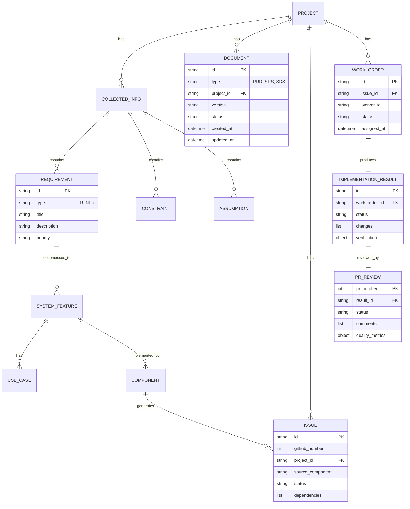

# Software Design Specification (SDS)

## Agent-Driven Software Development Lifecycle System

| Field | Value |
|-------|-------|
| **Document ID** | SDS-001 |
| **Source SRS** | SRS-001 |
| **Source PRD** | PRD-001 |
| **Version** | 1.0.0 |
| **Status** | Draft |
| **Created** | 2025-12-27 |
| **Author** | System Architect |

---

## Table of Contents

1. [Introduction](#1-introduction)
2. [System Architecture](#2-system-architecture)
3. [Component Design](#3-component-design)
4. [Data Design](#4-data-design)
5. [Interface Design](#5-interface-design)
6. [Security Design](#6-security-design)
7. [Deployment Architecture](#7-deployment-architecture)
8. [Error Handling & Recovery](#8-error-handling--recovery)
9. [Traceability Matrix](#9-traceability-matrix)
10. [Appendix](#10-appendix)

---

## 1. Introduction

### 1.1 Purpose

본 소프트웨어 설계 명세서(SDS)는 Agent-Driven SDLC (AD-SDLC) 시스템의 상세 설계를 정의합니다. SRS-001에서 정의된 시스템 기능을 구현하기 위한 아키텍처, 컴포넌트, 인터페이스, 데이터 설계를 명시하여 개발팀이 직접 구현에 활용할 수 있도록 합니다.

**대상 독자:**
- Software Developers
- System Architects
- DevOps Engineers
- QA Engineers

### 1.2 Scope

본 SDS는 다음 범위의 설계를 포함합니다:

| Category | Scope |
|----------|-------|
| **Architecture** | 멀티 에이전트 오케스트레이션 아키텍처, Scratchpad 패턴 |
| **Components** | 8개 특화 에이전트 컴포넌트 설계 |
| **Data** | 파일 기반 상태 스키마, 데이터 엔티티 정의 |
| **Interfaces** | 에이전트 간 통신, GitHub API 연동, CLI 인터페이스 |
| **Security** | 인증, 권한 관리, 민감 정보 보호 |
| **Deployment** | 로컬 실행 환경, 설정 관리 |

### 1.3 Design Goals

| Goal ID | Goal | Description |
|---------|------|-------------|
| DG-001 | **Modularity** | 각 에이전트가 독립적으로 개발/테스트/배포 가능 |
| DG-002 | **Extensibility** | 새로운 에이전트 추가 및 워크플로우 커스터마이징 용이 |
| DG-003 | **Resilience** | 실패 시 자동 복구, 재시도 메커니즘 |
| DG-004 | **Traceability** | 요구사항-설계-구현 간 완전한 추적성 |
| DG-005 | **Transparency** | 모든 에이전트 활동 로깅 및 감사 가능 |

### 1.4 Design Constraints

| Constraint ID | Constraint | Design Decision |
|---------------|------------|-----------------|
| DC-001 | Claude Agent SDK 단방향 통신 | Scratchpad 패턴 (파일 기반 상태 공유) 도입 |
| DC-002 | Context Window 200K 토큰 | Context Compaction 전략, 문서 분할 처리 |
| DC-003 | GitHub API Rate Limit | 배치 처리, 캐싱, 지수 백오프 |
| DC-004 | 동시 Worker 최대 5개 | Worker Pool 관리, 큐 기반 스케줄링 |

### 1.5 References

| Reference | Description |
|-----------|-------------|
| PRD-001 | Product Requirements Document |
| SRS-001 | Software Requirements Specification |
| Claude Agent SDK | https://platform.claude.com/docs/en/agent-sdk |
| Claude Code Subagents | https://code.claude.com/docs/en/sub-agents |

---

## 2. System Architecture

### 2.1 Architecture Overview

AD-SDLC는 **계층형 멀티 에이전트 아키텍처**를 채택합니다. Main Orchestrator가 특화된 서브 에이전트들을 조율하며, Scratchpad 패턴을 통해 에이전트 간 상태를 공유합니다.

```
┌─────────────────────────────────────────────────────────────────────────────────┐
│                              AD-SDLC System Architecture                         │
├─────────────────────────────────────────────────────────────────────────────────┤
│                                                                                 │
│  ┌───────────────────────────────────────────────────────────────────────────┐ │
│  │                         PRESENTATION LAYER                                 │ │
│  │  ┌─────────────────┐  ┌─────────────────┐  ┌─────────────────┐           │ │
│  │  │   CLI Input     │  │  File Input     │  │   URL Input     │           │ │
│  │  │  (Natural Lang) │  │ (.md/.pdf/.docx)│  │  (HTTP/HTTPS)   │           │ │
│  │  └────────┬────────┘  └────────┬────────┘  └────────┬────────┘           │ │
│  └───────────┼────────────────────┼────────────────────┼─────────────────────┘ │
│              │                    │                    │                        │
│              └────────────────────┼────────────────────┘                        │
│                                   ▼                                             │
│  ┌───────────────────────────────────────────────────────────────────────────┐ │
│  │                       ORCHESTRATION LAYER                                  │ │
│  │  ┌─────────────────────────────────────────────────────────────────────┐ │ │
│  │  │                      Main Claude Agent                               │ │ │
│  │  │                   (Entry Point & Coordinator)                        │ │ │
│  │  │  ┌─────────────┐ ┌─────────────┐ ┌─────────────┐ ┌─────────────┐   │ │ │
│  │  │  │  Workflow   │ │   State     │ │  Approval   │ │   Error     │   │ │ │
│  │  │  │  Manager    │ │  Manager    │ │   Gate      │ │  Handler    │   │ │ │
│  │  │  └─────────────┘ └─────────────┘ └─────────────┘ └─────────────┘   │ │ │
│  │  └─────────────────────────────────────────────────────────────────────┘ │ │
│  └───────────────────────────────────────────────────────────────────────────┘ │
│                                   │                                             │
│                    ┌──────────────┼──────────────┐                             │
│                    ▼              ▼              ▼                             │
│  ┌───────────────────────────────────────────────────────────────────────────┐ │
│  │                         AGENT LAYER                                        │ │
│  │                                                                            │ │
│  │  ┌─────────────────────────────────────────────────────────────────────┐ │ │
│  │  │                    DOCUMENT PIPELINE (Sequential)                    │ │ │
│  │  │  ┌──────────┐   ┌──────────┐   ┌──────────┐   ┌──────────┐         │ │ │
│  │  │  │CMP-001   │──▶│CMP-002   │──▶│CMP-003   │──▶│CMP-004   │         │ │ │
│  │  │  │Collector │   │PRD Writer│   │SRS Writer│   │SDS Writer│         │ │ │
│  │  │  └──────────┘   └──────────┘   └──────────┘   └──────────┘         │ │ │
│  │  └─────────────────────────────────────────────────────────────────────┘ │ │
│  │                                                                            │ │
│  │  ┌─────────────────────────────────────────────────────────────────────┐ │ │
│  │  │                   ISSUE MANAGEMENT (Sequential)                      │ │ │
│  │  │  ┌──────────┐   ┌──────────┐                                        │ │ │
│  │  │  │CMP-005   │──▶│CMP-006   │                                        │ │ │
│  │  │  │Issue Gen │   │Controller│                                        │ │ │
│  │  │  └──────────┘   └──────────┘                                        │ │ │
│  │  └─────────────────────────────────────────────────────────────────────┘ │ │
│  │                                                                            │ │
│  │  ┌─────────────────────────────────────────────────────────────────────┐ │ │
│  │  │                      EXECUTION (Parallel)                            │ │ │
│  │  │  ┌──────────┐ ┌──────────┐ ┌──────────┐         ┌──────────┐       │ │ │
│  │  │  │CMP-007   │ │CMP-007   │ │CMP-007   │   ──▶   │CMP-008   │       │ │ │
│  │  │  │Worker #1 │ │Worker #2 │ │Worker #N │         │PR Review │       │ │ │
│  │  │  └──────────┘ └──────────┘ └──────────┘         └──────────┘       │ │ │
│  │  └─────────────────────────────────────────────────────────────────────┘ │ │
│  └───────────────────────────────────────────────────────────────────────────┘ │
│                                   │                                             │
│                                   ▼                                             │
│  ┌───────────────────────────────────────────────────────────────────────────┐ │
│  │                     STATE MANAGEMENT LAYER                                 │ │
│  │  ┌─────────────────┐  ┌─────────────────┐  ┌─────────────────┐           │ │
│  │  │   Scratchpad    │  │  Session Store  │  │   Audit Log     │           │ │
│  │  │  (File-based    │  │  (Transcripts)  │  │  (Event Trail)  │           │ │
│  │  │   YAML/JSON/MD) │  │                 │  │                 │           │ │
│  │  └─────────────────┘  └─────────────────┘  └─────────────────┘           │ │
│  └───────────────────────────────────────────────────────────────────────────┘ │
│                                   │                                             │
│                                   ▼                                             │
│  ┌───────────────────────────────────────────────────────────────────────────┐ │
│  │                    EXTERNAL INTEGRATION LAYER                              │ │
│  │  ┌─────────────────┐  ┌─────────────────┐  ┌─────────────────┐           │ │
│  │  │   GitHub API    │  │   File System   │  │   Web Sources   │           │ │
│  │  │ (Issues, PRs,   │  │ (Code, Docs,    │  │ (URLs, Search)  │           │ │
│  │  │  Actions)       │  │  Config)        │  │                 │           │ │
│  │  └─────────────────┘  └─────────────────┘  └─────────────────┘           │ │
│  └───────────────────────────────────────────────────────────────────────────┘ │
│                                                                                 │
└─────────────────────────────────────────────────────────────────────────────────┘
```

### 2.2 Architecture Patterns

#### 2.2.1 Scratchpad Pattern

Claude Agent SDK의 단방향 통신(부모→자식) 제약을 극복하기 위한 파일 기반 상태 공유 패턴입니다.

```
┌─────────────────────────────────────────────────────────────────────────────┐
│                         Scratchpad Pattern                                   │
├─────────────────────────────────────────────────────────────────────────────┤
│                                                                             │
│   ┌───────────────┐         ┌───────────────┐         ┌───────────────┐    │
│   │   Agent A     │         │  Scratchpad   │         │   Agent B     │    │
│   │ (Producer)    │         │ (File System) │         │ (Consumer)    │    │
│   └───────┬───────┘         └───────────────┘         └───────┬───────┘    │
│           │                         │                         │            │
│           │    1. Write State       │                         │            │
│           │─────────────────────────▶                         │            │
│           │                         │                         │            │
│           │                         │    2. Read State        │            │
│           │                         ◀─────────────────────────│            │
│           │                         │                         │            │
│           │                         │    3. Write Result      │            │
│           │                         ◀─────────────────────────│            │
│           │                         │                         │            │
│                                                                             │
│   File Structure:                                                           │
│   .ad-sdlc/scratchpad/                                                      │
│   ├── info/{project_id}/                                                    │
│   │   ├── collected_info.yaml      ◀── Collector writes                    │
│   │   └── clarifications.json      ◀── Q&A history                         │
│   ├── documents/{project_id}/                                               │
│   │   ├── prd.md                   ◀── PRD Writer writes, SRS Reader reads │
│   │   ├── srs.md                   ◀── SRS Writer writes, SDS Reader reads │
│   │   └── sds.md                   ◀── SDS Writer writes                   │
│   ├── issues/{project_id}/                                                  │
│   │   ├── issue_list.json          ◀── Issue Generator writes              │
│   │   └── dependency_graph.json    ◀── Dependency mapping                  │
│   └── progress/{project_id}/                                                │
│       ├── controller_state.yaml    ◀── Controller state                    │
│       ├── work_orders/*.yaml       ◀── Work assignments                    │
│       └── results/*.yaml           ◀── Implementation results              │
│                                                                             │
└─────────────────────────────────────────────────────────────────────────────┘
```

#### 2.2.2 Pipeline Pattern

에이전트들은 두 가지 실행 패턴을 따릅니다:

**Sequential Pipeline (문서 생성):**
```
Collector → PRD Writer → SRS Writer → SDS Writer → Issue Generator → Controller
```

**Parallel Execution (코드 구현):**
```
Controller ──┬── Worker #1 ──┐
             ├── Worker #2 ──┼──▶ PR Review
             └── Worker #N ──┘
```

#### 2.2.3 Event-Driven Coordination

```yaml
Events:
  stage_complete:
    payload:
      stage: string
      project_id: string
      output_files: list
      success: boolean
    triggers:
      - next_stage_start
      - approval_gate (if configured)
      - notification

  approval_granted:
    payload:
      stage: string
      approver: string
      timestamp: datetime
    triggers:
      - next_stage_start

  worker_complete:
    payload:
      worker_id: string
      issue_id: string
      status: success|failure|blocked
    triggers:
      - controller_schedule_next
      - pr_review (if all workers done)
```

### 2.3 Technology Stack

| Layer | Technology | Version | Rationale |
|-------|------------|---------|-----------|
| **Runtime** | Claude Agent SDK | Latest | 공식 에이전트 SDK |
| **CLI** | Claude Code CLI | Latest | 개발자 친화적 인터페이스 |
| **Model** | Claude Sonnet 4 | claude-sonnet-4-* | 비용/성능 균형 |
| **Model (Critical)** | Claude Opus 4.5 | claude-opus-4-5-* | 복잡한 추론 필요 시 |
| **VCS** | Git | 2.30+ | 버전 관리 |
| **Issue Tracking** | GitHub CLI | 2.0+ | GitHub 연동 |
| **Config Format** | YAML | 1.2 | 설정 파일 |
| **Data Format** | JSON, YAML, Markdown | - | 상태 및 문서 저장 |
| **Logging** | JSON Structured Logs | - | 구조화된 로깅 |

### 2.4 Directory Structure

```
project-root/
├── .claude/
│   ├── agents/                          # Agent Definition Files
│   │   ├── collector.md                 # CMP-001
│   │   ├── prd-writer.md                # CMP-002
│   │   ├── srs-writer.md                # CMP-003
│   │   ├── sds-writer.md                # CMP-004
│   │   ├── issue-generator.md           # CMP-005
│   │   ├── controller.md                # CMP-006
│   │   ├── worker.md                    # CMP-007
│   │   └── pr-reviewer.md               # CMP-008
│   └── settings.json                    # Claude Code settings
│
├── .ad-sdlc/
│   ├── scratchpad/                      # Inter-agent State (Scratchpad)
│   │   ├── info/{project_id}/           # Collected information
│   │   │   ├── collected_info.yaml
│   │   │   └── clarifications.json
│   │   ├── documents/{project_id}/      # Generated documents
│   │   │   ├── prd.md
│   │   │   ├── srs.md
│   │   │   └── sds.md
│   │   ├── issues/{project_id}/         # Issue tracking
│   │   │   ├── issue_list.json
│   │   │   └── dependency_graph.json
│   │   └── progress/{project_id}/       # Progress tracking
│   │       ├── controller_state.yaml
│   │       ├── work_orders/
│   │       │   └── WO-{xxx}.yaml
│   │       ├── results/
│   │       │   └── WO-{xxx}-result.yaml
│   │       └── reviews/
│   │           └── PR-{xxx}-review.yaml
│   │
│   ├── templates/                       # Document Templates
│   │   ├── prd-template.md
│   │   ├── srs-template.md
│   │   ├── sds-template.md
│   │   └── issue-template.md
│   │
│   ├── config/                          # Configuration
│   │   ├── agents.yaml                  # Agent registry
│   │   └── workflow.yaml                # Pipeline config
│   │
│   └── logs/                            # Audit Logs
│       ├── ad-sdlc.log
│       └── agent-logs/
│           ├── collector.log
│           └── ...
│
├── docs/                                # Published Documents
│   ├── prd/
│   │   └── PRD-{project_id}.md
│   ├── srs/
│   │   └── SRS-{project_id}.md
│   └── sds/
│       └── SDS-{project_id}.md
│
└── src/                                 # Generated Source Code
    └── ...
```

---

## 3. Component Design

### 3.1 Component Overview

| CMP ID | Component Name | Korean Name | Source Features | Responsibility |
|--------|----------------|-------------|-----------------|----------------|
| CMP-001 | Collector Agent | 정보 수집 에이전트 | SF-001 | 다중 소스 정보 수집 및 구조화 |
| CMP-002 | PRD Writer Agent | PRD 작성 에이전트 | SF-002 | PRD 문서 자동 생성 |
| CMP-003 | SRS Writer Agent | SRS 작성 에이전트 | SF-003 | SRS 문서 자동 생성 |
| CMP-004 | SDS Writer Agent | SDS 작성 에이전트 | SF-004 | SDS 문서 자동 생성 |
| CMP-005 | Issue Generator | 이슈 생성 에이전트 | SF-005 | GitHub Issue 자동 생성 |
| CMP-006 | Controller Agent | 관제 에이전트 | SF-006, SF-007 | 작업 우선순위 및 할당 관리 |
| CMP-007 | Worker Agent | 작업 에이전트 | SF-008, SF-009 | 코드 구현 및 자체 검증 |
| CMP-008 | PR Review Agent | PR 리뷰 에이전트 | SF-010, SF-011 | PR 생성 및 코드 리뷰 |
| CMP-009 | State Manager | 상태 관리자 | SF-014 | Scratchpad 상태 관리 |
| CMP-010 | Logger | 로깅 서비스 | SF-015 | 활동 로깅 및 감사 |
| CMP-011 | Error Handler | 오류 처리기 | SF-016 | 재시도 및 복구 관리 |

### 3.2 CMP-001: Collector Agent

**Source Features**: SF-001 (UC-001, UC-002, UC-003)

**Responsibility**: 사용자로부터 다양한 형태의 입력(자연어, 파일, URL)을 수집하고 구조화된 정보 문서로 변환

#### 3.2.1 Interface Definition

```typescript
interface ICollectorAgent {
  /**
   * 자연어 입력을 분석하여 구조화된 정보를 추출
   * @param input 사용자의 자연어 입력
   * @returns 추출된 정보와 명확화 질문
   */
  collectFromText(input: string): Promise<CollectionResult>;

  /**
   * 파일 내용을 읽고 정보를 추출
   * @param filePaths 입력 파일 경로들
   * @returns 추출된 정보
   */
  collectFromFiles(filePaths: string[]): Promise<CollectionResult>;

  /**
   * URL에서 콘텐츠를 가져와 정보를 추출
   * @param urls URL 목록
   * @returns 추출된 정보
   */
  collectFromUrls(urls: string[]): Promise<CollectionResult>;

  /**
   * 명확화 질문에 대한 사용자 응답을 처리
   * @param questionId 질문 ID
   * @param answer 사용자 응답
   */
  processAnswer(questionId: string, answer: string): Promise<void>;

  /**
   * 수집된 정보를 최종 YAML로 저장
   * @param projectId 프로젝트 ID
   */
  finalize(projectId: string): Promise<string>;
}

interface CollectionResult {
  projectName: string;
  description: string;
  requirements: {
    functional: FunctionalRequirement[];
    nonFunctional: NonFunctionalRequirement[];
  };
  constraints: string[];
  assumptions: string[];
  dependencies: Dependency[];
  questions: ClarifyingQuestion[];  // 추가 명확화 필요 항목
  confidence: number;  // 0.0 - 1.0
}

interface ClarifyingQuestion {
  id: string;
  category: 'requirement' | 'constraint' | 'assumption' | 'priority';
  question: string;
  context: string;
  required: boolean;
}
```

#### 3.2.2 State Schema

```yaml
# .ad-sdlc/scratchpad/info/{project_id}/collected_info.yaml
schema:
  version: "1.0"
  project_id: string
  created_at: datetime
  updated_at: datetime
  status: collecting | clarifying | completed

  project:
    name: string
    description: string

  stakeholders:
    - name: string
      role: string
      contact: string  # Optional

  requirements:
    functional:
      - id: "FR-XXX"
        title: string
        description: string
        priority: P0 | P1 | P2 | P3
        source: string  # 입력 소스 (user_input, file:path, url:uri)
        acceptance_criteria:
          - criterion: string

    non_functional:
      - id: "NFR-XXX"
        category: performance | security | reliability | usability | maintainability
        requirement: string
        metric: string  # Optional
        target: string  # Optional

  constraints:
    - id: "CON-XXX"
      description: string
      rationale: string

  assumptions:
    - id: "ASM-XXX"
      description: string
      risk_if_wrong: string

  dependencies:
    - name: string
      version: string  # Optional
      type: library | service | system
      purpose: string

  clarifications:
    - question_id: string
      question: string
      answer: string
      answered_at: datetime

  sources:
    - type: text | file | url
      reference: string
      extracted_at: datetime
```

#### 3.2.3 Tools Required

| Tool | Purpose | Usage |
|------|---------|-------|
| `Read` | 파일 내용 읽기 | .md, .pdf, .docx, .txt 파일 처리 |
| `WebFetch` | URL 콘텐츠 가져오기 | HTTP/HTTPS URL 처리 |
| `WebSearch` | 관련 정보 검색 | 추가 컨텍스트 수집 |
| `Grep` | 패턴 기반 정보 추출 | 기존 코드베이스 분석 |
| `Write` | 정보 문서 저장 | YAML 형식으로 저장 |

#### 3.2.4 Processing Logic

```python
# Pseudo-code for Collector Agent logic
class CollectorAgent:
    MAX_QUESTIONS = 5
    MIN_CONFIDENCE = 0.8

    def collect(self, inputs: List[Input]) -> CollectionResult:
        """
        1. 입력 타입별 처리
        2. 정보 추출 및 구조화
        3. 신뢰도 평가
        4. 명확화 질문 생성 (필요 시)
        """
        extracted_info = []

        for input in inputs:
            if input.type == "text":
                info = self._extract_from_text(input.content)
            elif input.type == "file":
                info = self._extract_from_file(input.path)
            elif input.type == "url":
                info = self._extract_from_url(input.url)
            extracted_info.append(info)

        # 정보 통합 및 중복 제거
        merged = self._merge_information(extracted_info)

        # 신뢰도 평가
        confidence = self._evaluate_confidence(merged)

        # 명확화 질문 생성
        questions = []
        if confidence < self.MIN_CONFIDENCE:
            questions = self._generate_questions(merged)[:self.MAX_QUESTIONS]

        return CollectionResult(
            **merged,
            questions=questions,
            confidence=confidence
        )

    def _evaluate_confidence(self, info: dict) -> float:
        """
        정보 완전성 및 명확성 평가
        - 필수 필드 존재 여부
        - 요구사항 상세도
        - 충돌 또는 모호성 존재 여부
        """
        score = 0.0

        # 필수 필드 체크 (각 20%)
        if info.get('project', {}).get('name'):
            score += 0.2
        if len(info.get('requirements', {}).get('functional', [])) >= 3:
            score += 0.2
        if info.get('constraints'):
            score += 0.2

        # 상세도 체크 (40%)
        for fr in info.get('requirements', {}).get('functional', []):
            if fr.get('acceptance_criteria'):
                score += 0.1

        return min(score, 1.0)
```

#### 3.2.5 Error Handling

| Error Code | Condition | Handling |
|------------|-----------|----------|
| COL-001 | 입력이 너무 짧음 (< 50자) | 최소 요구사항 안내 메시지 반환 |
| COL-002 | 파일 읽기 실패 | 오류 로그, 대체 입력 요청 |
| COL-003 | URL 접근 불가 | 오류 로그, 수동 입력 요청 |
| COL-004 | 지원하지 않는 파일 형식 | 지원 형식 목록 안내 |
| COL-005 | Context 한계 도달 | 입력 분할 처리 안내 |

---

### 3.3 CMP-002: PRD Writer Agent

**Source Features**: SF-002 (UC-004, UC-005)

**Responsibility**: 수집된 정보를 분석하여 표준 PRD 템플릿 기반의 문서를 자동 생성

#### 3.3.1 Interface Definition

```typescript
interface IPRDWriterAgent {
  /**
   * 수집된 정보로부터 PRD 초안 생성
   * @param projectId 프로젝트 ID
   * @returns PRD 문서 경로
   */
  generatePRD(projectId: string): Promise<PRDGenerationResult>;

  /**
   * PRD Gap Analysis 수행
   * @param prdContent PRD 내용
   * @returns 누락된 정보 목록
   */
  analyzeGaps(prdContent: string): Promise<GapAnalysisResult>;

  /**
   * 요구사항 간 충돌 검사
   * @param requirements 요구사항 목록
   * @returns 충돌 목록
   */
  checkConsistency(requirements: Requirement[]): Promise<ConsistencyResult>;

  /**
   * 사용자 피드백 반영하여 PRD 수정
   * @param projectId 프로젝트 ID
   * @param feedback 수정 요청 내용
   */
  revisePRD(projectId: string, feedback: string): Promise<string>;
}

interface PRDGenerationResult {
  prdPath: string;
  sections: PRDSection[];
  gaps: string[];
  conflicts: ConflictItem[];
  quality: QualityMetrics;
}

interface QualityMetrics {
  completeness: number;  // 0.0 - 1.0
  consistency: number;
  clarity: number;
  overall: number;
}
```

#### 3.3.2 PRD Template Structure

```markdown
# PRD: {Product Name}

| Field | Value |
|-------|-------|
| Document ID | PRD-{project_id} |
| Version | {version} |
| Status | Draft | Review | Approved |
| Created | {date} |

## 1. Executive Summary
[자동 생성: 프로젝트 개요 1-2 문단]

## 2. Problem Statement
### 2.1 Current Challenges
[수집된 정보 기반 현재 문제점]

### 2.2 Target Users
[식별된 사용자 그룹]

## 3. Goals & Success Metrics
| Goal ID | Goal | Metric | Target |
|---------|------|--------|--------|
| G-001 | {goal} | {metric} | {target} |

## 4. User Personas
### 4.1 Primary Persona
[자동 생성된 페르소나]

## 5. Functional Requirements
### FR-001: {Requirement Title}
- **Description**: {description}
- **Priority**: P0 | P1 | P2 | P3
- **Acceptance Criteria**:
  - [ ] {criterion 1}
  - [ ] {criterion 2}
- **Dependencies**: {dependencies}
- **Source**: {source reference}

## 6. Non-Functional Requirements
| NFR ID | Category | Requirement | Metric |
|--------|----------|-------------|--------|

## 7. Constraints & Assumptions
### 7.1 Constraints
### 7.2 Assumptions

## 8. Timeline & Milestones
[자동 생성 또는 TBD]

## 9. Risks & Mitigations
| Risk ID | Risk | Probability | Impact | Mitigation |
|---------|------|-------------|--------|------------|

## 10. Appendix
### 10.1 Gap Analysis
[자동 식별된 누락 정보]

### 10.2 Traceability
[collected_info.yaml 항목과의 매핑]
```

#### 3.3.3 Quality Gates

```yaml
prd_quality_gates:
  required_sections:
    - executive_summary
    - problem_statement
    - goals_and_metrics
    - functional_requirements
    - non_functional_requirements

  validation_rules:
    - rule: "min_functional_requirements"
      value: 3
      message: "최소 3개의 기능 요구사항이 필요합니다"

    - rule: "all_fr_have_priority"
      message: "모든 기능 요구사항에 우선순위가 지정되어야 합니다"

    - rule: "all_fr_have_acceptance_criteria"
      min_criteria: 1
      message: "각 요구사항에 최소 1개의 인수 기준이 필요합니다"

    - rule: "unique_requirement_ids"
      message: "요구사항 ID는 고유해야 합니다"
```

---

### 3.4 CMP-003: SRS Writer Agent

**Source Features**: SF-003 (UC-006)

**Responsibility**: PRD를 분석하여 상세한 소프트웨어 요구사항 명세서(SRS)를 자동 생성

#### 3.4.1 Interface Definition

```typescript
interface ISRSWriterAgent {
  /**
   * PRD로부터 SRS 생성
   * @param projectId 프로젝트 ID
   * @returns SRS 생성 결과
   */
  generateSRS(projectId: string): Promise<SRSGenerationResult>;

  /**
   * PRD 요구사항을 시스템 기능으로 분해
   * @param requirement PRD 요구사항
   * @returns 분해된 시스템 기능 목록
   */
  decomposeRequirement(requirement: FunctionalRequirement): Promise<SystemFeature[]>;

  /**
   * 유스케이스 시나리오 생성
   * @param feature 시스템 기능
   * @returns 유스케이스 목록
   */
  generateUseCases(feature: SystemFeature): Promise<UseCase[]>;

  /**
   * 추적성 매트릭스 생성
   * @param projectId 프로젝트 ID
   * @returns PRD → SRS 추적성 매트릭스
   */
  buildTraceabilityMatrix(projectId: string): Promise<TraceabilityMatrix>;
}

interface SystemFeature {
  id: string;        // SF-XXX
  name: string;
  description: string;
  sourceRequirement: string;  // FR-XXX
  priority: Priority;
  useCases: UseCase[];
  acceptanceCriteria: string[];
  dependencies: string[];
}

interface UseCase {
  id: string;        // UC-XXX
  title: string;
  actor: string;
  preconditions: string[];
  mainFlow: FlowStep[];
  alternativeFlows: AlternativeFlow[];
  exceptionFlows: ExceptionFlow[];
  postconditions: string[];
}
```

#### 3.4.2 SRS Structure

```yaml
srs_structure:
  sections:
    - section: "1. Introduction"
      subsections:
        - "1.1 Purpose"
        - "1.2 Scope"
        - "1.3 Definitions & Acronyms"
        - "1.4 References"

    - section: "2. Overall Description"
      subsections:
        - "2.1 Product Perspective"
        - "2.2 Product Functions Summary"
        - "2.3 User Classes and Characteristics"
        - "2.4 Operating Environment"
        - "2.5 Design and Implementation Constraints"
        - "2.6 Assumptions and Dependencies"

    - section: "3. System Features"
      # 각 SF-XXX 별 서브섹션
      per_feature:
        - "Description"
        - "Use Cases"
        - "Acceptance Criteria"
        - "Dependencies"

    - section: "4. External Interface Requirements"
      subsections:
        - "4.1 User Interfaces"
        - "4.2 API Interfaces"
        - "4.3 File Interfaces"
        - "4.4 External System Interfaces"

    - section: "5. Non-Functional Requirements"
      subsections:
        - "5.1 Performance"
        - "5.2 Reliability"
        - "5.3 Security"
        - "5.4 Maintainability"

    - section: "6. Data Requirements"
      subsections:
        - "6.1 Data Entities"
        - "6.2 Data Relationships"
        - "6.3 Data Constraints"

    - section: "7. Traceability Matrix"
      # PRD → SRS 매핑
```

---

### 3.5 CMP-004: SDS Writer Agent

**Source Features**: SF-004 (UC-007)

**Responsibility**: SRS를 분석하여 소프트웨어 설계 명세서(SDS)를 자동 생성

#### 3.5.1 Interface Definition

```typescript
interface ISDSWriterAgent {
  /**
   * SRS로부터 SDS 생성
   * @param projectId 프로젝트 ID
   * @returns SDS 생성 결과
   */
  generateSDS(projectId: string): Promise<SDSGenerationResult>;

  /**
   * 시스템 아키텍처 설계
   * @param features 시스템 기능 목록
   * @returns 아키텍처 설계
   */
  designArchitecture(features: SystemFeature[]): Promise<ArchitectureDesign>;

  /**
   * 컴포넌트 설계
   * @param feature 시스템 기능
   * @returns 컴포넌트 명세
   */
  designComponent(feature: SystemFeature): Promise<ComponentSpec>;

  /**
   * API 설계
   * @param useCases 유스케이스 목록
   * @returns API 명세
   */
  designAPIs(useCases: UseCase[]): Promise<APISpec[]>;

  /**
   * 데이터베이스 스키마 설계
   * @param dataRequirements 데이터 요구사항
   * @returns 스키마 설계
   */
  designSchema(dataRequirements: DataRequirement[]): Promise<SchemaDesign>;
}

interface ComponentSpec {
  id: string;           // CMP-XXX
  name: string;
  sourceFeatures: string[];  // SF-XXX
  responsibility: string;
  type: 'service' | 'controller' | 'repository' | 'utility' | 'agent';

  interfaces: {
    provided: InterfaceSpec[];
    required: InterfaceSpec[];
  };

  dependencies: {
    internal: InternalDep[];
    external: ExternalDep[];
  };

  dataAccess: DataAccessSpec[];
  errorHandling: ErrorHandlingSpec[];
  implementationNotes: string;
}

interface APISpec {
  endpoint: string;
  method: 'GET' | 'POST' | 'PUT' | 'PATCH' | 'DELETE';
  sourceUseCase: string;  // UC-XXX
  component: string;      // CMP-XXX
  request: {
    headers: Record<string, string>;
    params: ParameterSpec[];
    body: SchemaSpec;
  };
  response: {
    success: ResponseSpec;
    errors: ErrorResponseSpec[];
  };
  security: SecuritySpec;
}
```

#### 3.5.2 Component Types

```yaml
component_types:
  agent:
    description: "Claude Agent 기반 자율 실행 컴포넌트"
    characteristics:
      - "Claude API 호출"
      - "특정 도구 세트 사용"
      - "독립적 실행 컨텍스트"
    examples:
      - "Collector Agent"
      - "PRD Writer Agent"

  service:
    description: "비즈니스 로직을 캡슐화한 서비스"
    characteristics:
      - "상태 비저장 (Stateless)"
      - "단일 책임 원칙"
    examples:
      - "Validation Service"
      - "Notification Service"

  controller:
    description: "요청 라우팅 및 조율"
    characteristics:
      - "입력 검증"
      - "서비스 호출 조율"
    examples:
      - "Controller Agent (orchestration)"

  repository:
    description: "데이터 접근 레이어"
    characteristics:
      - "CRUD 연산"
      - "파일 시스템 추상화"
    examples:
      - "Scratchpad Repository"

  utility:
    description: "공통 유틸리티 함수"
    characteristics:
      - "순수 함수"
      - "재사용 가능"
    examples:
      - "ID Generator"
      - "Date Formatter"
```

---

### 3.6 CMP-005: Issue Generator Agent

**Source Features**: SF-005 (UC-008)

**Responsibility**: SDS 컴포넌트를 분석하여 구현 가능한 단위의 GitHub Issue를 자동 생성

#### 3.6.1 Interface Definition

```typescript
interface IIssueGeneratorAgent {
  /**
   * SDS로부터 GitHub Issue 생성
   * @param projectId 프로젝트 ID
   * @returns 생성된 이슈 목록
   */
  generateIssues(projectId: string): Promise<IssueGenerationResult>;

  /**
   * 컴포넌트를 구현 단위로 분해
   * @param component 컴포넌트 명세
   * @returns 작업 단위 목록
   */
  breakdownComponent(component: ComponentSpec): Promise<WorkItem[]>;

  /**
   * 이슈 간 의존성 분석
   * @param workItems 작업 단위 목록
   * @returns 의존성 그래프
   */
  analyzeDependencies(workItems: WorkItem[]): Promise<DependencyGraph>;

  /**
   * GitHub에 이슈 생성
   * @param issue 이슈 정보
   * @returns 생성된 이슈 번호
   */
  createGitHubIssue(issue: IssueSpec): Promise<number>;
}

interface IssueSpec {
  title: string;
  body: string;
  labels: string[];
  assignees: string[];
  milestone: string;
  sourceComponent: string;  // CMP-XXX
  sourceFeature: string;    // SF-XXX
  sourceRequirement: string; // FR-XXX
  estimatedEffort: 'XS' | 'S' | 'M' | 'L' | 'XL';
  dependencies: number[];    // Blocked by issue numbers
  acceptanceCriteria: string[];
}

interface DependencyGraph {
  nodes: GraphNode[];
  edges: GraphEdge[];
  criticalPath: string[];  // Issue IDs on critical path
}
```

#### 3.6.2 Issue Template

```markdown
## Description
{자동 생성된 작업 설명}

## Source References
- **SDS Component**: CMP-XXX
- **SRS Feature**: SF-XXX
- **PRD Requirement**: FR-XXX

## Context
{관련 아키텍처 및 설계 컨텍스트}

## Acceptance Criteria
- [ ] {criterion 1}
- [ ] {criterion 2}
- [ ] {criterion 3}

## Technical Notes
{구현 관련 기술적 가이드}

### Suggested Approach
1. {step 1}
2. {step 2}
3. {step 3}

### Related Files
- `path/to/related/file.ts`

## Dependencies
- **Blocked by**: #{issue_number}
- **Blocks**: #{issue_number}

## Estimated Effort
**{XS | S | M | L | XL}**

| Effort | Description | Typical Duration |
|--------|-------------|------------------|
| XS | < 1 hour | Trivial change |
| S | 1-4 hours | Small feature |
| M | 4-8 hours | Medium feature |
| L | 1-3 days | Large feature |
| XL | 3+ days | Complex feature |

---
_Auto-generated by AD-SDLC Issue Generator Agent_
_Labels: `ad-sdlc:auto-generated`, `priority:{P0-P3}`, `type:{feature|fix|docs}`_
```

#### 3.6.3 Work Breakdown Strategy

```yaml
breakdown_rules:
  max_issue_size: "L"  # XL은 분할 필요
  decomposition_criteria:
    - name: "single_responsibility"
      description: "하나의 이슈는 하나의 책임만"

    - name: "testable_unit"
      description: "독립적으로 테스트 가능한 단위"

    - name: "estimatable"
      description: "명확하게 공수 추정 가능"

  breakdown_patterns:
    service:
      - "Interface definition"
      - "Core implementation"
      - "Unit tests"
      - "Integration"

    api_endpoint:
      - "Route definition"
      - "Request validation"
      - "Business logic"
      - "Response formatting"
      - "Error handling"
      - "Tests"

    data_model:
      - "Schema definition"
      - "Validation rules"
      - "Migration scripts"
      - "Tests"
```

---

### 3.7 CMP-006: Controller Agent

**Source Features**: SF-006, SF-007 (UC-009, UC-010, UC-011)

**Responsibility**: 생성된 Issue들을 분석하고, Worker Agent에게 작업을 할당하며 진행 상황을 모니터링

#### 3.7.1 Interface Definition

```typescript
interface IControllerAgent {
  /**
   * 이슈 우선순위 결정
   * @param issues 이슈 목록
   * @param graph 의존성 그래프
   * @returns 우선순위 정렬된 실행 큐
   */
  prioritize(issues: Issue[], graph: DependencyGraph): Promise<ExecutionQueue>;

  /**
   * 작업 할당
   * @param issue 할당할 이슈
   * @param workerId Worker ID
   * @returns Work Order
   */
  assignWork(issue: Issue, workerId: string): Promise<WorkOrder>;

  /**
   * 진행 상황 모니터링
   * @returns 진행 보고서
   */
  monitorProgress(): Promise<ProgressReport>;

  /**
   * Worker 상태 확인
   * @param workerId Worker ID
   * @returns Worker 상태
   */
  checkWorkerStatus(workerId: string): Promise<WorkerStatus>;

  /**
   * 작업 재할당 (실패 시)
   * @param workOrderId Work Order ID
   * @returns 새 Work Order
   */
  reassignWork(workOrderId: string): Promise<WorkOrder>;
}

interface WorkOrder {
  id: string;           // WO-XXX
  issueId: string;
  issueNumber: number;
  issueTitle: string;
  createdAt: Date;
  deadline?: Date;
  priority: number;     // 1 = highest

  assignment: {
    workerId: string;
    assignedAt: Date;
    status: 'pending' | 'assigned' | 'in_progress' | 'completed' | 'failed';
  };

  context: {
    sdsComponent: string;
    srsFeature: string;
    prdRequirement: string;
    relatedFiles: string[];
    dependenciesStatus: DependencyStatus[];
    implementationHints: string;
    acceptanceCriteria: string[];
  };
}

interface ExecutionQueue {
  ready: QueueItem[];      // 의존성 해결됨, 실행 가능
  blocked: QueueItem[];    // 의존성 대기 중
  inProgress: QueueItem[]; // 현재 실행 중
  completed: QueueItem[];  // 완료됨
}
```

#### 3.7.2 Prioritization Algorithm

```python
class PriorityCalculator:
    """
    우선순위 계산 알고리즘
    Score = (Priority_Weight × Priority_Value) +
            (Dependency_Weight × Dependent_Count) +
            (Critical_Path_Weight × Is_Critical)

    낮은 점수 = 높은 우선순위
    """
    PRIORITY_WEIGHT = 10
    DEPENDENCY_WEIGHT = 5
    CRITICAL_PATH_WEIGHT = 20

    PRIORITY_VALUES = {
        'P0': 1,
        'P1': 2,
        'P2': 3,
        'P3': 4
    }

    def calculate(self, issue: Issue, graph: DependencyGraph) -> int:
        base_priority = self.PRIORITY_VALUES[issue.priority] * self.PRIORITY_WEIGHT

        # 이 이슈에 의존하는 이슈 수 (많을수록 우선)
        dependent_count = self._count_dependents(issue.id, graph)
        dependency_score = dependent_count * self.DEPENDENCY_WEIGHT

        # 크리티컬 패스 여부
        is_critical = issue.id in graph.critical_path
        critical_score = self.CRITICAL_PATH_WEIGHT if is_critical else 0

        return base_priority - dependency_score - critical_score

    def _count_dependents(self, issue_id: str, graph: DependencyGraph) -> int:
        """이 이슈에 의존하는(blocked by) 다른 이슈 수"""
        return len([e for e in graph.edges if e.blocked_by == issue_id])
```

#### 3.7.3 Controller State Schema

```yaml
# .ad-sdlc/scratchpad/progress/{project_id}/controller_state.yaml
schema:
  version: "1.0"
  project_id: string
  phase: planning | executing | reviewing | completed
  updated_at: datetime

  summary:
    total_issues: integer
    pending: integer
    in_progress: integer
    completed: integer
    blocked: integer
    failed: integer

  workers:
    max_parallel: 5
    active:
      - worker_id: string
        status: idle | working | error
        current_issue: string
        started_at: datetime
        performance:
          completed_count: integer
          avg_completion_time: duration
          success_rate: float

  execution_queue:
    ready:
      - issue_id: string
        priority_score: integer
        reason: string

    blocked:
      - issue_id: string
        blocked_by: list
        blocked_since: datetime

  progress:
    started_at: datetime
    estimated_completion: datetime
    current_percentage: float
    velocity: float  # issues per hour

  bottlenecks:
    - issue_id: string
      type: dependency_chain | long_running | repeated_failure
      detected_at: datetime
      resolution_suggestion: string
```

---

### 3.8 CMP-007: Worker Agent

**Source Features**: SF-008, SF-009 (UC-012, UC-013)

**Responsibility**: Controller Agent로부터 할당받은 Issue를 실제로 구현

#### 3.8.1 Interface Definition

```typescript
interface IWorkerAgent {
  /**
   * Work Order 수신 및 처리
   * @param workOrder 작업 지시서
   * @returns 구현 결과
   */
  executeWork(workOrder: WorkOrder): Promise<ImplementationResult>;

  /**
   * 코드 구현
   * @param context 구현 컨텍스트
   * @returns 변경 사항
   */
  implementCode(context: ImplementationContext): Promise<CodeChange[]>;

  /**
   * 테스트 작성
   * @param codeChanges 코드 변경 사항
   * @returns 테스트 파일
   */
  writeTests(codeChanges: CodeChange[]): Promise<TestFile[]>;

  /**
   * 자체 검증 실행
   * @returns 검증 결과
   */
  selfVerify(): Promise<VerificationResult>;

  /**
   * 오류 수정 및 재시도
   * @param error 발생한 오류
   * @param attempt 현재 시도 횟수
   * @returns 수정 결과
   */
  fixAndRetry(error: VerificationError, attempt: number): Promise<ImplementationResult>;
}

interface ImplementationResult {
  workOrderId: string;
  issueId: string;
  githubIssue: number;

  status: 'completed' | 'failed' | 'blocked';
  startedAt: Date;
  completedAt: Date;

  changes: CodeChange[];
  tests: TestResult;
  verification: VerificationResult;

  branch: {
    name: string;
    commits: Commit[];
  };

  notes: string;
  blockers?: string[];
}

interface VerificationResult {
  testsPassed: boolean;
  testsOutput: string;
  lintPassed: boolean;
  lintOutput: string;
  buildPassed: boolean;
  buildOutput: string;
  coverage: number;
}
```

#### 3.8.2 Implementation Workflow

```
┌─────────────────────────────────────────────────────────────────────────────┐
│                        Worker Agent Implementation Flow                      │
├─────────────────────────────────────────────────────────────────────────────┤
│                                                                             │
│  ┌─────────────────────────────────────────────────────────────────────┐   │
│  │ 1. RECEIVE WORK ORDER                                                │   │
│  │    └─ Read WO-XXX.yaml from scratchpad                              │   │
│  └─────────────────────────────────────────────────────────────────────┘   │
│                                   │                                         │
│                                   ▼                                         │
│  ┌─────────────────────────────────────────────────────────────────────┐   │
│  │ 2. UNDERSTAND CONTEXT                                                │   │
│  │    ├─ Read issue description and acceptance criteria                │   │
│  │    ├─ Analyze related files (Glob, Grep, Read)                      │   │
│  │    ├─ Review dependency completion status                           │   │
│  │    └─ Understand existing codebase patterns                         │   │
│  └─────────────────────────────────────────────────────────────────────┘   │
│                                   │                                         │
│                                   ▼                                         │
│  ┌─────────────────────────────────────────────────────────────────────┐   │
│  │ 3. CREATE BRANCH                                                     │   │
│  │    └─ git checkout -b feature/ISS-{number}-{description}            │   │
│  └─────────────────────────────────────────────────────────────────────┘   │
│                                   │                                         │
│                                   ▼                                         │
│  ┌─────────────────────────────────────────────────────────────────────┐   │
│  │ 4. IMPLEMENT CODE                                                    │   │
│  │    ├─ Create new files (Write)                                      │   │
│  │    ├─ Modify existing files (Edit)                                  │   │
│  │    ├─ Follow coding standards                                       │   │
│  │    └─ Add inline documentation                                      │   │
│  └─────────────────────────────────────────────────────────────────────┘   │
│                                   │                                         │
│                                   ▼                                         │
│  ┌─────────────────────────────────────────────────────────────────────┐   │
│  │ 5. WRITE TESTS                                                       │   │
│  │    ├─ Create test file (*.test.ts / *.spec.ts)                      │   │
│  │    ├─ Write unit tests (min 80% coverage)                           │   │
│  │    └─ Include edge cases and error scenarios                        │   │
│  └─────────────────────────────────────────────────────────────────────┘   │
│                                   │                                         │
│                                   ▼                                         │
│  ┌─────────────────────────────────────────────────────────────────────┐   │
│  │ 6. SELF-VERIFY                                                       │   │
│  │    ├─ Run tests: npm test -- --coverage                             │   │
│  │    ├─ Run lint: npm run lint                                        │   │
│  │    └─ Run build: npm run build                                      │   │
│  └─────────────────────────────────────────────────────────────────────┘   │
│                                   │                                         │
│                    ┌──────────────┴──────────────┐                         │
│                    ▼                              ▼                         │
│            ┌─────────────┐                ┌─────────────┐                  │
│            │    PASS     │                │    FAIL     │                  │
│            └──────┬──────┘                └──────┬──────┘                  │
│                   │                              │                          │
│                   │                              ▼                          │
│                   │               ┌─────────────────────────┐              │
│                   │               │  RETRY (max 3 attempts) │              │
│                   │               │  ├─ Analyze error        │              │
│                   │               │  ├─ Apply fix            │              │
│                   │               │  └─ Re-run verification  │              │
│                   │               └────────────┬────────────┘              │
│                   │                            │                            │
│                   │               ┌────────────┴────────────┐              │
│                   │               ▼                          ▼              │
│                   │        ┌─────────────┐          ┌─────────────┐        │
│                   │        │    FIXED    │          │ MAX RETRIES │        │
│                   │        └──────┬──────┘          └──────┬──────┘        │
│                   │               │                        │                │
│                   └───────────────┤                        │                │
│                                   ▼                        ▼                │
│  ┌─────────────────────────────────────────────────────────────────────┐   │
│  │ 7. COMMIT CHANGES                                                    │   │
│  │    └─ git commit -m "feat(scope): description\n\nRefs: #{issue}"    │   │
│  └─────────────────────────────────────────────────────────────────────┘   │
│                                   │                                         │
│                                   ▼                                         │
│  ┌─────────────────────────────────────────────────────────────────────┐   │
│  │ 8. REPORT RESULT                                                     │   │
│  │    └─ Write WO-XXX-result.yaml to scratchpad                        │   │
│  └─────────────────────────────────────────────────────────────────────┘   │
│                                                                             │
└─────────────────────────────────────────────────────────────────────────────┘
```

#### 3.8.3 Retry Policy

```yaml
retry_policy:
  max_attempts: 3
  backoff: exponential
  base_delay_seconds: 5
  max_delay_seconds: 60

  retryable_errors:
    - test_failure:
        action: "Analyze test output, fix code, re-run"
    - lint_error:
        action: "Apply auto-fix (--fix), manual fix if needed"
    - build_error:
        action: "Check dependencies, fix type errors"
    - type_error:
        action: "Fix type definitions, add type guards"

  non_retryable_errors:
    - missing_dependency:
        action: "Report blocked, request dependency resolution"
    - permission_denied:
        action: "Report error, escalate"
    - context_limit:
        action: "Split task, report partial completion"
```

---

### 3.9 CMP-008: PR Review Agent

**Source Features**: SF-010, SF-011 (UC-014, UC-015, UC-016)

**Responsibility**: Worker Agent의 구현 결과를 기반으로 PR을 생성하고, 코드 리뷰를 수행

#### 3.9.1 Interface Definition

```typescript
interface IPRReviewAgent {
  /**
   * PR 자동 생성
   * @param result 구현 결과
   * @returns PR 정보
   */
  createPR(result: ImplementationResult): Promise<PRInfo>;

  /**
   * 자동 코드 리뷰 수행
   * @param prNumber PR 번호
   * @returns 리뷰 결과
   */
  reviewPR(prNumber: number): Promise<ReviewResult>;

  /**
   * 품질 게이트 확인
   * @param prNumber PR 번호
   * @returns 품질 게이트 결과
   */
  checkQualityGates(prNumber: number): Promise<QualityGateResult>;

  /**
   * 머지 결정
   * @param prNumber PR 번호
   * @param gateResult 품질 게이트 결과
   * @returns 머지 결과
   */
  decideMerge(prNumber: number, gateResult: QualityGateResult): Promise<MergeResult>;
}

interface ReviewResult {
  prNumber: number;
  prUrl: string;
  reviewStatus: 'approved' | 'changes_requested' | 'rejected';

  comments: ReviewComment[];

  qualityMetrics: {
    codeCoverage: number;
    complexityScore: number;
    securityIssues: number;
    styleViolations: number;
  };

  decision: 'merge' | 'revise' | 'reject';
}

interface ReviewComment {
  file: string;
  line: number;
  comment: string;
  severity: 'critical' | 'major' | 'minor' | 'suggestion';
  category: 'security' | 'performance' | 'style' | 'logic' | 'test';
}

interface QualityGateResult {
  passed: boolean;

  required: {
    testsPassed: boolean;
    buildPassed: boolean;
    noCriticalIssues: boolean;
    coverageThresholdMet: boolean;
  };

  recommended: {
    noMajorIssues: boolean;
    complexityThresholdMet: boolean;
    documentationComplete: boolean;
  };
}
```

#### 3.9.2 Review Criteria

```yaml
review_criteria:
  security:
    - check: "no_hardcoded_secrets"
      severity: critical
      pattern: "(password|secret|api_key|token)\\s*[:=]\\s*['\"][^'\"]+['\"]"

    - check: "no_sql_injection"
      severity: critical
      pattern: "query.*\\+.*user_input"

    - check: "input_validation"
      severity: major
      description: "User input should be validated before use"

  performance:
    - check: "no_n_plus_one"
      severity: major
      description: "Avoid N+1 query patterns"

    - check: "proper_async"
      severity: minor
      description: "Use async/await properly"

  style:
    - check: "naming_conventions"
      severity: minor
      description: "Follow project naming conventions"

    - check: "max_function_length"
      severity: minor
      threshold: 50  # lines

  testing:
    - check: "coverage_threshold"
      severity: major
      threshold: 80  # percent

    - check: "edge_cases_covered"
      severity: minor

quality_gates:
  required:
    - tests_pass: true
    - build_pass: true
    - no_critical_issues: true
    - coverage: ">= 80%"

  recommended:
    - no_major_issues: true
    - complexity_score: "<= 10"
    - documentation_complete: true
```

#### 3.9.3 PR Template

```markdown
## Summary
{자동 생성된 변경 요약}

## Related Issue
Closes #{issue_number}

## Changes
{변경 사항 목록}

### Files Changed
- `path/to/file1.ts` - {변경 설명}
- `path/to/file2.ts` - {변경 설명}

## Test Results
✅ All tests passed
- Coverage: {coverage}%
- New tests: {test_count}

## Quality Checks
| Check | Status |
|-------|--------|
| Tests | ✅ Passed |
| Lint | ✅ Passed |
| Build | ✅ Passed |
| Coverage | ✅ {coverage}% (≥ 80%) |

## Source Traceability
- **PRD**: FR-{xxx}
- **SRS**: SF-{xxx}, UC-{xxx}
- **SDS**: CMP-{xxx}

## Acceptance Criteria Verification
- [x] Criterion 1
- [x] Criterion 2
- [x] Criterion 3

---
_Auto-generated by AD-SDLC PR Review Agent_
```

---

### 3.10 Supporting Components

#### 3.10.1 CMP-009: State Manager

**Source Features**: SF-014 (UC-020, UC-021)

```typescript
interface IStateManager {
  /**
   * 상태 읽기
   * @param path Scratchpad 경로
   * @returns 상태 객체
   */
  readState<T>(path: string): Promise<T>;

  /**
   * 상태 쓰기
   * @param path Scratchpad 경로
   * @param state 상태 객체
   */
  writeState<T>(path: string, state: T): Promise<void>;

  /**
   * 상태 존재 확인
   * @param path Scratchpad 경로
   * @returns 존재 여부
   */
  exists(path: string): Promise<boolean>;

  /**
   * 상태 스키마 검증
   * @param state 상태 객체
   * @param schema 스키마 정의
   * @returns 검증 결과
   */
  validate<T>(state: T, schema: Schema): ValidationResult;

  /**
   * 상태 마이그레이션
   * @param path Scratchpad 경로
   * @param fromVersion 현재 버전
   * @param toVersion 목표 버전
   */
  migrate(path: string, fromVersion: string, toVersion: string): Promise<void>;
}
```

#### 3.10.2 CMP-010: Logger

**Source Features**: SF-015 (UC-022, UC-023)

```typescript
interface ILogger {
  /**
   * 로그 기록
   * @param level 로그 레벨
   * @param message 메시지
   * @param context 추가 컨텍스트
   */
  log(level: LogLevel, message: string, context?: LogContext): void;

  debug(message: string, context?: LogContext): void;
  info(message: string, context?: LogContext): void;
  warn(message: string, context?: LogContext): void;
  error(message: string, error?: Error, context?: LogContext): void;

  /**
   * 에이전트 활동 로깅
   * @param agentId 에이전트 ID
   * @param action 수행한 작업
   * @param details 상세 정보
   */
  logAgentActivity(agentId: string, action: string, details: object): void;
}

interface LogContext {
  projectId?: string;
  agentId?: string;
  stage?: string;
  issueId?: string;
  duration?: number;
  [key: string]: unknown;
}

// Log Format (JSON)
interface LogEntry {
  timestamp: string;    // ISO 8601
  level: string;        // DEBUG, INFO, WARN, ERROR
  agent: string;
  stage: string;
  message: string;
  context: object;
  duration_ms?: number;
}
```

#### 3.10.3 CMP-011: Error Handler

**Source Features**: SF-016 (UC-024)

```typescript
interface IErrorHandler {
  /**
   * 오류 처리
   * @param error 발생한 오류
   * @param context 오류 컨텍스트
   * @returns 처리 결과
   */
  handle(error: Error, context: ErrorContext): Promise<ErrorHandlingResult>;

  /**
   * 재시도 가능 여부 확인
   * @param error 발생한 오류
   * @returns 재시도 가능 여부
   */
  isRetryable(error: Error): boolean;

  /**
   * 재시도 지연 계산
   * @param attempt 현재 시도 횟수
   * @returns 대기 시간 (ms)
   */
  calculateBackoff(attempt: number): number;

  /**
   * Circuit Breaker 상태 확인
   * @param serviceId 서비스 ID
   * @returns Circuit 상태
   */
  checkCircuit(serviceId: string): CircuitState;
}

interface ErrorHandlingResult {
  handled: boolean;
  action: 'retry' | 'escalate' | 'ignore' | 'circuit_open';
  delay?: number;
  message?: string;
}

type CircuitState = 'closed' | 'open' | 'half_open';
```

---

## 4. Data Design

### 4.1 Entity-Relationship Diagram



### 4.2 Data Models

#### 4.2.1 Project Entity

```yaml
entity: Project
storage: .ad-sdlc/scratchpad/projects/{project_id}/project.yaml
fields:
  - name: id
    type: string
    format: "PRJ-XXXXXX"
    primary_key: true
    auto_generate: true

  - name: name
    type: string
    constraints:
      - not_null
      - max_length: 100

  - name: description
    type: string
    constraints:
      - max_length: 2000

  - name: status
    type: enum
    values: [collecting, prd_drafting, srs_drafting, sds_drafting, issue_creating, executing, completed, failed]

  - name: created_at
    type: datetime
    auto_generate: true

  - name: updated_at
    type: datetime
    auto_update: true

  - name: documents
    type: object
    schema:
      prd: string  # File path
      srs: string
      sds: string

  - name: github
    type: object
    schema:
      repo: string
      milestone: string
      issue_count: integer
      pr_count: integer

indexes:
  - fields: [status]
    name: idx_project_status
```

#### 4.2.2 Work Order Entity

```yaml
entity: WorkOrder
storage: .ad-sdlc/scratchpad/progress/{project_id}/work_orders/WO-{id}.yaml
fields:
  - name: id
    type: string
    format: "WO-XXXXXX"
    primary_key: true

  - name: project_id
    type: string
    foreign_key: Project.id

  - name: issue_id
    type: string

  - name: github_issue_number
    type: integer

  - name: status
    type: enum
    values: [pending, assigned, in_progress, completed, failed, blocked]

  - name: priority
    type: integer
    constraints:
      - min: 1
      - max: 100

  - name: assignment
    type: object
    schema:
      worker_id: string
      assigned_at: datetime
      deadline: datetime  # Optional

  - name: context
    type: object
    schema:
      sds_component: string
      srs_feature: string
      prd_requirement: string
      related_files: list
      acceptance_criteria: list
      implementation_hints: string

  - name: result
    type: object
    nullable: true
    schema:
      status: enum[success, failure, blocked]
      completed_at: datetime
      notes: string

indexes:
  - fields: [project_id, status]
    name: idx_wo_project_status
  - fields: [assignment.worker_id]
    name: idx_wo_worker
```

### 4.3 Data Access Patterns

| Operation | Frequency | Path Pattern | Format |
|-----------|-----------|--------------|--------|
| Read collected info | Per PRD generation | `scratchpad/info/{id}/collected_info.yaml` | YAML |
| Write document | Per agent stage | `scratchpad/documents/{id}/*.md` | Markdown |
| Read previous document | Per agent stage | `scratchpad/documents/{id}/*.md` | Markdown |
| Write issue list | Once per project | `scratchpad/issues/{id}/issue_list.json` | JSON |
| Read/Write controller state | Every 30s | `scratchpad/progress/{id}/controller_state.yaml` | YAML |
| Write work order | Per assignment | `scratchpad/progress/{id}/work_orders/WO-*.yaml` | YAML |
| Write implementation result | Per completion | `scratchpad/progress/{id}/results/WO-*-result.yaml` | YAML |

### 4.4 Data Validation Rules

```yaml
validation_rules:
  requirement_id:
    pattern: "^(FR|NFR)-\\d{3}$"
    message: "ID must follow FR-XXX or NFR-XXX format"

  feature_id:
    pattern: "^SF-\\d{3}$"
    message: "ID must follow SF-XXX format"

  component_id:
    pattern: "^CMP-\\d{3}$"
    message: "ID must follow CMP-XXX format"

  priority:
    enum: [P0, P1, P2, P3]
    message: "Priority must be P0, P1, P2, or P3"

  effort:
    enum: [XS, S, M, L, XL]
    message: "Effort must be XS, S, M, L, or XL"

  coverage:
    type: number
    min: 0
    max: 100
    message: "Coverage must be between 0 and 100"
```

---

## 5. Interface Design

### 5.1 Agent Communication Interfaces

#### 5.1.1 File-Based Communication (Scratchpad)

```yaml
communication_patterns:
  document_pipeline:
    producer: collector
    consumer: prd-writer
    channel: ".ad-sdlc/scratchpad/info/{project_id}/collected_info.yaml"
    format: YAML
    schema: CollectedInfo

  prd_to_srs:
    producer: prd-writer
    consumer: srs-writer
    channel: ".ad-sdlc/scratchpad/documents/{project_id}/prd.md"
    format: Markdown

  work_assignment:
    producer: controller
    consumer: worker
    channel: ".ad-sdlc/scratchpad/progress/{project_id}/work_orders/WO-{id}.yaml"
    format: YAML
    schema: WorkOrder

  result_reporting:
    producer: worker
    consumer: controller, pr-reviewer
    channel: ".ad-sdlc/scratchpad/progress/{project_id}/results/WO-{id}-result.yaml"
    format: YAML
    schema: ImplementationResult
```

#### 5.1.2 Main Agent → Sub-Agent Interface

```typescript
// Claude Code Task Tool 기반 에이전트 호출
interface AgentInvocation {
  /**
   * 에이전트 실행
   * @param agentType 에이전트 타입 (agent definitions에 정의된 이름)
   * @param prompt 에이전트에게 전달할 프롬프트
   * @param model 사용할 모델 (optional, default: sonnet)
   */
  invoke(agentType: string, prompt: string, model?: ModelType): Promise<AgentResult>;
}

type AgentType =
  | 'collector'
  | 'prd-writer'
  | 'srs-writer'
  | 'sds-writer'
  | 'issue-generator'
  | 'controller'
  | 'worker'
  | 'pr-reviewer';

type ModelType = 'sonnet' | 'opus' | 'haiku';

interface AgentResult {
  success: boolean;
  output: string;
  artifacts: string[];  // 생성된 파일 경로
  error?: string;
}
```

### 5.2 GitHub API Interfaces

#### 5.2.1 Issue Creation

```typescript
interface GitHubIssueAPI {
  /**
   * Issue 생성 (gh issue create)
   */
  create(issue: CreateIssueParams): Promise<number>;

  /**
   * Issue 조회
   */
  get(issueNumber: number): Promise<GitHubIssue>;

  /**
   * Issue 업데이트
   */
  update(issueNumber: number, params: UpdateIssueParams): Promise<void>;

  /**
   * Issue Close
   */
  close(issueNumber: number): Promise<void>;
}

interface CreateIssueParams {
  title: string;
  body: string;
  labels: string[];
  assignees?: string[];
  milestone?: string;
}
```

#### 5.2.2 Pull Request

```typescript
interface GitHubPRAPI {
  /**
   * PR 생성 (gh pr create)
   */
  create(params: CreatePRParams): Promise<PRInfo>;

  /**
   * PR 리뷰 제출 (gh pr review)
   */
  review(prNumber: number, review: ReviewParams): Promise<void>;

  /**
   * PR 머지 (gh pr merge)
   */
  merge(prNumber: number, strategy: MergeStrategy): Promise<MergeResult>;

  /**
   * 브랜치 삭제
   */
  deleteBranch(branchName: string): Promise<void>;
}

interface CreatePRParams {
  title: string;
  body: string;
  base: string;     // 기본: main
  head: string;     // 피처 브랜치
  draft?: boolean;
  labels?: string[];
}

type MergeStrategy = 'merge' | 'squash' | 'rebase';
```

### 5.3 CLI Interface

```yaml
cli_commands:
  init:
    description: "AD-SDLC 프로젝트 초기화"
    usage: "claude ad-sdlc init [project-name]"
    creates:
      - ".ad-sdlc/scratchpad/"
      - ".ad-sdlc/config/"
      - ".claude/agents/"

  start:
    description: "새 요구사항으로 파이프라인 시작"
    usage: "claude ad-sdlc start [--file <path>] [--url <url>]"
    options:
      - "--file: 입력 파일 경로"
      - "--url: 입력 URL"
      - "--skip-approval: 승인 게이트 스킵"

  status:
    description: "현재 진행 상황 확인"
    usage: "claude ad-sdlc status [project-id]"
    output: "Progress report"

  resume:
    description: "중단된 프로젝트 재개"
    usage: "claude ad-sdlc resume <project-id>"

  logs:
    description: "에이전트 로그 조회"
    usage: "claude ad-sdlc logs [--agent <agent-id>] [--level <level>]"
```

---

## 6. Security Design

### 6.1 Authentication

#### 6.1.1 GitHub Authentication

```yaml
github_auth:
  methods:
    - type: "oauth"
      description: "GitHub OAuth 토큰"
      storage: "환경 변수 (GITHUB_TOKEN)"
      scope: ["repo", "read:org"]

    - type: "gh_cli"
      description: "GitHub CLI 인증"
      command: "gh auth login"
      storage: "~/.config/gh/hosts.yml"

  token_handling:
    - rule: "never_log_token"
      description: "토큰은 로그에 기록하지 않음"

    - rule: "environment_only"
      description: "토큰은 환경 변수에만 저장"

    - rule: "mask_in_output"
      pattern: "ghp_[a-zA-Z0-9]{36}"
      replacement: "ghp_****"
```

#### 6.1.2 Claude API Authentication

```yaml
claude_auth:
  method: "api_key"
  storage: "환경 변수 (ANTHROPIC_API_KEY)"

  validation:
    - check: "key_format"
      pattern: "^sk-ant-[a-zA-Z0-9-]+$"

  masking:
    pattern: "sk-ant-[a-zA-Z0-9-]+"
    replacement: "sk-ant-****"
```

### 6.2 Authorization

```yaml
authorization:
  github_operations:
    issue_create:
      required_permissions: ["repo"]
      check: "can_push_to_repo"

    pr_create:
      required_permissions: ["repo"]
      check: "can_create_pr"

    pr_merge:
      required_permissions: ["repo"]
      check: "can_merge_pr"

  file_operations:
    read:
      scope: "project_directory"
      allow_patterns:
        - "src/**"
        - "tests/**"
        - ".ad-sdlc/**"
        - "docs/**"

    write:
      scope: "project_directory"
      allow_patterns:
        - "src/**"
        - "tests/**"
        - ".ad-sdlc/scratchpad/**"
        - "docs/**"
      deny_patterns:
        - "**/.env*"
        - "**/secrets*"
        - "**/*.key"
        - "**/*.pem"
```

### 6.3 Data Protection

```yaml
data_protection:
  sensitive_patterns:
    - name: "api_key"
      pattern: "(api[_-]?key|apikey)\\s*[:=]\\s*['\"][^'\"]+['\"]"
      action: "mask"

    - name: "password"
      pattern: "(password|passwd|pwd)\\s*[:=]\\s*['\"][^'\"]+['\"]"
      action: "mask"

    - name: "token"
      pattern: "(token|bearer|auth)\\s*[:=]\\s*['\"][^'\"]+['\"]"
      action: "mask"

    - name: "connection_string"
      pattern: "(mongodb|postgres|mysql|redis)://[^\\s]+"
      action: "mask"

  code_generation_rules:
    - rule: "no_hardcoded_secrets"
      description: "생성된 코드에 하드코딩된 시크릿 금지"
      enforcement: "PR review check"

    - rule: "use_environment_variables"
      description: "민감한 값은 환경 변수 사용"
      template: "process.env.{SECRET_NAME}"

  logging_rules:
    - rule: "mask_sensitive_data"
      description: "로그에서 민감 데이터 마스킹"

    - rule: "no_full_request_body"
      description: "전체 요청 본문 로깅 금지"
```

### 6.4 Input Validation

```yaml
input_validation:
  user_input:
    - type: "natural_language"
      max_length: 50000  # characters
      sanitize: true

    - type: "file_path"
      validate:
        - "path_traversal_check"
        - "allowed_extensions"
      allowed_extensions: [".md", ".pdf", ".docx", ".txt", ".yaml", ".json"]

    - type: "url"
      validate:
        - "url_format"
        - "allowed_protocols"
      allowed_protocols: ["http", "https"]

  code_injection_prevention:
    bash_commands:
      - sanitize: "shell_escape"
      - deny_patterns:
          - "rm -rf"
          - "; rm"
          - "| rm"
          - "`rm"
```

---

## 7. Deployment Architecture

### 7.1 Deployment Diagram

```
┌─────────────────────────────────────────────────────────────────────────────┐
│                          Local Development Machine                           │
├─────────────────────────────────────────────────────────────────────────────┤
│                                                                             │
│  ┌─────────────────────────────────────────────────────────────────────┐   │
│  │                         Claude Code CLI                              │   │
│  │                                                                      │   │
│  │   $ claude ad-sdlc start "Build a todo app with..."                 │   │
│  │                                                                      │   │
│  └─────────────────────────────────────────────────────────────────────┘   │
│                                   │                                         │
│                                   ▼                                         │
│  ┌─────────────────────────────────────────────────────────────────────┐   │
│  │                       AD-SDLC Agent System                           │   │
│  │                                                                      │   │
│  │   ┌─────────────┐  ┌─────────────┐  ┌─────────────┐                │   │
│  │   │   Agents    │  │ Scratchpad  │  │   Logs      │                │   │
│  │   │ (.claude/)  │  │ (.ad-sdlc/) │  │ (.ad-sdlc/) │                │   │
│  │   └─────────────┘  └─────────────┘  └─────────────┘                │   │
│  │                                                                      │   │
│  └─────────────────────────────────────────────────────────────────────┘   │
│                                   │                                         │
│                    ┌──────────────┴──────────────┐                         │
│                    ▼                              ▼                         │
│           ┌─────────────┐                ┌─────────────┐                   │
│           │  File System │                │  Git Repo   │                   │
│           │  (Local)     │                │  (Local)    │                   │
│           └─────────────┘                └──────┬──────┘                   │
│                                                  │                          │
└──────────────────────────────────────────────────┼──────────────────────────┘
                                                   │
                                                   ▼
                              ┌─────────────────────────────────┐
                              │          External Services       │
                              ├─────────────────────────────────┤
                              │                                 │
                              │  ┌─────────────────────────┐   │
                              │  │      GitHub API         │   │
                              │  │  - Issues               │   │
                              │  │  - Pull Requests        │   │
                              │  │  - Actions              │   │
                              │  └─────────────────────────┘   │
                              │                                 │
                              │  ┌─────────────────────────┐   │
                              │  │      Claude API         │   │
                              │  │  - Model Inference      │   │
                              │  │  - Agent Execution      │   │
                              │  └─────────────────────────┘   │
                              │                                 │
                              └─────────────────────────────────┘
```

### 7.2 Environment Configuration

```yaml
environments:
  development:
    description: "로컬 개발 환경"
    configuration:
      log_level: "DEBUG"
      approval_gates: true
      max_workers: 2
      retry_attempts: 3
      mock_github: false

  testing:
    description: "테스트 환경"
    configuration:
      log_level: "INFO"
      approval_gates: false  # 자동 승인
      max_workers: 1
      retry_attempts: 1
      mock_github: true

  production:
    description: "실제 사용 환경"
    configuration:
      log_level: "INFO"
      approval_gates: true
      max_workers: 5
      retry_attempts: 3
      mock_github: false
```

### 7.3 Configuration Management

```yaml
# .ad-sdlc/config/workflow.yaml
configuration_hierarchy:
  1_defaults:
    source: "Built-in defaults"
    priority: lowest

  2_global:
    source: "~/.config/claude-code/ad-sdlc.yaml"
    priority: medium

  3_project:
    source: ".ad-sdlc/config/workflow.yaml"
    priority: high

  4_environment:
    source: "Environment variables (AD_SDLC_*)"
    priority: highest

environment_variables:
  AD_SDLC_LOG_LEVEL:
    type: string
    values: [DEBUG, INFO, WARN, ERROR]
    default: INFO

  AD_SDLC_MAX_WORKERS:
    type: integer
    min: 1
    max: 10
    default: 5

  AD_SDLC_SKIP_APPROVAL:
    type: boolean
    default: false

  GITHUB_TOKEN:
    type: string
    required: true

  ANTHROPIC_API_KEY:
    type: string
    required: true
```

---

## 8. Error Handling & Recovery

### 8.1 Error Classification

```yaml
error_categories:
  transient:
    description: "일시적 오류, 재시도로 복구 가능"
    examples:
      - "Network timeout"
      - "Rate limit exceeded"
      - "Service temporarily unavailable"
    handling: "Retry with exponential backoff"

  permanent:
    description: "영구 오류, 재시도 불가"
    examples:
      - "Invalid input"
      - "Authentication failed"
      - "Resource not found"
    handling: "Report error, require user action"

  partial:
    description: "부분 완료, 일부만 성공"
    examples:
      - "Some issues created, others failed"
      - "Code generated, tests failed"
    handling: "Save progress, allow resume"

  critical:
    description: "시스템 오류, 즉시 중단 필요"
    examples:
      - "Disk full"
      - "Out of memory"
      - "Corrupted state"
    handling: "Stop pipeline, alert user, preserve state"
```

### 8.2 Retry Strategy

```yaml
retry_strategy:
  default:
    max_attempts: 3
    backoff_type: exponential
    base_delay_ms: 5000
    max_delay_ms: 60000
    jitter: true

  per_operation:
    github_api:
      max_attempts: 5
      base_delay_ms: 1000
      rate_limit_handling:
        wait_for_reset: true
        max_wait_ms: 300000  # 5 minutes

    claude_api:
      max_attempts: 3
      base_delay_ms: 5000

    file_operations:
      max_attempts: 2
      base_delay_ms: 1000

  circuit_breaker:
    failure_threshold: 5
    success_threshold: 2
    timeout_ms: 60000
    half_open_requests: 1
```

### 8.3 Recovery Procedures

```yaml
recovery_procedures:
  pipeline_failure:
    steps:
      - "1. Identify failure stage from logs"
      - "2. Check scratchpad for last successful state"
      - "3. Resolve the issue (fix input, retry, etc.)"
      - "4. Resume from last checkpoint: claude ad-sdlc resume <project-id>"

  state_corruption:
    steps:
      - "1. Backup current scratchpad"
      - "2. Identify corrupted files from logs"
      - "3. Restore from previous version if available"
      - "4. Re-run affected stage"

  worker_stuck:
    steps:
      - "1. Check controller_state.yaml for stuck workers"
      - "2. Review work order and implementation result"
      - "3. Manually mark as failed or blocked"
      - "4. Controller will reassign automatically"

  github_sync_failure:
    steps:
      - "1. Verify GitHub authentication: gh auth status"
      - "2. Check network connectivity"
      - "3. Verify repository access permissions"
      - "4. Retry GitHub operations"
```

### 8.4 Checkpointing

```yaml
checkpoints:
  enabled: true
  storage: ".ad-sdlc/scratchpad/checkpoints/"

  checkpoint_events:
    - event: "stage_complete"
      saves: ["scratchpad state", "logs"]

    - event: "issue_batch_created"
      saves: ["issue_list.json", "dependency_graph.json"]

    - event: "worker_complete"
      saves: ["work_order result", "code changes"]

  recovery:
    strategy: "resume_from_last_checkpoint"
    command: "claude ad-sdlc resume <project-id> [--from-checkpoint <id>]"
```

---

## 9. Traceability Matrix

### 9.1 SRS → SDS Component Mapping

| SRS Feature | SDS Component(s) | Description |
|-------------|------------------|-------------|
| SF-001 (Multi-Source Collection) | CMP-001 (Collector Agent) | 다중 소스 정보 수집 |
| SF-002 (PRD Generation) | CMP-002 (PRD Writer Agent) | PRD 자동 생성 |
| SF-003 (SRS Generation) | CMP-003 (SRS Writer Agent) | SRS 자동 생성 |
| SF-004 (SDS Generation) | CMP-004 (SDS Writer Agent) | SDS 자동 생성 |
| SF-005 (Issue Generation) | CMP-005 (Issue Generator) | GitHub Issue 생성 |
| SF-006 (Work Prioritization) | CMP-006 (Controller Agent) | 작업 우선순위 결정 |
| SF-007 (Work Assignment) | CMP-006 (Controller Agent) | 작업 할당 및 모니터링 |
| SF-008 (Code Implementation) | CMP-007 (Worker Agent) | 코드 자동 구현 |
| SF-009 (Self-Verification) | CMP-007 (Worker Agent) | 자체 검증 |
| SF-010 (PR Creation & Review) | CMP-008 (PR Review Agent) | PR 생성 및 리뷰 |
| SF-011 (Quality Gate & Merge) | CMP-008 (PR Review Agent) | 품질 게이트 및 머지 |
| SF-012 (Traceability Matrix) | All Components | 추적성 유지 |
| SF-013 (Approval Gate) | Orchestration Layer | 승인 게이트 시스템 |
| SF-014 (Scratchpad State) | CMP-009 (State Manager) | 상태 관리 |
| SF-015 (Activity Logging) | CMP-010 (Logger) | 활동 로깅 |
| SF-016 (Error Handling) | CMP-011 (Error Handler) | 오류 처리 및 재시도 |

### 9.2 Component → API Mapping

| Component | APIs / Interfaces | External Dependencies |
|-----------|-------------------|----------------------|
| CMP-001 | collectFromText, collectFromFiles, collectFromUrls | Read, WebFetch, Write |
| CMP-002 | generatePRD, analyzeGaps, checkConsistency | Read, Write, Edit |
| CMP-003 | generateSRS, decomposeRequirement, generateUseCases | Read, Write, Edit |
| CMP-004 | generateSDS, designArchitecture, designAPIs | Read, Write, Edit |
| CMP-005 | generateIssues, breakdownComponent, createGitHubIssue | Read, Write, Bash (gh) |
| CMP-006 | prioritize, assignWork, monitorProgress | Read, Write, Edit |
| CMP-007 | executeWork, implementCode, writeTests, selfVerify | Read, Write, Edit, Bash |
| CMP-008 | createPR, reviewPR, checkQualityGates, decideMerge | Read, Bash (gh) |

### 9.3 Full Traceability Chain

```yaml
traceability_chain:
  # Example: User Authentication Feature
  example_feature:
    prd:
      requirement: "FR-001: User Authentication"
      priority: P0

    srs:
      features:
        - id: "SF-001"
          name: "Login"
          use_cases: ["UC-001", "UC-002"]
        - id: "SF-002"
          name: "Session Management"
          use_cases: ["UC-003"]

    sds:
      components:
        - id: "CMP-AUTH-001"
          name: "AuthService"
          source_features: ["SF-001"]
          apis: ["POST /api/v1/auth/login"]

        - id: "CMP-AUTH-002"
          name: "SessionManager"
          source_features: ["SF-002"]
          apis: ["GET /api/v1/auth/session"]

    issues:
      - number: 1
        title: "Implement AuthService.login()"
        component: "CMP-AUTH-001"

      - number: 2
        title: "Implement SessionManager"
        component: "CMP-AUTH-002"
        blocked_by: [1]

    implementation:
      - work_order: "WO-001"
        issue: 1
        branch: "feature/ISS-1-auth-service"

      - work_order: "WO-002"
        issue: 2
        branch: "feature/ISS-2-session-manager"

    prs:
      - number: 10
        issue: 1
        merge_commit: "abc123"

      - number: 11
        issue: 2
        merge_commit: "def456"
```

---

## 10. Appendix

### 10.1 Design Decisions (ADR)

#### ADR-001: Scratchpad Pattern for Inter-Agent Communication

**Status**: Accepted

**Context**: Claude Agent SDK는 부모→자식 단방향 통신만 지원하며, 형제 에이전트 간 직접 통신이 불가능합니다.

**Decision**: 파일 시스템 기반 Scratchpad 패턴을 도입하여 에이전트 간 상태를 공유합니다.

**Consequences**:
- (+) 에이전트 간 느슨한 결합
- (+) 상태 영속성 및 재개 가능
- (+) 디버깅 용이 (파일 직접 확인 가능)
- (-) 파일 I/O 오버헤드
- (-) 동시성 제어 필요 (단일 Writer 정책)

#### ADR-002: Sequential Document Pipeline

**Status**: Accepted

**Context**: 문서 생성(PRD→SRS→SDS)은 순차적 의존성이 있습니다.

**Decision**: Document Pipeline은 Sequential 실행, Execution Pipeline은 Parallel 실행으로 분리합니다.

**Consequences**:
- (+) 문서 간 일관성 보장
- (+) 추적성 유지 용이
- (-) 문서 생성 시간 증가

#### ADR-003: Worker Pool with Fixed Size

**Status**: Accepted

**Context**: 무제한 Worker 생성은 리소스 고갈을 초래할 수 있습니다.

**Decision**: 최대 5개의 Worker Pool을 유지하고, Controller가 큐 기반으로 작업을 할당합니다.

**Consequences**:
- (+) 리소스 사용 예측 가능
- (+) 시스템 안정성 확보
- (-) 대규모 프로젝트에서 병목 가능

### 10.2 Open Questions

| Question ID | Question | Status | Resolution |
|-------------|----------|--------|------------|
| OQ-001 | 다중 리포지토리 지원 필요성? | Open | Phase 2에서 검토 |
| OQ-002 | 외부 테스트 서비스 (SonarQube 등) 연동? | Open | 플러그인 아키텍처 고려 |
| OQ-003 | 비영어권 코드베이스 지원 범위? | Open | 코드는 영어, 주석은 다국어 허용 |
| OQ-004 | Context Window 초과 시 문서 분할 전략? | Resolved | Hierarchical Summarization 적용 |

### 10.3 Glossary

| Term | Definition |
|------|------------|
| **ADR** | Architecture Decision Record - 아키텍처 결정 기록 |
| **Circuit Breaker** | 연속 실패 시 일시 중단하는 안정성 패턴 |
| **Critical Path** | 프로젝트 완료를 결정하는 가장 긴 의존성 경로 |
| **Scratchpad** | 에이전트 간 상태 공유를 위한 파일 기반 저장소 |
| **Topological Sort** | 의존성 그래프의 실행 순서 결정 알고리즘 |
| **Work Order** | Controller가 Worker에게 전달하는 작업 지시서 |

### 10.4 Document History

| Version | Date | Author | Changes |
|---------|------|--------|---------|
| 1.0.0 | 2025-12-27 | System Architect | Initial draft based on SRS-001 |

---

*This SDS was generated for the Agent-Driven SDLC project based on SRS-001 and PRD-001.*
