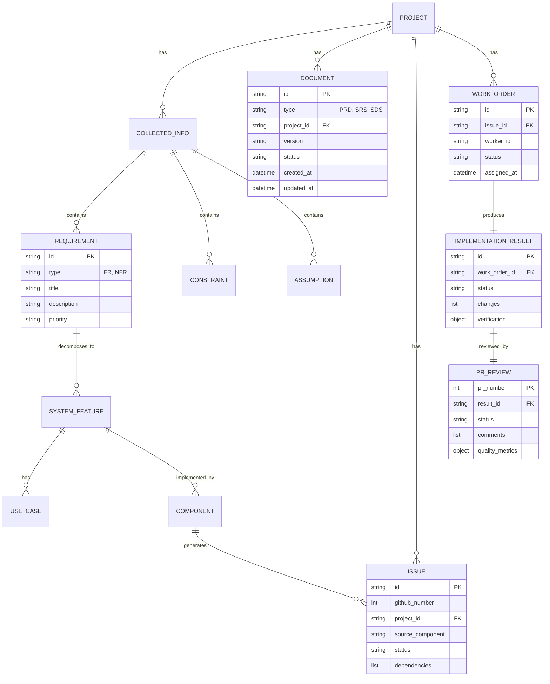

# Software Design Specification (SDS)

## Agent-Driven Software Development Lifecycle System

| Field | Value |
|-------|-------|
| **Document ID** | SDS-001 |
| **Source SRS** | SRS-001 |
| **Source PRD** | PRD-001 |
| **Version** | 1.1.0 |
| **Status** | Review |
| **Implementation** | Partial |
| **Created** | 2025-12-27 |
| **Author** | System Architect |

---

## Table of Contents

1. [Introduction](#1-introduction)
2. [System Architecture](#2-system-architecture)
3. [Component Design](#3-component-design)
4. [Data Design](#4-data-design)
5. [Interface Design](#5-interface-design)
6. [Security Design](#6-security-design)
7. [Deployment Architecture](#7-deployment-architecture)
8. [Error Handling & Recovery](#8-error-handling--recovery)
9. [Traceability Matrix](#9-traceability-matrix)
10. [Appendix](#10-appendix)

---

## 1. Introduction

### 1.1 Purpose

This Software Design Specification (SDS) defines the detailed design of the Agent-Driven SDLC (AD-SDLC) system. It specifies the architecture, components, interfaces, and data design required to implement the system features defined in SRS-001, enabling the development team to directly utilize it for implementation.

**Target Audience:**
- Software Developers
- System Architects
- DevOps Engineers
- QA Engineers

### 1.2 Scope

This SDS covers the following design scope:

| Category | Scope |
|----------|-------|
| **Architecture** | Multi-agent orchestration architecture, Scratchpad pattern |
| **Components** | 28 component designs (25 specialized agents + 3 infrastructure services) |
| **Data** | File-based state schema, data entity definitions |
| **Interfaces** | Inter-agent communication, GitHub API integration, CLI interface |
| **Security** | Authentication, authorization management, sensitive information protection |
| **Deployment** | Local execution environment, configuration management |

### 1.3 Design Goals

| Goal ID | Goal | Description |
|---------|------|-------------|
| DG-001 | **Modularity** | Each agent can be developed/tested/deployed independently |
| DG-002 | **Extensibility** | Easy to add new agents and customize workflows |
| DG-003 | **Resilience** | Automatic recovery and retry mechanisms upon failure |
| DG-004 | **Traceability** | Complete traceability between requirements-design-implementation |
| DG-005 | **Transparency** | All agent activities are logged and auditable |

### 1.4 Design Constraints

| Constraint ID | Constraint | Design Decision |
|---------------|------------|-----------------|
| DC-001 | Claude Agent SDK unidirectional communication | Introduce Scratchpad pattern (file-based state sharing) |
| DC-002 | Context Window 200K tokens | Context Compaction strategy, document chunking |
| DC-003 | GitHub API Rate Limit | Batch processing, caching, exponential backoff |
| DC-004 | Maximum 5 concurrent Workers | Worker Pool management, queue-based scheduling |

### 1.5 References

| Reference | Description |
|-----------|-------------|
| PRD-001 | Product Requirements Document |
| SRS-001 | Software Requirements Specification |
| Claude Agent SDK | https://platform.claude.com/docs/en/agent-sdk |
| Claude Code Subagents | https://code.claude.com/docs/en/sub-agents |

---

## 2. System Architecture

### 2.1 Architecture Overview

AD-SDLC adopts a **hierarchical multi-agent architecture**. The Main Orchestrator coordinates specialized sub-agents, sharing state between agents through the Scratchpad pattern.

```
┌─────────────────────────────────────────────────────────────────────────────────┐
│                              AD-SDLC System Architecture                         │
├─────────────────────────────────────────────────────────────────────────────────┤
│                                                                                 │
│  ┌───────────────────────────────────────────────────────────────────────────┐ │
│  │                         PRESENTATION LAYER                                 │ │
│  │  ┌─────────────────┐  ┌─────────────────┐  ┌─────────────────┐           │ │
│  │  │   CLI Input     │  │  File Input     │  │   URL Input     │           │ │
│  │  │  (Natural Lang) │  │ (.md/.pdf/.docx)│  │  (HTTP/HTTPS)   │           │ │
│  │  └────────┬────────┘  └────────┬────────┘  └────────┬────────┘           │ │
│  └───────────┼────────────────────┼────────────────────┼─────────────────────┘ │
│              │                    │                    │                        │
│              └────────────────────┼────────────────────┘                        │
│                                   ▼                                             │
│  ┌───────────────────────────────────────────────────────────────────────────┐ │
│  │                       ORCHESTRATION LAYER                                  │ │
│  │  ┌─────────────────────────────────────────────────────────────────────┐ │ │
│  │  │                      Main Claude Agent                               │ │ │
│  │  │                   (Entry Point & Coordinator)                        │ │ │
│  │  │  ┌─────────────┐ ┌─────────────┐ ┌─────────────┐ ┌─────────────┐   │ │ │
│  │  │  │  Workflow   │ │   State     │ │  Approval   │ │   Error     │   │ │ │
│  │  │  │  Manager    │ │  Manager    │ │   Gate      │ │  Handler    │   │ │ │
│  │  │  └─────────────┘ └─────────────┘ └─────────────┘ └─────────────┘   │ │ │
│  │  └─────────────────────────────────────────────────────────────────────┘ │ │
│  └───────────────────────────────────────────────────────────────────────────┘ │
│                                   │                                             │
│                    ┌──────────────┼──────────────┐                             │
│                    ▼              ▼              ▼                             │
│  ┌───────────────────────────────────────────────────────────────────────────┐ │
│  │                         AGENT LAYER                                        │ │
│  │                                                                            │ │
│  │  ┌─────────────────────────────────────────────────────────────────────┐ │ │
│  │  │                    DOCUMENT PIPELINE (Sequential)                    │ │ │
│  │  │  ┌──────────┐   ┌──────────┐   ┌──────────┐   ┌──────────┐         │ │ │
│  │  │  │CMP-001   │──▶│CMP-002   │──▶│CMP-003   │──▶│CMP-004   │         │ │ │
│  │  │  │Collector │   │PRD Writer│   │SRS Writer│   │SDS Writer│         │ │ │
│  │  │  └──────────┘   └──────────┘   └──────────┘   └──────────┘         │ │ │
│  │  └─────────────────────────────────────────────────────────────────────┘ │ │
│  │                                                                            │ │
│  │  ┌─────────────────────────────────────────────────────────────────────┐ │ │
│  │  │                   ISSUE MANAGEMENT (Sequential)                      │ │ │
│  │  │  ┌──────────┐   ┌──────────┐                                        │ │ │
│  │  │  │CMP-005   │──▶│CMP-006   │                                        │ │ │
│  │  │  │Issue Gen │   │Controller│                                        │ │ │
│  │  │  └──────────┘   └──────────┘                                        │ │ │
│  │  └─────────────────────────────────────────────────────────────────────┘ │ │
│  │                                                                            │ │
│  │  ┌─────────────────────────────────────────────────────────────────────┐ │ │
│  │  │                      EXECUTION (Parallel)                            │ │ │
│  │  │  ┌──────────┐ ┌──────────┐ ┌──────────┐         ┌──────────┐       │ │ │
│  │  │  │CMP-007   │ │CMP-007   │ │CMP-007   │   ──▶   │CMP-008   │       │ │ │
│  │  │  │Worker #1 │ │Worker #2 │ │Worker #N │         │PR Review │       │ │ │
│  │  │  └──────────┘ └──────────┘ └──────────┘         └──────────┘       │ │ │
│  │  └─────────────────────────────────────────────────────────────────────┘ │ │
│  └───────────────────────────────────────────────────────────────────────────┘ │
│                                   │                                             │
│                                   ▼                                             │
│  ┌───────────────────────────────────────────────────────────────────────────┐ │
│  │                     STATE MANAGEMENT LAYER                                 │ │
│  │  ┌─────────────────┐  ┌─────────────────┐  ┌─────────────────┐           │ │
│  │  │   Scratchpad    │  │  Session Store  │  │   Audit Log     │           │ │
│  │  │  (File-based    │  │  (Transcripts)  │  │  (Event Trail)  │           │ │
│  │  │   YAML/JSON/MD) │  │                 │  │                 │           │ │
│  │  └─────────────────┘  └─────────────────┘  └─────────────────┘           │ │
│  └───────────────────────────────────────────────────────────────────────────┘ │
│                                   │                                             │
│                                   ▼                                             │
│  ┌───────────────────────────────────────────────────────────────────────────┐ │
│  │                    EXTERNAL INTEGRATION LAYER                              │ │
│  │  ┌─────────────────┐  ┌─────────────────┐  ┌─────────────────┐           │ │
│  │  │   GitHub API    │  │   File System   │  │   Web Sources   │           │ │
│  │  │ (Issues, PRs,   │  │ (Code, Docs,    │  │ (URLs, Search)  │           │ │
│  │  │  Actions)       │  │  Config)        │  │                 │           │ │
│  │  └─────────────────┘  └─────────────────┘  └─────────────────┘           │ │
│  └───────────────────────────────────────────────────────────────────────────┘ │
│                                                                                 │
└─────────────────────────────────────────────────────────────────────────────────┘
```

### 2.2 Architecture Patterns

#### 2.2.1 Scratchpad Pattern

A file-based state sharing pattern to overcome the unidirectional communication (parent→child) constraint of Claude Agent SDK.

```
┌─────────────────────────────────────────────────────────────────────────────┐
│                         Scratchpad Pattern                                   │
├─────────────────────────────────────────────────────────────────────────────┤
│                                                                             │
│   ┌───────────────┐         ┌───────────────┐         ┌───────────────┐    │
│   │   Agent A     │         │  Scratchpad   │         │   Agent B     │    │
│   │ (Producer)    │         │ (File System) │         │ (Consumer)    │    │
│   └───────┬───────┘         └───────────────┘         └───────┬───────┘    │
│           │                         │                         │            │
│           │    1. Write State       │                         │            │
│           │─────────────────────────▶                         │            │
│           │                         │                         │            │
│           │                         │    2. Read State        │            │
│           │                         ◀─────────────────────────│            │
│           │                         │                         │            │
│           │                         │    3. Write Result      │            │
│           │                         ◀─────────────────────────│            │
│           │                         │                         │            │
│                                                                             │
│   File Structure:                                                           │
│   .ad-sdlc/scratchpad/                                                      │
│   ├── info/{project_id}/                                                    │
│   │   ├── collected_info.yaml      ◀── Collector writes                    │
│   │   └── clarifications.json      ◀── Q&A history                         │
│   ├── documents/{project_id}/                                               │
│   │   ├── prd.md                   ◀── PRD Writer writes, SRS Reader reads │
│   │   ├── srs.md                   ◀── SRS Writer writes, SDS Reader reads │
│   │   └── sds.md                   ◀── SDS Writer writes                   │
│   ├── issues/{project_id}/                                                  │
│   │   ├── issue_list.json          ◀── Issue Generator writes              │
│   │   └── dependency_graph.json    ◀── Dependency mapping                  │
│   └── progress/{project_id}/                                                │
│       ├── controller_state.yaml    ◀── Controller state                    │
│       ├── work_orders/*.yaml       ◀── Work assignments                    │
│       └── results/*.yaml           ◀── Implementation results              │
│                                                                             │
└─────────────────────────────────────────────────────────────────────────────┘
```

#### 2.2.2 Pipeline Pattern

Agents follow two execution patterns:

**Sequential Pipeline (Document Generation):**
```
Collector → PRD Writer → SRS Writer → SDS Writer → Issue Generator → Controller
```

**Parallel Execution (Code Implementation):**
```
Controller ──┬── Worker #1 ──┐
             ├── Worker #2 ──┼──▶ PR Review
             └── Worker #N ──┘
```

#### 2.2.3 Event-Driven Coordination

```yaml
Events:
  stage_complete:
    payload:
      stage: string
      project_id: string
      output_files: list
      success: boolean
    triggers:
      - next_stage_start
      - approval_gate (if configured)
      - notification

  approval_granted:
    payload:
      stage: string
      approver: string
      timestamp: datetime
    triggers:
      - next_stage_start

  worker_complete:
    payload:
      worker_id: string
      issue_id: string
      status: success|failure|blocked
    triggers:
      - controller_schedule_next
      - pr_review (if all workers done)
```

### 2.3 Technology Stack

| Layer | Technology | Version | Rationale |
|-------|------------|---------|-----------|
| **Runtime** | Claude Agent SDK | Latest | Official Agent SDK |
| **CLI** | Claude Code CLI | Latest | Developer-friendly interface |
| **Model** | Claude Sonnet 4.5 | claude-sonnet-4-5-20250929 | Cost/performance balance |
| **Model (Critical)** | Claude Opus 4.6 | claude-opus-4-6 | For complex reasoning tasks |
| **Model (Light)** | Claude Haiku 4.5 | claude-haiku-4-5-20251001 | Quick, low-cost tasks |
| **VCS** | Git | 2.30+ | Version control |
| **Issue Tracking** | GitHub CLI | 2.0+ | GitHub integration |
| **Config Format** | YAML | 1.2 | Configuration files |
| **Data Format** | JSON, YAML, Markdown | - | State and document storage |
| **Logging** | JSON Structured Logs | - | Structured logging |

### 2.4 Directory Structure

```
project-root/
├── .claude/
│   ├── agents/                          # Agent Definition Files
│   │   ├── collector.md                 # CMP-001
│   │   ├── prd-writer.md                # CMP-002
│   │   ├── srs-writer.md                # CMP-003
│   │   ├── sds-writer.md                # CMP-004
│   │   ├── issue-generator.md           # CMP-005
│   │   ├── controller.md                # CMP-006
│   │   ├── worker.md                    # CMP-007
│   │   └── pr-reviewer.md               # CMP-008
│   └── settings.json                    # Claude Code settings
│
├── .ad-sdlc/
│   ├── scratchpad/                      # Inter-agent State (Scratchpad)
│   │   ├── info/{project_id}/           # Collected information
│   │   │   ├── collected_info.yaml
│   │   │   └── clarifications.json
│   │   ├── documents/{project_id}/      # Generated documents
│   │   │   ├── prd.md
│   │   │   ├── srs.md
│   │   │   └── sds.md
│   │   ├── issues/{project_id}/         # Issue tracking
│   │   │   ├── issue_list.json
│   │   │   └── dependency_graph.json
│   │   └── progress/{project_id}/       # Progress tracking
│   │       ├── controller_state.yaml
│   │       ├── work_orders/
│   │       │   └── WO-{xxx}.yaml
│   │       ├── results/
│   │       │   └── WO-{xxx}-result.yaml
│   │       └── reviews/
│   │           └── PR-{xxx}-review.yaml
│   │
│   ├── templates/                       # Document Templates
│   │   ├── prd-template.md
│   │   ├── srs-template.md
│   │   ├── sds-template.md
│   │   └── issue-template.md
│   │
│   ├── config/                          # Configuration
│   │   ├── agents.yaml                  # Agent registry
│   │   └── workflow.yaml                # Pipeline config
│   │
│   └── logs/                            # Audit Logs
│       ├── ad-sdlc.log
│       └── agent-logs/
│           ├── collector.log
│           └── ...
│
├── docs/                                # Published Documents
│   ├── prd/
│   │   └── PRD-{project_id}.md
│   ├── srs/
│   │   └── SRS-{project_id}.md
│   └── sds/
│       └── SDS-{project_id}.md
│
└── src/                                 # Generated Source Code
    └── ...
```

---

## 3. Component Design

### 3.1 Component Overview

| CMP ID | Component Name | Korean Name | Source Features | Responsibility |
|--------|----------------|-------------|-----------------|----------------|
| CMP-001 | Collector Agent | Information Collection Agent | SF-001 | Multi-source information collection and structuring |
| CMP-002 | PRD Writer Agent | PRD Writing Agent | SF-002 | Automatic PRD document generation |
| CMP-003 | SRS Writer Agent | SRS Writing Agent | SF-003 | Automatic SRS document generation |
| CMP-004 | SDS Writer Agent | SDS Writing Agent | SF-004 | Automatic SDS document generation |
| CMP-005 | Issue Generator | Issue Generation Agent | SF-005 | Automatic GitHub Issue generation |
| CMP-006 | Controller Agent | Control Agent | SF-006, SF-007 | Work prioritization and assignment management |
| CMP-007 | Worker Agent | Work Agent | SF-008, SF-009 | Code implementation and self-verification |
| CMP-008 | PR Review Agent | PR Review Agent | SF-010, SF-011 | PR creation and code review |
| CMP-009 | State Manager | State Manager | SF-014 | Scratchpad state management |
| CMP-010 | Logger | Logging Service | SF-015 | Activity logging and auditing |
| CMP-011 | Error Handler | Error Handler | SF-016 | Retry and recovery management |
| CMP-012 | Document Reader Agent | Document Reader | SF-017 | Parse existing PRD/SRS/SDS documents |
| CMP-013 | Codebase Analyzer Agent | Codebase Analyzer | SF-018 | Analyze architecture patterns and dependencies |
| CMP-014 | Impact Analyzer Agent | Impact Analyzer | SF-019 | Assess change impact and risk |
| CMP-015 | PRD Updater Agent | PRD Updater | SF-020 | Incremental PRD updates |
| CMP-016 | SRS Updater Agent | SRS Updater | SF-021 | Incremental SRS updates |
| CMP-017 | SDS Updater Agent | SDS Updater | SF-022 | Incremental SDS updates |
| CMP-018 | Regression Tester Agent | Regression Tester | SF-023 | Run regression tests and assess coverage |
| CMP-019 | Doc-Code Comparator Agent | Doc-Code Comparator | SF-024 | Compare spec vs code, generate gap report |
| CMP-020 | Code Reader Agent | Code Reader | SF-025 | AST-based source code analysis |
| CMP-021 | CI Fixer Agent | CI Fixer | SF-026 | Diagnose and fix CI/CD failures |
| CMP-022 | Mode Detector Agent | Mode Detector | SF-027 | Detect Greenfield/Enhancement pipeline mode |
| CMP-023 | Project Initializer Agent | Project Initializer | SF-028 | Initialize .ad-sdlc workspace |
| CMP-024 | Repo Detector Agent | Repo Detector | SF-029 | Detect existing GitHub repository |
| CMP-025 | AD-SDLC Orchestrator Agent | Pipeline Orchestrator | SF-030 | Full pipeline coordination |
| CMP-026 | Analysis Orchestrator Agent | Analysis Orchestrator | SF-030 | Enhancement analysis sub-pipeline |
| CMP-027 | GitHub Repo Setup Agent | GitHub Repo Setup | SF-029 | Create and initialize GitHub repository |
| CMP-028 | Issue Reader Agent | Issue Reader | SF-031 | Import existing GitHub Issues |

### 3.2 CMP-001: Collector Agent

**Source Features**: SF-001 (UC-001, UC-002, UC-003)

**Responsibility**: Collect various forms of input from users (natural language, files, URLs) and transform them into structured information documents

#### 3.2.1 Interface Definition

```typescript
interface ICollectorAgent {
  /**
   * Analyze natural language input to extract structured information
   * @param input User's natural language input
   * @returns Extracted information and clarifying questions
   */
  collectFromText(input: string): Promise<CollectionResult>;

  /**
   * Read file contents and extract information
   * @param filePaths Input file paths
   * @returns Extracted information
   */
  collectFromFiles(filePaths: string[]): Promise<CollectionResult>;

  /**
   * Fetch content from URLs and extract information
   * @param urls List of URLs
   * @returns Extracted information
   */
  collectFromUrls(urls: string[]): Promise<CollectionResult>;

  /**
   * Process user responses to clarifying questions
   * @param questionId Question ID
   * @param answer User response
   */
  processAnswer(questionId: string, answer: string): Promise<void>;

  /**
   * Save collected information as final YAML
   * @param projectId Project ID
   */
  finalize(projectId: string): Promise<string>;
}

interface CollectionResult {
  projectName: string;
  description: string;
  requirements: {
    functional: FunctionalRequirement[];
    nonFunctional: NonFunctionalRequirement[];
  };
  constraints: string[];
  assumptions: string[];
  dependencies: Dependency[];
  questions: ClarifyingQuestion[];  // Items needing additional clarification
  confidence: number;  // 0.0 - 1.0
}

interface ClarifyingQuestion {
  id: string;
  category: 'requirement' | 'constraint' | 'assumption' | 'priority';
  question: string;
  context: string;
  required: boolean;
}
```

#### 3.2.2 State Schema

```yaml
# .ad-sdlc/scratchpad/info/{project_id}/collected_info.yaml
schema:
  version: "1.0"
  project_id: string
  created_at: datetime
  updated_at: datetime
  status: collecting | clarifying | completed

  project:
    name: string
    description: string

  stakeholders:
    - name: string
      role: string
      contact: string  # Optional

  requirements:
    functional:
      - id: "FR-XXX"
        title: string
        description: string
        priority: P0 | P1 | P2 | P3
        source: string  # Input source (user_input, file:path, url:uri)
        acceptance_criteria:
          - criterion: string

    non_functional:
      - id: "NFR-XXX"
        category: performance | security | reliability | usability | maintainability
        requirement: string
        metric: string  # Optional
        target: string  # Optional

  constraints:
    - id: "CON-XXX"
      description: string
      rationale: string

  assumptions:
    - id: "ASM-XXX"
      description: string
      risk_if_wrong: string

  dependencies:
    - name: string
      version: string  # Optional
      type: library | service | system
      purpose: string

  clarifications:
    - question_id: string
      question: string
      answer: string
      answered_at: datetime

  sources:
    - type: text | file | url
      reference: string
      extracted_at: datetime
```

#### 3.2.3 Tools Required

| Tool | Purpose | Usage |
|------|---------|-------|
| `Read` | Read file contents | Process .md, .pdf, .docx, .txt files |
| `WebFetch` | Fetch URL content | Process HTTP/HTTPS URLs |
| `WebSearch` | Search for related information | Collect additional context |
| `Grep` | Pattern-based information extraction | Analyze existing codebase |
| `Write` | Save information document | Save in YAML format |

#### 3.2.4 Processing Logic

```python
# Pseudo-code for Collector Agent logic
class CollectorAgent:
    MAX_QUESTIONS = 5
    MIN_CONFIDENCE = 0.8

    def collect(self, inputs: List[Input]) -> CollectionResult:
        """
        1. Process by input type
        2. Extract and structure information
        3. Evaluate confidence
        4. Generate clarifying questions (if needed)
        """
        extracted_info = []

        for input in inputs:
            if input.type == "text":
                info = self._extract_from_text(input.content)
            elif input.type == "file":
                info = self._extract_from_file(input.path)
            elif input.type == "url":
                info = self._extract_from_url(input.url)
            extracted_info.append(info)

        # Merge information and remove duplicates
        merged = self._merge_information(extracted_info)

        # Evaluate confidence
        confidence = self._evaluate_confidence(merged)

        # Generate clarifying questions
        questions = []
        if confidence < self.MIN_CONFIDENCE:
            questions = self._generate_questions(merged)[:self.MAX_QUESTIONS]

        return CollectionResult(
            **merged,
            questions=questions,
            confidence=confidence
        )

    def _evaluate_confidence(self, info: dict) -> float:
        """
        Evaluate information completeness and clarity
        - Check for required fields
        - Requirement detail level
        - Presence of conflicts or ambiguities
        """
        score = 0.0

        # Required field check (20% each)
        if info.get('project', {}).get('name'):
            score += 0.2
        if len(info.get('requirements', {}).get('functional', [])) >= 3:
            score += 0.2
        if info.get('constraints'):
            score += 0.2

        # Detail level check (40%)
        for fr in info.get('requirements', {}).get('functional', []):
            if fr.get('acceptance_criteria'):
                score += 0.1

        return min(score, 1.0)
```

#### 3.2.5 Error Handling

| Error Code | Condition | Handling |
|------------|-----------|----------|
| COL-001 | Input too short (< 50 characters) | Return minimum requirements guidance message |
| COL-002 | File read failure | Log error, request alternative input |
| COL-003 | URL inaccessible | Log error, request manual input |
| COL-004 | Unsupported file format | Provide supported format list |
| COL-005 | Context limit reached | Guide input chunking |

---

### 3.3 CMP-002: PRD Writer Agent

**Source Features**: SF-002 (UC-004, UC-005)

**Responsibility**: Analyze collected information and automatically generate documents based on standard PRD templates

#### 3.3.1 Interface Definition

```typescript
interface IPRDWriterAgent {
  /**
   * Generate PRD draft from collected information
   * @param projectId Project ID
   * @returns PRD document path
   */
  generatePRD(projectId: string): Promise<PRDGenerationResult>;

  /**
   * Perform PRD Gap Analysis
   * @param prdContent PRD content
   * @returns List of missing information
   */
  analyzeGaps(prdContent: string): Promise<GapAnalysisResult>;

  /**
   * Check consistency between requirements
   * @param requirements List of requirements
   * @returns List of conflicts
   */
  checkConsistency(requirements: Requirement[]): Promise<ConsistencyResult>;

  /**
   * Revise PRD based on user feedback
   * @param projectId Project ID
   * @param feedback Revision request content
   */
  revisePRD(projectId: string, feedback: string): Promise<string>;
}

interface PRDGenerationResult {
  prdPath: string;
  sections: PRDSection[];
  gaps: string[];
  conflicts: ConflictItem[];
  quality: QualityMetrics;
}

interface QualityMetrics {
  completeness: number;  // 0.0 - 1.0
  consistency: number;
  clarity: number;
  overall: number;
}
```

#### 3.3.2 PRD Template Structure

```markdown
# PRD: {Product Name}

| Field | Value |
|-------|-------|
| Document ID | PRD-{project_id} |
| Version | {version} |
| Status | Draft | Review | Approved |
| Created | {date} |

## 1. Executive Summary
[Auto-generated: 1-2 paragraphs of project overview]

## 2. Problem Statement
### 2.1 Current Challenges
[Current issues based on collected information]

### 2.2 Target Users
[Identified user groups]

## 3. Goals & Success Metrics
| Goal ID | Goal | Metric | Target |
|---------|------|--------|--------|
| G-001 | {goal} | {metric} | {target} |

## 4. User Personas
### 4.1 Primary Persona
[Auto-generated persona]

## 5. Functional Requirements
### FR-001: {Requirement Title}
- **Description**: {description}
- **Priority**: P0 | P1 | P2 | P3
- **Acceptance Criteria**:
  - [ ] {criterion 1}
  - [ ] {criterion 2}
- **Dependencies**: {dependencies}
- **Source**: {source reference}

## 6. Non-Functional Requirements
| NFR ID | Category | Requirement | Metric |
|--------|----------|-------------|--------|

## 7. Constraints & Assumptions
### 7.1 Constraints
### 7.2 Assumptions

## 8. Timeline & Milestones
[Auto-generated or TBD]

## 9. Risks & Mitigations
| Risk ID | Risk | Probability | Impact | Mitigation |
|---------|------|-------------|--------|------------|

## 10. Appendix
### 10.1 Gap Analysis
[Auto-identified missing information]

### 10.2 Traceability
[Mapping to collected_info.yaml items]
```

#### 3.3.3 Quality Gates

```yaml
prd_quality_gates:
  required_sections:
    - executive_summary
    - problem_statement
    - goals_and_metrics
    - functional_requirements
    - non_functional_requirements

  validation_rules:
    - rule: "min_functional_requirements"
      value: 3
      message: "At least 3 functional requirements are required"

    - rule: "all_fr_have_priority"
      message: "All functional requirements must have a priority assigned"

    - rule: "all_fr_have_acceptance_criteria"
      min_criteria: 1
      message: "Each requirement must have at least 1 acceptance criterion"

    - rule: "unique_requirement_ids"
      message: "Requirement IDs must be unique"
```

---

### 3.4 CMP-003: SRS Writer Agent

**Source Features**: SF-003 (UC-006)

**Responsibility**: Analyze PRD and automatically generate detailed Software Requirements Specification (SRS)

#### 3.4.1 Interface Definition

```typescript
interface ISRSWriterAgent {
  /**
   * Generate SRS from PRD
   * @param projectId Project ID
   * @returns SRS generation result
   */
  generateSRS(projectId: string): Promise<SRSGenerationResult>;

  /**
   * Decompose PRD requirements into system features
   * @param requirement PRD requirement
   * @returns List of decomposed system features
   */
  decomposeRequirement(requirement: FunctionalRequirement): Promise<SystemFeature[]>;

  /**
   * Generate use case scenarios
   * @param feature System feature
   * @returns List of use cases
   */
  generateUseCases(feature: SystemFeature): Promise<UseCase[]>;

  /**
   * Build traceability matrix
   * @param projectId Project ID
   * @returns PRD → SRS traceability matrix
   */
  buildTraceabilityMatrix(projectId: string): Promise<TraceabilityMatrix>;
}

interface SystemFeature {
  id: string;        // SF-XXX
  name: string;
  description: string;
  sourceRequirement: string;  // FR-XXX
  priority: Priority;
  useCases: UseCase[];
  acceptanceCriteria: string[];
  dependencies: string[];
}

interface UseCase {
  id: string;        // UC-XXX
  title: string;
  actor: string;
  preconditions: string[];
  mainFlow: FlowStep[];
  alternativeFlows: AlternativeFlow[];
  exceptionFlows: ExceptionFlow[];
  postconditions: string[];
}
```

#### 3.4.2 SRS Structure

```yaml
srs_structure:
  sections:
    - section: "1. Introduction"
      subsections:
        - "1.1 Purpose"
        - "1.2 Scope"
        - "1.3 Definitions & Acronyms"
        - "1.4 References"

    - section: "2. Overall Description"
      subsections:
        - "2.1 Product Perspective"
        - "2.2 Product Functions Summary"
        - "2.3 User Classes and Characteristics"
        - "2.4 Operating Environment"
        - "2.5 Design and Implementation Constraints"
        - "2.6 Assumptions and Dependencies"

    - section: "3. System Features"
      # Subsections per SF-XXX
      per_feature:
        - "Description"
        - "Use Cases"
        - "Acceptance Criteria"
        - "Dependencies"

    - section: "4. External Interface Requirements"
      subsections:
        - "4.1 User Interfaces"
        - "4.2 API Interfaces"
        - "4.3 File Interfaces"
        - "4.4 External System Interfaces"

    - section: "5. Non-Functional Requirements"
      subsections:
        - "5.1 Performance"
        - "5.2 Reliability"
        - "5.3 Security"
        - "5.4 Maintainability"

    - section: "6. Data Requirements"
      subsections:
        - "6.1 Data Entities"
        - "6.2 Data Relationships"
        - "6.3 Data Constraints"

    - section: "7. Traceability Matrix"
      # PRD → SRS mapping
```

---

### 3.5 CMP-004: SDS Writer Agent

**Source Features**: SF-004 (UC-007)

**Responsibility**: Analyze SRS and automatically generate Software Design Specification (SDS)

#### 3.5.1 Interface Definition

```typescript
interface ISDSWriterAgent {
  /**
   * Generate SDS from SRS
   * @param projectId Project ID
   * @returns SDS generation result
   */
  generateSDS(projectId: string): Promise<SDSGenerationResult>;

  /**
   * Design system architecture
   * @param features List of system features
   * @returns Architecture design
   */
  designArchitecture(features: SystemFeature[]): Promise<ArchitectureDesign>;

  /**
   * Design component
   * @param feature System feature
   * @returns Component specification
   */
  designComponent(feature: SystemFeature): Promise<ComponentSpec>;

  /**
   * Design APIs
   * @param useCases List of use cases
   * @returns API specifications
   */
  designAPIs(useCases: UseCase[]): Promise<APISpec[]>;

  /**
   * Design database schema
   * @param dataRequirements Data requirements
   * @returns Schema design
   */
  designSchema(dataRequirements: DataRequirement[]): Promise<SchemaDesign>;
}

interface ComponentSpec {
  id: string;           // CMP-XXX
  name: string;
  sourceFeatures: string[];  // SF-XXX
  responsibility: string;
  type: 'service' | 'controller' | 'repository' | 'utility' | 'agent';

  interfaces: {
    provided: InterfaceSpec[];
    required: InterfaceSpec[];
  };

  dependencies: {
    internal: InternalDep[];
    external: ExternalDep[];
  };

  dataAccess: DataAccessSpec[];
  errorHandling: ErrorHandlingSpec[];
  implementationNotes: string;
}

interface APISpec {
  endpoint: string;
  method: 'GET' | 'POST' | 'PUT' | 'PATCH' | 'DELETE';
  sourceUseCase: string;  // UC-XXX
  component: string;      // CMP-XXX
  request: {
    headers: Record<string, string>;
    params: ParameterSpec[];
    body: SchemaSpec;
  };
  response: {
    success: ResponseSpec;
    errors: ErrorResponseSpec[];
  };
  security: SecuritySpec;
}
```

#### 3.5.2 Component Types

```yaml
component_types:
  agent:
    description: "Autonomous execution component based on Claude Agent"
    characteristics:
      - "Claude API calls"
      - "Uses specific tool sets"
      - "Independent execution context"
    examples:
      - "Collector Agent"
      - "PRD Writer Agent"

  service:
    description: "Service encapsulating business logic"
    characteristics:
      - "Stateless"
      - "Single responsibility principle"
    examples:
      - "Validation Service"
      - "Notification Service"

  controller:
    description: "Request routing and coordination"
    characteristics:
      - "Input validation"
      - "Service call coordination"
    examples:
      - "Controller Agent (orchestration)"

  repository:
    description: "Data access layer"
    characteristics:
      - "CRUD operations"
      - "File system abstraction"
    examples:
      - "Scratchpad Repository"

  utility:
    description: "Common utility functions"
    characteristics:
      - "Pure functions"
      - "Reusable"
    examples:
      - "ID Generator"
      - "Date Formatter"
```

---

### 3.6 CMP-005: Issue Generator Agent

**Source Features**: SF-005 (UC-008)

**Responsibility**: Analyze SDS components and automatically generate GitHub Issues as implementable units

#### 3.6.1 Interface Definition

```typescript
interface IIssueGeneratorAgent {
  /**
   * Generate GitHub Issues from SDS
   * @param projectId Project ID
   * @returns List of generated issues
   */
  generateIssues(projectId: string): Promise<IssueGenerationResult>;

  /**
   * Decompose component into implementation units
   * @param component Component specification
   * @returns List of work items
   */
  breakdownComponent(component: ComponentSpec): Promise<WorkItem[]>;

  /**
   * Analyze dependencies between issues
   * @param workItems List of work items
   * @returns Dependency graph
   */
  analyzeDependencies(workItems: WorkItem[]): Promise<DependencyGraph>;

  /**
   * Create issue on GitHub
   * @param issue Issue information
   * @returns Created issue number
   */
  createGitHubIssue(issue: IssueSpec): Promise<number>;
}

interface IssueSpec {
  title: string;
  body: string;
  labels: string[];
  assignees: string[];
  milestone: string;
  sourceComponent: string;  // CMP-XXX
  sourceFeature: string;    // SF-XXX
  sourceRequirement: string; // FR-XXX
  estimatedEffort: 'XS' | 'S' | 'M' | 'L' | 'XL';
  dependencies: number[];    // Blocked by issue numbers
  acceptanceCriteria: string[];
}

interface DependencyGraph {
  nodes: GraphNode[];
  edges: GraphEdge[];
  criticalPath: string[];  // Issue IDs on critical path
}
```

#### 3.6.2 Issue Template

```markdown
## Description
{Auto-generated work description}

## Source References
- **SDS Component**: CMP-XXX
- **SRS Feature**: SF-XXX
- **PRD Requirement**: FR-XXX

## Context
{Related architecture and design context}

## Acceptance Criteria
- [ ] {criterion 1}
- [ ] {criterion 2}
- [ ] {criterion 3}

## Technical Notes
{Technical guidance for implementation}

### Suggested Approach
1. {step 1}
2. {step 2}
3. {step 3}

### Related Files
- `path/to/related/file.ts`

## Dependencies
- **Blocked by**: #{issue_number}
- **Blocks**: #{issue_number}

## Estimated Effort
**{XS | S | M | L | XL}**

| Effort | Description | Typical Duration |
|--------|-------------|------------------|
| XS | < 1 hour | Trivial change |
| S | 1-4 hours | Small feature |
| M | 4-8 hours | Medium feature |
| L | 1-3 days | Large feature |
| XL | 3+ days | Complex feature |

---
_Auto-generated by AD-SDLC Issue Generator Agent_
_Labels: `ad-sdlc:auto-generated`, `priority:{P0-P3}`, `type:{feature|fix|docs}`_
```

#### 3.6.3 Work Breakdown Strategy

```yaml
breakdown_rules:
  max_issue_size: "L"  # XL requires splitting
  decomposition_criteria:
    - name: "single_responsibility"
      description: "One issue has only one responsibility"

    - name: "testable_unit"
      description: "Independently testable unit"

    - name: "estimatable"
      description: "Clearly estimable effort"

  breakdown_patterns:
    service:
      - "Interface definition"
      - "Core implementation"
      - "Unit tests"
      - "Integration"

    api_endpoint:
      - "Route definition"
      - "Request validation"
      - "Business logic"
      - "Response formatting"
      - "Error handling"
      - "Tests"

    data_model:
      - "Schema definition"
      - "Validation rules"
      - "Migration scripts"
      - "Tests"
```

---

### 3.7 CMP-006: Controller Agent

**Source Features**: SF-006, SF-007 (UC-009, UC-010, UC-011)

**Responsibility**: Analyze generated Issues, assign work to Worker Agents, and monitor progress

#### 3.7.1 Interface Definition

```typescript
interface IControllerAgent {
  /**
   * Determine issue priority
   * @param issues List of issues
   * @param graph Dependency graph
   * @returns Priority-sorted execution queue
   */
  prioritize(issues: Issue[], graph: DependencyGraph): Promise<ExecutionQueue>;

  /**
   * Assign work
   * @param issue Issue to assign
   * @param workerId Worker ID
   * @returns Work Order
   */
  assignWork(issue: Issue, workerId: string): Promise<WorkOrder>;

  /**
   * Monitor progress
   * @returns Progress report
   */
  monitorProgress(): Promise<ProgressReport>;

  /**
   * Check Worker status
   * @param workerId Worker ID
   * @returns Worker status
   */
  checkWorkerStatus(workerId: string): Promise<WorkerStatus>;

  /**
   * Reassign work (on failure)
   * @param workOrderId Work Order ID
   * @returns New Work Order
   */
  reassignWork(workOrderId: string): Promise<WorkOrder>;
}

interface WorkOrder {
  id: string;           // WO-XXX
  issueId: string;
  issueNumber: number;
  issueTitle: string;
  createdAt: Date;
  deadline?: Date;
  priority: number;     // 1 = highest

  assignment: {
    workerId: string;
    assignedAt: Date;
    status: 'pending' | 'assigned' | 'in_progress' | 'completed' | 'failed';
  };

  context: {
    sdsComponent: string;
    srsFeature: string;
    prdRequirement: string;
    relatedFiles: string[];
    dependenciesStatus: DependencyStatus[];
    implementationHints: string;
    acceptanceCriteria: string[];
  };
}

interface ExecutionQueue {
  ready: QueueItem[];      // Dependencies resolved, executable
  blocked: QueueItem[];    // Waiting for dependencies
  inProgress: QueueItem[]; // Currently executing
  completed: QueueItem[];  // Completed
}
```

#### 3.7.2 Prioritization Algorithm

```python
class PriorityCalculator:
    """
    Priority calculation algorithm
    Score = (Priority_Weight × Priority_Value) +
            (Dependency_Weight × Dependent_Count) +
            (Critical_Path_Weight × Is_Critical)

    Lower score = Higher priority
    """
    PRIORITY_WEIGHT = 10
    DEPENDENCY_WEIGHT = 5
    CRITICAL_PATH_WEIGHT = 20

    PRIORITY_VALUES = {
        'P0': 1,
        'P1': 2,
        'P2': 3,
        'P3': 4
    }

    def calculate(self, issue: Issue, graph: DependencyGraph) -> int:
        base_priority = self.PRIORITY_VALUES[issue.priority] * self.PRIORITY_WEIGHT

        # Number of issues depending on this issue (more = higher priority)
        dependent_count = self._count_dependents(issue.id, graph)
        dependency_score = dependent_count * self.DEPENDENCY_WEIGHT

        # Critical path status
        is_critical = issue.id in graph.critical_path
        critical_score = self.CRITICAL_PATH_WEIGHT if is_critical else 0

        return base_priority - dependency_score - critical_score

    def _count_dependents(self, issue_id: str, graph: DependencyGraph) -> int:
        """Count other issues blocked by this issue"""
        return len([e for e in graph.edges if e.blocked_by == issue_id])
```

#### 3.7.3 Controller State Schema

```yaml
# .ad-sdlc/scratchpad/progress/{project_id}/controller_state.yaml
schema:
  version: "1.0"
  project_id: string
  phase: planning | executing | reviewing | completed
  updated_at: datetime

  summary:
    total_issues: integer
    pending: integer
    in_progress: integer
    completed: integer
    blocked: integer
    failed: integer

  workers:
    max_parallel: 5
    active:
      - worker_id: string
        status: idle | working | error
        current_issue: string
        started_at: datetime
        performance:
          completed_count: integer
          avg_completion_time: duration
          success_rate: float

  execution_queue:
    ready:
      - issue_id: string
        priority_score: integer
        reason: string

    blocked:
      - issue_id: string
        blocked_by: list
        blocked_since: datetime

  progress:
    started_at: datetime
    estimated_completion: datetime
    current_percentage: float
    velocity: float  # issues per hour

  bottlenecks:
    - issue_id: string
      type: dependency_chain | long_running | repeated_failure
      detected_at: datetime
      resolution_suggestion: string
```

---

### 3.8 CMP-007: Worker Agent

**Source Features**: SF-008, SF-009 (UC-012, UC-013)

**Responsibility**: Implement Issues assigned by Controller Agent

#### 3.8.1 Interface Definition

```typescript
interface IWorkerAgent {
  /**
   * Receive and process Work Order
   * @param workOrder Work order
   * @returns Implementation result
   */
  executeWork(workOrder: WorkOrder): Promise<ImplementationResult>;

  /**
   * Implement code
   * @param context Implementation context
   * @returns Code changes
   */
  implementCode(context: ImplementationContext): Promise<CodeChange[]>;

  /**
   * Write tests
   * @param codeChanges Code changes
   * @returns Test files
   */
  writeTests(codeChanges: CodeChange[]): Promise<TestFile[]>;

  /**
   * Execute self-verification
   * @returns Verification result
   */
  selfVerify(): Promise<VerificationResult>;

  /**
   * Fix errors and retry
   * @param error Occurred error
   * @param attempt Current attempt number
   * @returns Fix result
   */
  fixAndRetry(error: VerificationError, attempt: number): Promise<ImplementationResult>;
}

interface ImplementationResult {
  workOrderId: string;
  issueId: string;
  githubIssue: number;

  status: 'completed' | 'failed' | 'blocked';
  startedAt: Date;
  completedAt: Date;

  changes: CodeChange[];
  tests: TestResult;
  verification: VerificationResult;

  branch: {
    name: string;
    commits: Commit[];
  };

  notes: string;
  blockers?: string[];
}

interface VerificationResult {
  testsPassed: boolean;
  testsOutput: string;
  lintPassed: boolean;
  lintOutput: string;
  buildPassed: boolean;
  buildOutput: string;
  coverage: number;
}
```

#### 3.8.2 Implementation Workflow

```
┌─────────────────────────────────────────────────────────────────────────────┐
│                        Worker Agent Implementation Flow                      │
├─────────────────────────────────────────────────────────────────────────────┤
│                                                                             │
│  ┌─────────────────────────────────────────────────────────────────────┐   │
│  │ 1. RECEIVE WORK ORDER                                                │   │
│  │    └─ Read WO-XXX.yaml from scratchpad                              │   │
│  └─────────────────────────────────────────────────────────────────────┘   │
│                                   │                                         │
│                                   ▼                                         │
│  ┌─────────────────────────────────────────────────────────────────────┐   │
│  │ 2. UNDERSTAND CONTEXT                                                │   │
│  │    ├─ Read issue description and acceptance criteria                │   │
│  │    ├─ Analyze related files (Glob, Grep, Read)                      │   │
│  │    ├─ Review dependency completion status                           │   │
│  │    └─ Understand existing codebase patterns                         │   │
│  └─────────────────────────────────────────────────────────────────────┘   │
│                                   │                                         │
│                                   ▼                                         │
│  ┌─────────────────────────────────────────────────────────────────────┐   │
│  │ 3. CREATE BRANCH                                                     │   │
│  │    └─ git checkout -b feature/ISS-{number}-{description}            │   │
│  └─────────────────────────────────────────────────────────────────────┘   │
│                                   │                                         │
│                                   ▼                                         │
│  ┌─────────────────────────────────────────────────────────────────────┐   │
│  │ 4. IMPLEMENT CODE                                                    │   │
│  │    ├─ Create new files (Write)                                      │   │
│  │    ├─ Modify existing files (Edit)                                  │   │
│  │    ├─ Follow coding standards                                       │   │
│  │    └─ Add inline documentation                                      │   │
│  └─────────────────────────────────────────────────────────────────────┘   │
│                                   │                                         │
│                                   ▼                                         │
│  ┌─────────────────────────────────────────────────────────────────────┐   │
│  │ 5. WRITE TESTS                                                       │   │
│  │    ├─ Create test file (*.test.ts / *.spec.ts)                      │   │
│  │    ├─ Write unit tests (min 80% coverage)                           │   │
│  │    └─ Include edge cases and error scenarios                        │   │
│  └─────────────────────────────────────────────────────────────────────┘   │
│                                   │                                         │
│                                   ▼                                         │
│  ┌─────────────────────────────────────────────────────────────────────┐   │
│  │ 6. SELF-VERIFY                                                       │   │
│  │    ├─ Run tests: npm test -- --coverage                             │   │
│  │    ├─ Run lint: npm run lint                                        │   │
│  │    └─ Run build: npm run build                                      │   │
│  └─────────────────────────────────────────────────────────────────────┘   │
│                                   │                                         │
│                    ┌──────────────┴──────────────┐                         │
│                    ▼                              ▼                         │
│            ┌─────────────┐                ┌─────────────┐                  │
│            │    PASS     │                │    FAIL     │                  │
│            └──────┬──────┘                └──────┬──────┘                  │
│                   │                              │                          │
│                   │                              ▼                          │
│                   │               ┌─────────────────────────┐              │
│                   │               │  RETRY (max 3 attempts) │              │
│                   │               │  ├─ Analyze error        │              │
│                   │               │  ├─ Apply fix            │              │
│                   │               │  └─ Re-run verification  │              │
│                   │               └────────────┬────────────┘              │
│                   │                            │                            │
│                   │               ┌────────────┴────────────┐              │
│                   │               ▼                          ▼              │
│                   │        ┌─────────────┐          ┌─────────────┐        │
│                   │        │    FIXED    │          │ MAX RETRIES │        │
│                   │        └──────┬──────┘          └──────┬──────┘        │
│                   │               │                        │                │
│                   └───────────────┤                        │                │
│                                   ▼                        ▼                │
│  ┌─────────────────────────────────────────────────────────────────────┐   │
│  │ 7. COMMIT CHANGES                                                    │   │
│  │    └─ git commit -m "feat(scope): description\n\nRefs: #{issue}"    │   │
│  └─────────────────────────────────────────────────────────────────────┘   │
│                                   │                                         │
│                                   ▼                                         │
│  ┌─────────────────────────────────────────────────────────────────────┐   │
│  │ 8. REPORT RESULT                                                     │   │
│  │    └─ Write WO-XXX-result.yaml to scratchpad                        │   │
│  └─────────────────────────────────────────────────────────────────────┘   │
│                                                                             │
└─────────────────────────────────────────────────────────────────────────────┘
```

#### 3.8.3 Retry Policy

```yaml
retry_policy:
  max_attempts: 3
  backoff: exponential
  base_delay_seconds: 5
  max_delay_seconds: 60

  retryable_errors:
    - test_failure:
        action: "Analyze test output, fix code, re-run"
    - lint_error:
        action: "Apply auto-fix (--fix), manual fix if needed"
    - build_error:
        action: "Check dependencies, fix type errors"
    - type_error:
        action: "Fix type definitions, add type guards"

  non_retryable_errors:
    - missing_dependency:
        action: "Report blocked, request dependency resolution"
    - permission_denied:
        action: "Report error, escalate"
    - context_limit:
        action: "Split task, report partial completion"
```

---

### 3.9 CMP-008: PR Review Agent

**Source Features**: SF-010, SF-011 (UC-014, UC-015, UC-016)

**Responsibility**: Create PRs based on Worker Agent implementation results and perform code review

#### 3.9.1 Interface Definition

```typescript
interface IPRReviewAgent {
  /**
   * Auto-generate PR
   * @param result Implementation result
   * @returns PR information
   */
  createPR(result: ImplementationResult): Promise<PRInfo>;

  /**
   * Perform automated code review
   * @param prNumber PR number
   * @returns Review result
   */
  reviewPR(prNumber: number): Promise<ReviewResult>;

  /**
   * Check quality gates
   * @param prNumber PR number
   * @returns Quality gate result
   */
  checkQualityGates(prNumber: number): Promise<QualityGateResult>;

  /**
   * Merge decision
   * @param prNumber PR number
   * @param gateResult Quality gate result
   * @returns Merge result
   */
  decideMerge(prNumber: number, gateResult: QualityGateResult): Promise<MergeResult>;
}

interface ReviewResult {
  prNumber: number;
  prUrl: string;
  reviewStatus: 'approved' | 'changes_requested' | 'rejected';

  comments: ReviewComment[];

  qualityMetrics: {
    codeCoverage: number;
    complexityScore: number;
    securityIssues: number;
    styleViolations: number;
  };

  decision: 'merge' | 'revise' | 'reject';
}

interface ReviewComment {
  file: string;
  line: number;
  comment: string;
  severity: 'critical' | 'major' | 'minor' | 'suggestion';
  category: 'security' | 'performance' | 'style' | 'logic' | 'test';
}

interface QualityGateResult {
  passed: boolean;

  required: {
    testsPassed: boolean;
    buildPassed: boolean;
    noCriticalIssues: boolean;
    coverageThresholdMet: boolean;
  };

  recommended: {
    noMajorIssues: boolean;
    complexityThresholdMet: boolean;
    documentationComplete: boolean;
  };
}
```

#### 3.9.2 Review Criteria

```yaml
review_criteria:
  security:
    - check: "no_hardcoded_secrets"
      severity: critical
      pattern: "(password|secret|api_key|token)\\s*[:=]\\s*['\"][^'\"]+['\"]"

    - check: "no_sql_injection"
      severity: critical
      pattern: "query.*\\+.*user_input"

    - check: "input_validation"
      severity: major
      description: "User input should be validated before use"

  performance:
    - check: "no_n_plus_one"
      severity: major
      description: "Avoid N+1 query patterns"

    - check: "proper_async"
      severity: minor
      description: "Use async/await properly"

  style:
    - check: "naming_conventions"
      severity: minor
      description: "Follow project naming conventions"

    - check: "max_function_length"
      severity: minor
      threshold: 50  # lines

  testing:
    - check: "coverage_threshold"
      severity: major
      threshold: 80  # percent

    - check: "edge_cases_covered"
      severity: minor

quality_gates:
  required:
    - tests_pass: true
    - build_pass: true
    - no_critical_issues: true
    - coverage: ">= 80%"

  recommended:
    - no_major_issues: true
    - complexity_score: "<= 10"
    - documentation_complete: true
```

#### 3.9.3 PR Template

```markdown
## Summary
{Auto-generated change summary}

## Related Issue
Closes #{issue_number}

## Changes
{List of changes}

### Files Changed
- `path/to/file1.ts` - {change description}
- `path/to/file2.ts` - {change description}

## Test Results
✅ All tests passed
- Coverage: {coverage}%
- New tests: {test_count}

## Quality Checks
| Check | Status |
|-------|--------|
| Tests | ✅ Passed |
| Lint | ✅ Passed |
| Build | ✅ Passed |
| Coverage | ✅ {coverage}% (≥ 80%) |

## Source Traceability
- **PRD**: FR-{xxx}
- **SRS**: SF-{xxx}, UC-{xxx}
- **SDS**: CMP-{xxx}

## Acceptance Criteria Verification
- [x] Criterion 1
- [x] Criterion 2
- [x] Criterion 3

---
_Auto-generated by AD-SDLC PR Review Agent_
```

---

### 3.10 Supporting Components

#### 3.10.1 CMP-009: State Manager

**Source Features**: SF-014 (UC-020, UC-021)

```typescript
interface IStateManager {
  /**
   * Read state
   * @param path Scratchpad path
   * @returns State object
   */
  readState<T>(path: string): Promise<T>;

  /**
   * Write state
   * @param path Scratchpad path
   * @param state State object
   */
  writeState<T>(path: string, state: T): Promise<void>;

  /**
   * Check state existence
   * @param path Scratchpad path
   * @returns Existence status
   */
  exists(path: string): Promise<boolean>;

  /**
   * Validate state schema
   * @param state State object
   * @param schema Schema definition
   * @returns Validation result
   */
  validate<T>(state: T, schema: Schema): ValidationResult;

  /**
   * Migrate state
   * @param path Scratchpad path
   * @param fromVersion Current version
   * @param toVersion Target version
   */
  migrate(path: string, fromVersion: string, toVersion: string): Promise<void>;
}
```

#### 3.10.2 CMP-010: Logger

**Source Features**: SF-015 (UC-022, UC-023)

```typescript
interface ILogger {
  /**
   * Record log
   * @param level Log level
   * @param message Message
   * @param context Additional context
   */
  log(level: LogLevel, message: string, context?: LogContext): void;

  debug(message: string, context?: LogContext): void;
  info(message: string, context?: LogContext): void;
  warn(message: string, context?: LogContext): void;
  error(message: string, error?: Error, context?: LogContext): void;

  /**
   * Log agent activity
   * @param agentId Agent ID
   * @param action Action performed
   * @param details Detailed information
   */
  logAgentActivity(agentId: string, action: string, details: object): void;
}

interface LogContext {
  projectId?: string;
  agentId?: string;
  stage?: string;
  issueId?: string;
  duration?: number;
  [key: string]: unknown;
}

// Log Format (JSON)
interface LogEntry {
  timestamp: string;    // ISO 8601
  level: string;        // DEBUG, INFO, WARN, ERROR
  agent: string;
  stage: string;
  message: string;
  context: object;
  duration_ms?: number;
}
```

#### 3.10.3 CMP-011: Error Handler

**Source Features**: SF-016 (UC-024)

```typescript
interface IErrorHandler {
  /**
   * Handle error
   * @param error Occurred error
   * @param context Error context
   * @returns Handling result
   */
  handle(error: Error, context: ErrorContext): Promise<ErrorHandlingResult>;

  /**
   * Check if retryable
   * @param error Occurred error
   * @returns Retryable status
   */
  isRetryable(error: Error): boolean;

  /**
   * Calculate retry delay
   * @param attempt Current attempt number
   * @returns Wait time (ms)
   */
  calculateBackoff(attempt: number): number;

  /**
   * Check Circuit Breaker state
   * @param serviceId Service ID
   * @returns Circuit state
   */
  checkCircuit(serviceId: string): CircuitState;
}

interface ErrorHandlingResult {
  handled: boolean;
  action: 'retry' | 'escalate' | 'ignore' | 'circuit_open';
  delay?: number;
  message?: string;
}

type CircuitState = 'closed' | 'open' | 'half_open';
```

---

### 3.11 Enhancement Pipeline Components

#### 3.11.1 CMP-012: Document Reader Agent

**Source Features**: SF-017 (UC-025, UC-026)

**Responsibility**: Parse existing PRD/SRS/SDS markdown files and build a unified traceability map of all requirements, features, components, and their relationships.

```typescript
interface IDocumentReaderAgent {
  /**
   * Parse a specification document and extract structured data
   * @param filePath Path to the markdown document (PRD, SRS, or SDS)
   * @returns Parsed document structure with requirements, features, or components
   */
  parseDocument(filePath: string): Promise<ParsedDocument>;

  /**
   * Build a complete traceability map across all specification documents
   * @param projectDir Project root directory containing docs/
   * @returns Traceability mappings between PRD requirements, SRS features, and SDS components
   */
  buildTraceabilityMap(projectDir: string): Promise<TraceabilityMap>;
}

interface ParsedDocument {
  type: 'PRD' | 'SRS' | 'SDS';
  version: string;
  items: DocumentItem[];
  metadata: Record<string, string>;
}

interface DocumentItem {
  id: string;           // e.g., "FR-001", "SF-001", "CMP-001"
  title: string;
  description: string;
  references: string[]; // IDs of linked items in other documents
}

interface TraceabilityMap {
  requirements: DocumentItem[];   // PRD items
  features: DocumentItem[];       // SRS items
  components: DocumentItem[];     // SDS items
  mappings: TraceabilityLink[];
}

interface TraceabilityLink {
  sourceId: string;
  targetId: string;
  linkType: 'implements' | 'traces_to' | 'depends_on';
}
```

**Output**: `.ad-sdlc/scratchpad/analysis/{project_id}/current_state.yaml`

#### 3.11.2 CMP-013: Codebase Analyzer Agent

**Source Features**: SF-018 (UC-027, UC-028)

**Responsibility**: Analyze the existing codebase to detect architecture patterns, build system, coding conventions, and generate a dependency graph.

```typescript
interface ICodebaseAnalyzerAgent {
  /**
   * Analyze codebase architecture and detect patterns
   * @param projectDir Project root directory
   * @returns Architecture overview including patterns, conventions, and structure
   */
  analyzeArchitecture(projectDir: string): Promise<ArchitectureOverview>;

  /**
   * Generate a dependency graph of modules and packages
   * @param projectDir Project root directory
   * @returns Dependency graph with nodes (modules) and edges (dependencies)
   */
  generateDependencyGraph(projectDir: string): Promise<DependencyGraph>;
}

interface ArchitectureOverview {
  projectType: string;          // e.g., "monorepo", "single-package"
  language: string;             // e.g., "TypeScript", "Python"
  buildSystem: string;          // e.g., "npm", "gradle", "cmake"
  patterns: ArchitecturePattern[];
  conventions: CodingConvention[];
  structure: DirectoryStructure;
}

interface ArchitecturePattern {
  name: string;                 // e.g., "MVC", "Clean Architecture", "Monolith"
  confidence: number;           // 0.0 - 1.0
  evidence: string[];           // File paths or patterns supporting detection
}

interface CodingConvention {
  category: string;             // e.g., "naming", "formatting", "testing"
  rule: string;
  examples: string[];
}

interface DirectoryStructure {
  root: string;
  sourceDirectories: string[];
  testDirectories: string[];
  configFiles: string[];
}
```

**Output**: `.ad-sdlc/scratchpad/analysis/{project_id}/architecture_overview.yaml`, `.ad-sdlc/scratchpad/analysis/{project_id}/dependency_graph.json`

#### 3.11.3 CMP-014: Impact Analyzer Agent

**Source Features**: SF-019 (UC-029, UC-030)

**Responsibility**: Given a user change request, analyze impact on existing requirements, features, and components. Assess risk and recommend an update strategy.

```typescript
interface IImpactAnalyzerAgent {
  /**
   * Analyze the impact of a proposed change across the system
   * @param changeRequest User's change description
   * @param currentState Current state from Document Reader
   * @param architecture Architecture overview from Codebase Analyzer
   * @returns Impact report with scope, affected components, and risk assessment
   */
  analyzeImpact(
    changeRequest: string,
    currentState: TraceabilityMap,
    architecture: ArchitectureOverview
  ): Promise<ImpactReport>;

  /**
   * Assess risk level and recommend mitigation strategies
   * @param impactReport Previously generated impact report
   * @returns Risk assessment with severity, likelihood, and recommendations
   */
  assessRisk(impactReport: ImpactReport): Promise<RiskAssessment>;
}

interface ImpactReport {
  changeRequest: string;
  changeScope: 'minor' | 'moderate' | 'major' | 'breaking';
  affectedRequirements: string[];   // FR-xxx IDs
  affectedFeatures: string[];       // SF-xxx IDs
  affectedComponents: string[];     // CMP-xxx IDs
  affectedFiles: string[];
  riskAssessment: RiskAssessment;
  recommendations: Recommendation[];
}

interface RiskAssessment {
  overallRisk: 'low' | 'medium' | 'high' | 'critical';
  factors: RiskFactor[];
}

interface RiskFactor {
  category: string;           // e.g., "breaking_change", "data_migration", "api_compatibility"
  severity: 'low' | 'medium' | 'high';
  description: string;
  mitigation: string;
}

interface Recommendation {
  type: 'add' | 'modify' | 'deprecate' | 'remove';
  targetDocument: 'PRD' | 'SRS' | 'SDS';
  targetId: string;
  description: string;
  priority: 'P0' | 'P1' | 'P2' | 'P3';
}
```

**Output**: `.ad-sdlc/scratchpad/analysis/{project_id}/impact_report.yaml`

#### 3.11.4 CMP-015: PRD Updater Agent

**Source Features**: SF-020 (UC-031)

**Responsibility**: Update the PRD document by adding, modifying, or deprecating requirements while maintaining version history and changelog.

```typescript
interface IPRDUpdaterAgent {
  /**
   * Add a new functional or non-functional requirement to the PRD
   * @param requirement New requirement definition
   * @returns Updated requirement ID and document version
   */
  addRequirement(requirement: NewRequirement): Promise<UpdateResult>;

  /**
   * Modify an existing requirement
   * @param requirementId ID of the requirement to modify (e.g., "FR-017")
   * @param changes Fields to update
   * @returns Updated document version
   */
  modifyRequirement(requirementId: string, changes: RequirementChanges): Promise<UpdateResult>;

  /**
   * Mark a requirement as deprecated with rationale
   * @param requirementId ID of the requirement to deprecate
   * @param reason Deprecation reason
   * @returns Updated document version
   */
  deprecateRequirement(requirementId: string, reason: string): Promise<UpdateResult>;
}

interface NewRequirement {
  type: 'FR' | 'NFR';
  title: string;
  description: string;
  priority: 'P0' | 'P1' | 'P2' | 'P3';
  acceptanceCriteria: string[];
}

interface RequirementChanges {
  title?: string;
  description?: string;
  priority?: 'P0' | 'P1' | 'P2' | 'P3';
  acceptanceCriteria?: string[];
}

interface UpdateResult {
  documentPath: string;
  itemId: string;
  newVersion: string;
  changelogEntry: string;
}
```

#### 3.11.5 CMP-016: SRS Updater Agent

**Source Features**: SF-021 (UC-032)

**Responsibility**: Update the SRS document by adding features and use cases, and maintaining the PRD-to-SRS traceability matrix.

```typescript
interface ISRSUpdaterAgent {
  /**
   * Add a new software feature to the SRS
   * @param feature New feature definition with linked PRD requirements
   * @returns Updated feature ID and document version
   */
  addFeature(feature: NewFeature): Promise<UpdateResult>;

  /**
   * Add a new use case under an existing feature
   * @param featureId Parent feature ID (e.g., "SF-017")
   * @param useCase Use case definition
   * @returns Updated use case ID and document version
   */
  addUseCase(featureId: string, useCase: NewUseCase): Promise<UpdateResult>;

  /**
   * Update the PRD-to-SRS traceability matrix
   * @param links Array of requirement-to-feature mappings
   */
  updateTraceability(links: TraceabilityLink[]): Promise<void>;
}

interface NewFeature {
  title: string;
  description: string;
  sourceRequirements: string[];   // FR-xxx IDs from PRD
  useCases: NewUseCase[];
}

interface NewUseCase {
  title: string;
  actor: string;
  preconditions: string[];
  mainFlow: string[];
  postconditions: string[];
  alternativeFlows?: string[];
}
```

#### 3.11.6 CMP-017: SDS Updater Agent

**Source Features**: SF-022 (UC-033)

**Responsibility**: Update the SDS document by adding components, API definitions, and architecture changes, while maintaining the SRS-to-SDS traceability matrix.

```typescript
interface ISDSUpdaterAgent {
  /**
   * Add a new component definition to the SDS
   * @param component New component with interface definition
   * @returns Updated component ID and document version
   */
  addComponent(component: NewComponent): Promise<UpdateResult>;

  /**
   * Add or update an API definition for an existing component
   * @param componentId Component ID (e.g., "CMP-012")
   * @param api API definition
   * @returns Updated document version
   */
  addAPI(componentId: string, api: APIDefinition): Promise<UpdateResult>;

  /**
   * Update architecture diagrams and descriptions
   * @param section Architecture section identifier
   * @param content Updated architecture content
   */
  updateArchitecture(section: string, content: string): Promise<UpdateResult>;
}

interface NewComponent {
  name: string;
  sourceFeatures: string[];       // SF-xxx IDs from SRS
  responsibility: string;
  interfaceDefinition: string;    // TypeScript interface as string
}

interface APIDefinition {
  name: string;
  signature: string;
  description: string;
  parameters: ParameterDef[];
  returnType: string;
}

interface ParameterDef {
  name: string;
  type: string;
  description: string;
  required: boolean;
}
```

#### 3.11.7 CMP-018: Regression Tester Agent

**Source Features**: SF-023 (UC-034)

**Responsibility**: Map affected tests based on impact analysis, execute regression suites, and analyze backward compatibility.

```typescript
interface IRegressionTesterAgent {
  /**
   * Identify tests affected by a set of changes
   * @param affectedComponents Component IDs from impact analysis
   * @param affectedFiles File paths from impact analysis
   * @returns Mapping of affected test files and test cases
   */
  mapAffectedTests(
    affectedComponents: string[],
    affectedFiles: string[]
  ): Promise<AffectedTestMap>;

  /**
   * Execute the regression test suite for affected areas
   * @param testMap Affected test mapping
   * @returns Regression test results
   */
  runRegressionSuite(testMap: AffectedTestMap): Promise<RegressionReport>;

  /**
   * Analyze backward compatibility of proposed changes
   * @param changes Proposed code changes
   * @returns Compatibility analysis with breaking change detection
   */
  analyzeCompatibility(changes: CodeChange[]): Promise<CompatibilityAnalysis>;
}

interface AffectedTestMap {
  testFiles: string[];
  testCases: TestCaseRef[];
  estimatedDuration: number;      // seconds
}

interface TestCaseRef {
  file: string;
  name: string;
  component: string;
}

interface RegressionReport {
  totalTests: number;
  passed: number;
  failed: number;
  skipped: number;
  duration: number;               // seconds
  failures: TestFailure[];
  coverageDelta: number;          // percentage change
}

interface TestFailure {
  testFile: string;
  testName: string;
  error: string;
  component: string;
}

interface CompatibilityAnalysis {
  isBackwardCompatible: boolean;
  breakingChanges: BreakingChange[];
}

interface BreakingChange {
  type: 'api' | 'schema' | 'behavior' | 'interface';
  description: string;
  affectedConsumers: string[];
  migrationPath: string;
}
```

**Output**: `.ad-sdlc/scratchpad/analysis/{project_id}/regression_report.yaml`

#### 3.11.8 CMP-019: Doc-Code Comparator Agent

**Source Features**: SF-024 (UC-035)

**Responsibility**: Compare specification documents against the actual codebase to detect drift, missing implementations, and undocumented features.

```typescript
interface IDocCodeComparatorAgent {
  /**
   * Compare specification documents against codebase implementation
   * @param currentState Traceability map from Document Reader
   * @param codeInventory Code inventory from Code Reader
   * @returns Gap report with discrepancies and recommendations
   */
  compareSpecs(
    currentState: TraceabilityMap,
    codeInventory: CodeInventory
  ): Promise<GapReport>;

  /**
   * Generate a detailed gap report with prioritized action items
   * @param comparison Raw comparison results
   * @returns Structured gap report
   */
  generateGapReport(comparison: ComparisonResult[]): Promise<GapReport>;
}

interface GapReport {
  timestamp: string;
  summary: GapSummary;
  gaps: Gap[];
  recommendations: GapRecommendation[];
}

interface GapSummary {
  totalSpecItems: number;
  implementedCount: number;
  missingCount: number;
  driftCount: number;
  undocumentedCount: number;
}

interface Gap {
  type: 'missing_implementation' | 'spec_drift' | 'undocumented_feature' | 'stale_spec';
  specId?: string;              // Document item ID if applicable
  filePath?: string;            // Source file if applicable
  description: string;
  severity: 'low' | 'medium' | 'high';
}

interface GapRecommendation {
  gapType: string;
  action: 'implement' | 'update_spec' | 'document' | 'remove';
  description: string;
  priority: 'P0' | 'P1' | 'P2' | 'P3';
}

interface ComparisonResult {
  specItem: DocumentItem;
  implementationStatus: 'implemented' | 'partial' | 'missing' | 'drifted';
  evidence: string[];
}
```

**Output**: `.ad-sdlc/scratchpad/analysis/{project_id}/gap_report.yaml`

#### 3.11.9 CMP-020: Code Reader Agent

**Source Features**: SF-025 (UC-036)

**Responsibility**: Perform deep code analysis using AST parsing (ts-morph for TypeScript) to extract classes, functions, dependencies, and build a code inventory.

```typescript
interface ICodeReaderAgent {
  /**
   * Analyze AST of source files to extract structural information
   * @param projectDir Project root directory
   * @param filePatterns Glob patterns for files to analyze (e.g., ["src/**/*.ts"])
   * @returns Structured code inventory
   */
  analyzeAST(projectDir: string, filePatterns: string[]): Promise<CodeInventory>;

  /**
   * Extract import/export dependencies between modules
   * @param projectDir Project root directory
   * @returns Module dependency map
   */
  extractDependencies(projectDir: string): Promise<ModuleDependencyMap>;
}

interface CodeInventory {
  files: SourceFile[];
  classes: ClassInfo[];
  functions: FunctionInfo[];
  interfaces: InterfaceInfo[];
  exports: ExportInfo[];
  totalLines: number;
}

interface SourceFile {
  path: string;
  language: string;
  lines: number;
  imports: string[];
  exports: string[];
}

interface ClassInfo {
  name: string;
  filePath: string;
  methods: string[];
  properties: string[];
  implements: string[];
  extends?: string;
}

interface FunctionInfo {
  name: string;
  filePath: string;
  parameters: string[];
  returnType: string;
  exported: boolean;
}

interface InterfaceInfo {
  name: string;
  filePath: string;
  methods: string[];
  properties: string[];
  extends: string[];
}

interface ExportInfo {
  name: string;
  filePath: string;
  type: 'class' | 'function' | 'interface' | 'constant' | 'type';
}

interface ModuleDependencyMap {
  modules: ModuleNode[];
  edges: ModuleEdge[];
}

interface ModuleNode {
  path: string;
  exportCount: number;
  importCount: number;
}

interface ModuleEdge {
  from: string;
  to: string;
  imports: string[];
}
```

**Output**: `.ad-sdlc/scratchpad/analysis/{project_id}/code_inventory.yaml`

#### 3.11.10 CMP-021: CI Fixer Agent

**Source Features**: SF-026 (UC-037)

**Responsibility**: Diagnose CI/CD pipeline failures (lint, type check, test, build) and apply automated fixes.

```typescript
interface ICIFixerAgent {
  /**
   * Diagnose a CI failure from log output
   * @param ciLog CI pipeline log output
   * @param failureType Type of CI failure
   * @returns Diagnosis with root cause and suggested fixes
   */
  diagnoseCIFailure(
    ciLog: string,
    failureType: CIFailureType
  ): Promise<CIDiagnosis>;

  /**
   * Apply an automated fix for a diagnosed CI failure
   * @param diagnosis CI failure diagnosis
   * @returns Fix result with modified files and verification status
   */
  applyFix(diagnosis: CIDiagnosis): Promise<CIFixResult>;
}

type CIFailureType = 'lint' | 'type_check' | 'test' | 'build' | 'unknown';

interface CIDiagnosis {
  failureType: CIFailureType;
  rootCause: string;
  affectedFiles: string[];
  suggestedFixes: SuggestedFix[];
  confidence: number;             // 0.0 - 1.0
}

interface SuggestedFix {
  description: string;
  filePath: string;
  changeType: 'edit' | 'add' | 'delete';
  preview: string;                // Diff or code snippet
}

interface CIFixResult {
  applied: boolean;
  modifiedFiles: string[];
  verificationPassed: boolean;
  verificationOutput: string;
  retryRecommended: boolean;
}
```

---

### 3.12 Infrastructure Components

#### 3.12.1 CMP-022: Mode Detector Agent

**Source Features**: SF-027 (UC-038)

**Responsibility**: Detect whether the project is a greenfield (new) or enhancement (existing) project to select the appropriate pipeline.

```typescript
interface IModeDetectorAgent {
  /**
   * Detect project mode based on directory contents and existing artifacts
   * @param projectDir Project root directory
   * @returns Detected mode with confidence score and evidence
   */
  detectMode(projectDir: string): Promise<ModeDetectionResult>;
}

interface ModeDetectionResult {
  mode: 'greenfield' | 'enhancement';
  confidence: number;             // 0.0 - 1.0
  evidence: ModeEvidence[];
}

interface ModeEvidence {
  factor: string;                 // e.g., "existing_source_code", "ad_sdlc_directory", "git_history"
  detected: boolean;
  weight: number;
  details: string;
}
```

#### 3.12.2 CMP-023: Project Initializer Agent

**Source Features**: SF-028 (UC-039)

**Responsibility**: Initialize the AD-SDLC workspace by creating the `.ad-sdlc` directory structure, configuration files, and gitignore entries.

```typescript
interface IProjectInitializerAgent {
  /**
   * Initialize the AD-SDLC project workspace
   * @param projectDir Project root directory
   * @param options Initialization options
   * @returns Initialization result with created paths
   */
  initialize(projectDir: string, options: InitOptions): Promise<InitResult>;
}

interface InitOptions {
  mode: 'greenfield' | 'enhancement';
  projectName: string;
  description?: string;
  createGitIgnore: boolean;
}

interface InitResult {
  success: boolean;
  createdDirectories: string[];
  createdFiles: string[];
  configPath: string;
}
```

#### 3.12.3 CMP-024: Repo Detector Agent

**Source Features**: SF-029 (UC-041)

**Responsibility**: Detect local git repository configuration and remote GitHub repository availability.

```typescript
interface IRepoDetectorAgent {
  /**
   * Detect repository configuration for the project
   * @param projectDir Project root directory
   * @returns Repository detection result with local and remote info
   */
  detectRepository(projectDir: string): Promise<RepoDetectionResult>;
}

interface RepoDetectionResult {
  hasLocalGit: boolean;
  hasRemote: boolean;
  remoteUrl?: string;
  defaultBranch?: string;
  owner?: string;
  repoName?: string;
  isGitHubRepo: boolean;
}
```

#### 3.12.4 CMP-025: AD-SDLC Orchestrator Agent

**Source Features**: SF-012 (UC-017, UC-018, UC-019), SF-013 (UC-019), SF-030 (UC-042, UC-043)

**Responsibility**: Top-level pipeline orchestrator that coordinates the entire AD-SDLC workflow, delegating to specialized agents based on the detected project mode.

```typescript
interface IADSDLCOrchestrator {
  /**
   * Execute the full AD-SDLC pipeline
   * @param projectDir Project root directory
   * @param userRequest User's project description or change request
   * @returns Pipeline execution result
   */
  executePipeline(projectDir: string, userRequest: string): Promise<PipelineResult>;

  /**
   * Coordinate multiple agents in sequence or parallel
   * @param agents Agent invocations to coordinate
   * @param strategy Execution strategy (sequential or parallel)
   * @returns Coordinated execution results
   */
  coordinateAgents(
    agents: AgentInvocation[],
    strategy: 'sequential' | 'parallel'
  ): Promise<AgentResult[]>;

  /**
   * Load a prior session from persisted YAML state
   * @param sessionId Session ID to load
   * @param projectDir Project root directory
   * @returns Reconstructed session or null if not found
   */
  loadPriorSession(sessionId: string, projectDir: string): Promise<OrchestratorSession | null>;

  /**
   * Find the most recent session for a project directory
   * @param projectDir Project root directory
   * @returns Most recent session ID or null
   */
  findLatestSession(projectDir: string): Promise<string | null>;
}

interface PipelineResult {
  projectId: string;
  mode: 'greenfield' | 'enhancement';
  stages: StageResult[];
  overallStatus: 'completed' | 'failed' | 'partial';
  duration: number;               // seconds
  artifacts: string[];            // Generated file paths
}

interface StageResult {
  name: string;
  agentType: string;
  status: 'completed' | 'failed' | 'skipped';
  duration: number;
  output: string;
  artifacts: string[];
}

/** Resume mode for pipeline execution */
type ResumeMode = 'fresh' | 'resume' | 'start_from';

interface PipelineRequest {
  projectDir: string;
  userRequest: string;
  overrideMode?: PipelineMode;
  projectId?: string;
  /** Resume mode: fresh (default), resume prior session, or start from stage */
  resumeMode?: ResumeMode;
  /** Session ID to resume from (required when resumeMode is 'resume') */
  resumeSessionId?: string;
  /** Stage to start from (required when resumeMode is 'start_from') */
  startFromStage?: StageName;
  /** Stages treated as already completed */
  preCompletedStages?: readonly StageName[];
}

interface OrchestratorSession {
  sessionId: string;
  projectDir: string;
  userRequest: string;
  mode: PipelineMode;
  startedAt: string;
  status: PipelineStatus;
  stageResults: StageResult[];
  scratchpadDir: string;
  /** Session ID that this session was resumed from */
  resumedFrom?: string;
  /** Stages treated as pre-completed when resuming */
  preCompletedStages?: StageName[];
}
```

**Resume Execution Flow**

When a pipeline is resumed (via `resumeSessionId` or `startFromStage`), the orchestrator follows this flow:

1. **Pre-completed set construction**: `startSession()` builds `preCompletedStages` from either:
   - Prior session's completed stages (via `loadPriorSession()`)
   - All stages before `startFromStage` (computed from stage definitions)
   - Directly from `PipelineRequest.preCompletedStages`

2. **Stage filtering**: `executeStages()` accepts an optional `preCompleted: ReadonlySet<StageName>` parameter. Pre-completed stages are:
   - Added to the internal `completedStages` set at initialization
   - Filtered out of the `remaining` stages list
   - The dependency resolution loop treats them as satisfied without changes

3. **Result merging**: `executePipeline()` merges prior completed results with newly executed results into the final `PipelineResult.stages` array.

#### 3.12.5 CMP-026: Analysis Orchestrator Agent

**Source Features**: SF-030 (UC-043)

**Responsibility**: Orchestrate the analysis sub-pipeline for enhancement mode: DocumentReader -> CodeReader -> Comparator -> IssueGenerator.

```typescript
interface IAnalysisOrchestrator {
  /**
   * Execute the analysis pipeline for enhancement mode
   * @param projectDir Project root directory
   * @param changeRequest User's change request description
   * @returns Analysis pipeline results including gap report and impact analysis
   */
  executeAnalysisPipeline(
    projectDir: string,
    changeRequest: string
  ): Promise<AnalysisPipelineResult>;
}

interface AnalysisPipelineResult {
  currentState: TraceabilityMap;
  codeInventory: CodeInventory;
  gapReport: GapReport;
  impactReport: ImpactReport;
  generatedIssues: number[];      // GitHub issue numbers
  recommendedActions: Recommendation[];
}
```

#### 3.12.6 CMP-027: GitHub Repo Setup Agent

**Source Features**: SF-029 (UC-040)
**Responsibility**: Creates and initializes a new public GitHub repository based on project metadata extracted from PRD and SRS. Generates README, selects license, creates .gitignore, and performs initial commit using the `gh` CLI.

```typescript
interface IGitHubRepoSetupAgent {
  /**
   * Create and initialize a GitHub repository
   * @param projectName Project name extracted from PRD
   * @param description Project description
   * @param options Repository creation options
   * @returns Repository URL and metadata
   */
  createRepository(
    projectName: string,
    description: string,
    options: RepoSetupOptions
  ): Promise<RepoSetupResult>;
}

interface RepoSetupOptions {
  /** License type (MIT, Apache-2.0, etc.) */
  readonly license: string;
  /** Programming language for .gitignore template */
  readonly language: string;
  /** Whether to create initial README from PRD */
  readonly generateReadme: boolean;
  /** GitHub visibility (public/private) */
  readonly visibility: 'public' | 'private';
}

interface RepoSetupResult {
  /** Full repository URL */
  readonly repoUrl: string;
  /** Owner/repo format */
  readonly repoFullName: string;
  /** Default branch name */
  readonly defaultBranch: string;
  /** Initial commit SHA */
  readonly initialCommitSha: string;
}
```

**Output**: GitHub repository created and initialized
**Tools Required**: Bash (gh CLI, git)

#### 3.12.7 CMP-028: Issue Reader Agent

**Source Features**: SF-031 (UC-044)
**Responsibility**: Imports existing GitHub Issues from a repository and converts them to AD-SDLC internal format. Parses issue metadata (labels, assignees, milestones), extracts inter-issue dependencies from issue body references, builds a dependency graph, and generates a structured issue list compatible with the Controller Agent.

```typescript
interface IIssueReaderAgent {
  /**
   * Import issues from GitHub repository
   * @param repoUrl GitHub repository URL or owner/repo
   * @param options Import filter options
   * @returns Imported issue list and dependency graph
   */
  importIssues(
    repoUrl: string,
    options: IssueImportOptions
  ): Promise<IssueImportResult>;
}

interface IssueImportOptions {
  /** Filter by issue state */
  readonly state?: 'open' | 'closed' | 'all';
  /** Filter by labels */
  readonly labels?: readonly string[];
  /** Filter by milestone */
  readonly milestone?: string;
  /** Maximum number of issues to import */
  readonly limit?: number;
}

interface IssueImportResult {
  /** Imported issues in AD-SDLC internal format */
  readonly issues: readonly ImportedIssue[];
  /** Dependency graph between issues */
  readonly dependencyGraph: DependencyGraph;
  /** Import statistics */
  readonly stats: {
    readonly total: number;
    readonly imported: number;
    readonly skipped: number;
    readonly withDependencies: number;
  };
}

interface ImportedIssue {
  /** GitHub issue number */
  readonly number: number;
  /** Issue title */
  readonly title: string;
  /** Parsed issue body */
  readonly body: string;
  /** GitHub labels */
  readonly labels: readonly string[];
  /** Assigned users */
  readonly assignees: readonly string[];
  /** Detected dependencies (issue numbers) */
  readonly dependsOn: readonly number[];
  /** Estimated complexity */
  readonly complexity: 'small' | 'medium' | 'large';
}
```

**Output**: `.ad-sdlc/scratchpad/issues/{project_id}/issue_list.json`, `.ad-sdlc/scratchpad/issues/{project_id}/dependency_graph.json`
**Tools Required**: Bash (gh CLI)

### 3.13 Infrastructure Modules

These cross-cutting infrastructure modules provide shared capabilities to all agents
and pipeline components. They are not agents themselves but foundational libraries
that enforce security, observability, and resource governance.

#### 3.13.1 Security Module (`src/security/`)

**Purpose**: Provides defense-in-depth security utilities for file operations,
command execution, input validation, and audit logging.

| Component | Responsibility | Singleton Access |
|-----------|---------------|------------------|
| `CommandSanitizer` | Sanitizes shell commands, prevents injection attacks | `getCommandSanitizer()` |
| `CommandWhitelist` | Maintains allowed command list with argument patterns | `DEFAULT_COMMAND_WHITELIST` |
| `InputValidator` | Validates user inputs (URLs, file paths, text) | `new InputValidator()` |
| `PathSanitizer` | Prevents path traversal attacks (e.g., `../../etc/passwd`) | `new PathSanitizer()` |
| `PathResolver` | Project-aware path resolution with security validation | `new PathResolver()` |
| `SymlinkResolver` | Secure symbolic link handling with configurable policies | `new SymlinkResolver()` |
| `SecureFileOps` | Centralized secure file read/write/mkdir operations | `getSecureFileOps()` |
| `SecureFileHandler` | File watching with integrity verification | `getSecureFileHandler()` |
| `AuditLogger` | Immutable audit trail for security-sensitive operations | `getAuditLogger()` |
| `RateLimiter` | Token-bucket rate limiting for API calls | `new RateLimiter()` |
| `SecretManager` | Secure secret storage with pluggable backends | `getSecretManager()` |

**Key Design Decisions**:
- All file operations route through `SecureFileOps` to enforce path validation
- Commands are validated against `CommandWhitelist` before execution
- `AuditLogger` records all security-sensitive events with tamper-evident logging
- `RateLimiter` uses token-bucket algorithm with per-operation configurable limits

#### 3.13.2 Monitoring Module (`src/monitoring/`)

**Purpose**: Provides observability, token budget management, performance tuning,
and alerting capabilities across the entire pipeline.

| Component | Responsibility | Singleton Access |
|-----------|---------------|------------------|
| `MetricsCollector` | Collects counter, gauge, histogram metrics per agent/stage | `getMetricsCollector()` |
| `AlertManager` | Evaluates alert conditions, triggers handlers, supports escalation | `getAlertManager()` |
| `TokenBudgetManager` | Enforces per-agent and per-pipeline token budgets | `getTokenBudgetManager()` |
| `AgentBudgetRegistry` | Registers agent budget configs, supports inter-agent budget transfer | `getAgentBudgetRegistry()` |
| `BudgetAggregator` | Aggregates usage across agents/categories, generates optimization suggestions | `getBudgetAggregator()` |
| `ContextPruner` | Prunes conversation context to fit within token limits | `createContextPruner()` |
| `ModelSelector` | Selects optimal model (Opus/Sonnet/Haiku) based on task complexity | `getModelSelector()` |
| `QueryCache` | LRU cache for repeated LLM queries with TTL expiry | `getQueryCache()` |
| `TokenUsageReport` | Generates usage reports with trend analysis and recommendations | `createTokenUsageReport()` |
| `ParallelExecutionTuner` | Dynamically adjusts worker pool size based on system resources | `getParallelExecutionTuner()` |
| `LatencyOptimizer` | Tracks and optimizes agent response latencies with warmup | `getLatencyOptimizer()` |
| `ResponseTimeBenchmarks` | Defines and validates performance benchmarks per pipeline stage | `getResponseTimeBenchmarks()` |
| `DashboardDataProvider` | Provides aggregated data for monitoring dashboards | `getDashboardDataProvider()` |
| `OpenTelemetryProvider` | OpenTelemetry SDK integration for distributed tracing | `getOpenTelemetryProvider()` |

**Key Design Decisions**:
- `ModelSelector` uses task complexity analysis to choose between Opus (complex), Sonnet (standard), and Haiku (simple) models
- `ParallelExecutionTuner` respects `max_parallel: 5` constraint from workflow.yaml while optimizing throughput
- `TokenBudgetManager` supports hierarchical budgets (global → pipeline → category → agent)
- OpenTelemetry spans propagate across agent boundaries via `propagateToSubagent()`

**Tracing Utilities** (`tracing.ts`):

```typescript
// Span creation helpers for consistent instrumentation
startAgentSpan(name: string, options: AgentSpanOptions): SpanWrapper
startToolSpan(name: string, options: ToolSpanOptions): SpanWrapper
startLLMSpan(name: string, options: LLMSpanOptions): SpanWrapper

// Higher-order wrappers for automatic span lifecycle management
withAgentSpan<T>(name: string, fn: () => T, options?: AgentSpanOptions): T
withToolSpan<T>(name: string, fn: () => T, options?: ToolSpanOptions): T
withTracedAgent<T>(name: string, fn: () => T): T
```

#### 3.13.3 Telemetry Module (`src/telemetry/`)

**Purpose**: Provides opt-in anonymous usage analytics with strict privacy controls.

| Component | Responsibility | Singleton Access |
|-----------|---------------|------------------|
| `Telemetry` | Core telemetry engine with consent management and event batching | `getTelemetry()` |

**Privacy-First Design**:
- **Explicit Opt-In**: No data collected without user consent
- **Consent Record**: Stores consent status, timestamp, and policy version
- **Event Types**: `command_executed`, `pipeline_completed`, `agent_invoked`, `feature_used`
- **Data NOT Collected**: Source code, file contents, user identities, API keys

**Event Schema**:

```typescript
interface TelemetryEvent {
  type: TelemetryEventType;
  timestamp: string;          // ISO 8601
  sessionId: string;          // Anonymous session ID
  properties: Record<string, unknown>;
}
```

#### 3.13.4 Module Interaction Diagram

```
┌─────────────────────────────────────────────────────────────────┐
│                        Agent Layer                               │
│  (Collector, PRD Writer, Worker, PR Reviewer, etc.)             │
├──────────┬──────────────┬──────────────┬────────────────────────┤
│          │              │              │                        │
│  ┌───────▼──────┐ ┌────▼─────┐ ┌─────▼──────┐ ┌──────────────┐│
│  │   Security    │ │Monitoring│ │ Telemetry  │ │   Logging    ││
│  │              │ │          │ │            │ │              ││
│  │ PathSanitizer│ │ Metrics  │ │  Consent   │ │   Logger     ││
│  │ CmdSanitizer│ │ Alerts   │ │  Events    │ │   Rotation   ││
│  │ SecureFileOps│ │ Budgets  │ │  Privacy   │ │   Query      ││
│  │ AuditLogger │ │ ModelSel │ │            │ │              ││
│  │ RateLimiter │ │ Tracing  │ │            │ │              ││
│  └──────────────┘ └──────────┘ └────────────┘ └──────────────┘│
└─────────────────────────────────────────────────────────────────┘
```

---

## 4. Data Design

### 4.1 Entity-Relationship Diagram



### 4.2 Data Models

#### 4.2.1 Project Entity

```yaml
entity: Project
storage: .ad-sdlc/scratchpad/projects/{project_id}/project.yaml
fields:
  - name: id
    type: string
    format: "PRJ-XXXXXX"
    primary_key: true
    auto_generate: true

  - name: name
    type: string
    constraints:
      - not_null
      - max_length: 100

  - name: description
    type: string
    constraints:
      - max_length: 2000

  - name: status
    type: enum
    values: [collecting, prd_drafting, srs_drafting, sds_drafting, issue_creating, executing, completed, failed]

  - name: created_at
    type: datetime
    auto_generate: true

  - name: updated_at
    type: datetime
    auto_update: true

  - name: documents
    type: object
    schema:
      prd: string  # File path
      srs: string
      sds: string

  - name: github
    type: object
    schema:
      repo: string
      milestone: string
      issue_count: integer
      pr_count: integer

indexes:
  - fields: [status]
    name: idx_project_status
```

#### 4.2.2 Work Order Entity

```yaml
entity: WorkOrder
storage: .ad-sdlc/scratchpad/progress/{project_id}/work_orders/WO-{id}.yaml
fields:
  - name: id
    type: string
    format: "WO-XXXXXX"
    primary_key: true

  - name: project_id
    type: string
    foreign_key: Project.id

  - name: issue_id
    type: string

  - name: github_issue_number
    type: integer

  - name: status
    type: enum
    values: [pending, assigned, in_progress, completed, failed, blocked]

  - name: priority
    type: integer
    constraints:
      - min: 1
      - max: 100

  - name: assignment
    type: object
    schema:
      worker_id: string
      assigned_at: datetime
      deadline: datetime  # Optional

  - name: context
    type: object
    schema:
      sds_component: string
      srs_feature: string
      prd_requirement: string
      related_files: list
      acceptance_criteria: list
      implementation_hints: string

  - name: result
    type: object
    nullable: true
    schema:
      status: enum[success, failure, blocked]
      completed_at: datetime
      notes: string

indexes:
  - fields: [project_id, status]
    name: idx_wo_project_status
  - fields: [assignment.worker_id]
    name: idx_wo_worker
```

### 4.3 Data Access Patterns

| Operation | Frequency | Path Pattern | Format |
|-----------|-----------|--------------|--------|
| Read collected info | Per PRD generation | `scratchpad/info/{id}/collected_info.yaml` | YAML |
| Write document | Per agent stage | `scratchpad/documents/{id}/*.md` | Markdown |
| Read previous document | Per agent stage | `scratchpad/documents/{id}/*.md` | Markdown |
| Write issue list | Once per project | `scratchpad/issues/{id}/issue_list.json` | JSON |
| Read/Write controller state | Every 30s | `scratchpad/progress/{id}/controller_state.yaml` | YAML |
| Write work order | Per assignment | `scratchpad/progress/{id}/work_orders/WO-*.yaml` | YAML |
| Write implementation result | Per completion | `scratchpad/progress/{id}/results/WO-*-result.yaml` | YAML |

### 4.4 Data Validation Rules

```yaml
validation_rules:
  requirement_id:
    pattern: "^(FR|NFR)-\\d{3}$"
    message: "ID must follow FR-XXX or NFR-XXX format"

  feature_id:
    pattern: "^SF-\\d{3}$"
    message: "ID must follow SF-XXX format"

  component_id:
    pattern: "^CMP-\\d{3}$"
    message: "ID must follow CMP-XXX format"

  priority:
    enum: [P0, P1, P2, P3]
    message: "Priority must be P0, P1, P2, or P3"

  effort:
    enum: [XS, S, M, L, XL]
    message: "Effort must be XS, S, M, L, or XL"

  coverage:
    type: number
    min: 0
    max: 100
    message: "Coverage must be between 0 and 100"
```

---

## 5. Interface Design

### 5.1 Agent Communication Interfaces

#### 5.1.1 File-Based Communication (Scratchpad)

```yaml
communication_patterns:
  document_pipeline:
    producer: collector
    consumer: prd-writer
    channel: ".ad-sdlc/scratchpad/info/{project_id}/collected_info.yaml"
    format: YAML
    schema: CollectedInfo

  prd_to_srs:
    producer: prd-writer
    consumer: srs-writer
    channel: ".ad-sdlc/scratchpad/documents/{project_id}/prd.md"
    format: Markdown

  work_assignment:
    producer: controller
    consumer: worker
    channel: ".ad-sdlc/scratchpad/progress/{project_id}/work_orders/WO-{id}.yaml"
    format: YAML
    schema: WorkOrder

  result_reporting:
    producer: worker
    consumer: controller, pr-reviewer
    channel: ".ad-sdlc/scratchpad/progress/{project_id}/results/WO-{id}-result.yaml"
    format: YAML
    schema: ImplementationResult
```

#### 5.1.2 Main Agent → Sub-Agent Interface

```typescript
// Agent invocation based on Claude Code Task Tool
interface AgentInvocation {
  /**
   * Execute agent
   * @param agentType Agent type (name defined in agent definitions)
   * @param prompt Prompt to pass to agent
   * @param model Model to use (optional, default: sonnet)
   */
  invoke(agentType: string, prompt: string, model?: ModelType): Promise<AgentResult>;
}

type AgentType =
  // Greenfield Pipeline Agents
  | 'collector'
  | 'prd-writer'
  | 'srs-writer'
  | 'sds-writer'
  | 'issue-generator'
  | 'controller'
  | 'worker'
  | 'pr-reviewer'
  // Enhancement Pipeline Agents
  | 'document-reader'
  | 'codebase-analyzer'
  | 'impact-analyzer'
  | 'prd-updater'
  | 'srs-updater'
  | 'sds-updater'
  | 'regression-tester'
  | 'doc-code-comparator'
  | 'code-reader'
  | 'ci-fixer'
  // Infrastructure Agents
  | 'mode-detector'
  | 'project-initializer'
  | 'repo-detector'
  | 'ad-sdlc-orchestrator'
  | 'analysis-orchestrator'
  | 'github-repo-setup'
  | 'issue-reader';

type ModelType = 'sonnet' | 'opus' | 'haiku';

interface AgentResult {
  success: boolean;
  output: string;
  artifacts: string[];  // Generated file paths
  error?: string;
}
```

### 5.2 GitHub API Interfaces

#### 5.2.1 Issue Creation

```typescript
interface GitHubIssueAPI {
  /**
   * Create Issue (gh issue create)
   */
  create(issue: CreateIssueParams): Promise<number>;

  /**
   * Get Issue
   */
  get(issueNumber: number): Promise<GitHubIssue>;

  /**
   * Update Issue
   */
  update(issueNumber: number, params: UpdateIssueParams): Promise<void>;

  /**
   * Close Issue
   */
  close(issueNumber: number): Promise<void>;
}

interface CreateIssueParams {
  title: string;
  body: string;
  labels: string[];
  assignees?: string[];
  milestone?: string;
}
```

#### 5.2.2 Pull Request

```typescript
interface GitHubPRAPI {
  /**
   * Create PR (gh pr create)
   */
  create(params: CreatePRParams): Promise<PRInfo>;

  /**
   * Submit PR review (gh pr review)
   */
  review(prNumber: number, review: ReviewParams): Promise<void>;

  /**
   * Merge PR (gh pr merge)
   */
  merge(prNumber: number, strategy: MergeStrategy): Promise<MergeResult>;

  /**
   * Delete branch
   */
  deleteBranch(branchName: string): Promise<void>;
}

interface CreatePRParams {
  title: string;
  body: string;
  base: string;     // Default: main
  head: string;     // Feature branch
  draft?: boolean;
  labels?: string[];
}

type MergeStrategy = 'merge' | 'squash' | 'rebase';
```

### 5.3 CLI Interface

```yaml
cli_commands:
  init:
    description: "Initialize AD-SDLC project"
    usage: "claude ad-sdlc init [project-name]"
    creates:
      - ".ad-sdlc/scratchpad/"
      - ".ad-sdlc/config/"
      - ".claude/agents/"

  start:
    description: "Start pipeline with new requirements"
    usage: "claude ad-sdlc start [--file <path>] [--url <url>]"
    options:
      - "--file: Input file path"
      - "--url: Input URL"
      - "--skip-approval: Skip approval gates"

  status:
    description: "Check current progress"
    usage: "claude ad-sdlc status [project-id]"
    output: "Progress report"

  resume:
    description: "Resume interrupted project"
    usage: "claude ad-sdlc resume <project-id>"

  logs:
    description: "View agent logs"
    usage: "claude ad-sdlc logs [--agent <agent-id>] [--level <level>]"
```

---

## 6. Security Design

### 6.1 Authentication

#### 6.1.1 GitHub Authentication

```yaml
github_auth:
  methods:
    - type: "oauth"
      description: "GitHub OAuth token"
      storage: "Environment variable (GITHUB_TOKEN)"
      scope: ["repo", "read:org"]

    - type: "gh_cli"
      description: "GitHub CLI authentication"
      command: "gh auth login"
      storage: "~/.config/gh/hosts.yml"

  token_handling:
    - rule: "never_log_token"
      description: "Never log tokens"

    - rule: "environment_only"
      description: "Store tokens only in environment variables"

    - rule: "mask_in_output"
      pattern: "ghp_[a-zA-Z0-9]{36}"
      replacement: "ghp_****"
```

#### 6.1.2 Claude API Authentication

```yaml
claude_auth:
  method: "api_key"
  storage: "Environment variable (ANTHROPIC_API_KEY)"

  validation:
    - check: "key_format"
      pattern: "^sk-ant-[a-zA-Z0-9-]+$"

  masking:
    pattern: "sk-ant-[a-zA-Z0-9-]+"
    replacement: "sk-ant-****"
```

### 6.2 Authorization

```yaml
authorization:
  github_operations:
    issue_create:
      required_permissions: ["repo"]
      check: "can_push_to_repo"

    pr_create:
      required_permissions: ["repo"]
      check: "can_create_pr"

    pr_merge:
      required_permissions: ["repo"]
      check: "can_merge_pr"

  file_operations:
    read:
      scope: "project_directory"
      allow_patterns:
        - "src/**"
        - "tests/**"
        - ".ad-sdlc/**"
        - "docs/**"

    write:
      scope: "project_directory"
      allow_patterns:
        - "src/**"
        - "tests/**"
        - ".ad-sdlc/scratchpad/**"
        - "docs/**"
      deny_patterns:
        - "**/.env*"
        - "**/secrets*"
        - "**/*.key"
        - "**/*.pem"
```

### 6.3 Data Protection

```yaml
data_protection:
  sensitive_patterns:
    - name: "api_key"
      pattern: "(api[_-]?key|apikey)\\s*[:=]\\s*['\"][^'\"]+['\"]"
      action: "mask"

    - name: "password"
      pattern: "(password|passwd|pwd)\\s*[:=]\\s*['\"][^'\"]+['\"]"
      action: "mask"

    - name: "token"
      pattern: "(token|bearer|auth)\\s*[:=]\\s*['\"][^'\"]+['\"]"
      action: "mask"

    - name: "connection_string"
      pattern: "(mongodb|postgres|mysql|redis)://[^\\s]+"
      action: "mask"

  code_generation_rules:
    - rule: "no_hardcoded_secrets"
      description: "No hardcoded secrets in generated code"
      enforcement: "PR review check"

    - rule: "use_environment_variables"
      description: "Use environment variables for sensitive values"
      template: "process.env.{SECRET_NAME}"

  logging_rules:
    - rule: "mask_sensitive_data"
      description: "Mask sensitive data in logs"

    - rule: "no_full_request_body"
      description: "Do not log full request bodies"
```

### 6.4 Input Validation

```yaml
input_validation:
  user_input:
    - type: "natural_language"
      max_length: 50000  # characters
      sanitize: true

    - type: "file_path"
      validate:
        - "path_traversal_check"
        - "allowed_extensions"
      allowed_extensions: [".md", ".pdf", ".docx", ".txt", ".yaml", ".json"]

    - type: "url"
      validate:
        - "url_format"
        - "allowed_protocols"
      allowed_protocols: ["http", "https"]

  code_injection_prevention:
    bash_commands:
      - sanitize: "shell_escape"
      - deny_patterns:
          - "rm -rf"
          - "; rm"
          - "| rm"
          - "`rm"
```

---

## 7. Deployment Architecture

### 7.1 Deployment Diagram

```
┌─────────────────────────────────────────────────────────────────────────────┐
│                          Local Development Machine                           │
├─────────────────────────────────────────────────────────────────────────────┤
│                                                                             │
│  ┌─────────────────────────────────────────────────────────────────────┐   │
│  │                         Claude Code CLI                              │   │
│  │                                                                      │   │
│  │   $ claude ad-sdlc start "Build a todo app with..."                 │   │
│  │                                                                      │   │
│  └─────────────────────────────────────────────────────────────────────┘   │
│                                   │                                         │
│                                   ▼                                         │
│  ┌─────────────────────────────────────────────────────────────────────┐   │
│  │                       AD-SDLC Agent System                           │   │
│  │                                                                      │   │
│  │   ┌─────────────┐  ┌─────────────┐  ┌─────────────┐                │   │
│  │   │   Agents    │  │ Scratchpad  │  │   Logs      │                │   │
│  │   │ (.claude/)  │  │ (.ad-sdlc/) │  │ (.ad-sdlc/) │                │   │
│  │   └─────────────┘  └─────────────┘  └─────────────┘                │   │
│  │                                                                      │   │
│  └─────────────────────────────────────────────────────────────────────┘   │
│                                   │                                         │
│                    ┌──────────────┴──────────────┐                         │
│                    ▼                              ▼                         │
│           ┌─────────────┐                ┌─────────────┐                   │
│           │  File System │                │  Git Repo   │                   │
│           │  (Local)     │                │  (Local)    │                   │
│           └─────────────┘                └──────┬──────┘                   │
│                                                  │                          │
└──────────────────────────────────────────────────┼──────────────────────────┘
                                                   │
                                                   ▼
                              ┌─────────────────────────────────┐
                              │          External Services       │
                              ├─────────────────────────────────┤
                              │                                 │
                              │  ┌─────────────────────────┐   │
                              │  │      GitHub API         │   │
                              │  │  - Issues               │   │
                              │  │  - Pull Requests        │   │
                              │  │  - Actions              │   │
                              │  └─────────────────────────┘   │
                              │                                 │
                              │  ┌─────────────────────────┐   │
                              │  │      Claude API         │   │
                              │  │  - Model Inference      │   │
                              │  │  - Agent Execution      │   │
                              │  └─────────────────────────┘   │
                              │                                 │
                              └─────────────────────────────────┘
```

### 7.2 Environment Configuration

```yaml
environments:
  development:
    description: "Local development environment"
    configuration:
      log_level: "DEBUG"
      approval_gates: true
      max_workers: 2
      retry_attempts: 3
      mock_github: false

  testing:
    description: "Testing environment"
    configuration:
      log_level: "INFO"
      approval_gates: false  # Auto-approve
      max_workers: 1
      retry_attempts: 1
      mock_github: true

  production:
    description: "Production environment"
    configuration:
      log_level: "INFO"
      approval_gates: true
      max_workers: 5
      retry_attempts: 3
      mock_github: false
```

### 7.3 Configuration Management

```yaml
# .ad-sdlc/config/workflow.yaml
configuration_hierarchy:
  1_defaults:
    source: "Built-in defaults"
    priority: lowest

  2_global:
    source: "~/.config/claude-code/ad-sdlc.yaml"
    priority: medium

  3_project:
    source: ".ad-sdlc/config/workflow.yaml"
    priority: high

  4_environment:
    source: "Environment variables (AD_SDLC_*)"
    priority: highest

environment_variables:
  AD_SDLC_LOG_LEVEL:
    type: string
    values: [DEBUG, INFO, WARN, ERROR]
    default: INFO

  AD_SDLC_MAX_WORKERS:
    type: integer
    min: 1
    max: 10
    default: 5

  AD_SDLC_SKIP_APPROVAL:
    type: boolean
    default: false

  GITHUB_TOKEN:
    type: string
    required: true

  ANTHROPIC_API_KEY:
    type: string
    required: true
```

---

## 8. Error Handling & Recovery

### 8.1 Error Classification

```yaml
error_categories:
  transient:
    description: "Temporary errors, recoverable with retry"
    examples:
      - "Network timeout"
      - "Rate limit exceeded"
      - "Service temporarily unavailable"
    handling: "Retry with exponential backoff"

  permanent:
    description: "Permanent errors, not retryable"
    examples:
      - "Invalid input"
      - "Authentication failed"
      - "Resource not found"
    handling: "Report error, require user action"

  partial:
    description: "Partial completion, only some succeeded"
    examples:
      - "Some issues created, others failed"
      - "Code generated, tests failed"
    handling: "Save progress, allow resume"

  critical:
    description: "System error, immediate stop required"
    examples:
      - "Disk full"
      - "Out of memory"
      - "Corrupted state"
    handling: "Stop pipeline, alert user, preserve state"
```

### 8.2 Retry Strategy

```yaml
retry_strategy:
  default:
    max_attempts: 3
    backoff_type: exponential
    base_delay_ms: 5000
    max_delay_ms: 60000
    jitter: true

  per_operation:
    github_api:
      max_attempts: 5
      base_delay_ms: 1000
      rate_limit_handling:
        wait_for_reset: true
        max_wait_ms: 300000  # 5 minutes

    claude_api:
      max_attempts: 3
      base_delay_ms: 5000

    file_operations:
      max_attempts: 2
      base_delay_ms: 1000

  circuit_breaker:
    failure_threshold: 5
    success_threshold: 2
    timeout_ms: 60000
    half_open_requests: 1
```

### 8.3 Recovery Procedures

```yaml
recovery_procedures:
  pipeline_failure:
    steps:
      - "1. Identify failure stage from logs"
      - "2. Check scratchpad for last successful state"
      - "3. Resolve the issue (fix input, retry, etc.)"
      - "4. Resume from last checkpoint: claude ad-sdlc resume <project-id>"

  state_corruption:
    steps:
      - "1. Backup current scratchpad"
      - "2. Identify corrupted files from logs"
      - "3. Restore from previous version if available"
      - "4. Re-run affected stage"

  worker_stuck:
    steps:
      - "1. Check controller_state.yaml for stuck workers"
      - "2. Review work order and implementation result"
      - "3. Manually mark as failed or blocked"
      - "4. Controller will reassign automatically"

  github_sync_failure:
    steps:
      - "1. Verify GitHub authentication: gh auth status"
      - "2. Check network connectivity"
      - "3. Verify repository access permissions"
      - "4. Retry GitHub operations"
```

### 8.4 Checkpointing

```yaml
checkpoints:
  enabled: true
  storage: ".ad-sdlc/scratchpad/checkpoints/"

  checkpoint_events:
    - event: "stage_complete"
      saves: ["scratchpad state", "logs"]

    - event: "issue_batch_created"
      saves: ["issue_list.json", "dependency_graph.json"]

    - event: "worker_complete"
      saves: ["work_order result", "code changes"]

  recovery:
    strategy: "resume_from_last_checkpoint"
    command: "claude ad-sdlc resume <project-id> [--from-checkpoint <id>]"
```

---

## 9. Traceability Matrix

### 9.1 SRS → SDS Component Mapping

| SRS Feature | SDS Component(s) | Description |
|-------------|------------------|-------------|
| SF-001 (Multi-Source Collection) | CMP-001 (Collector Agent) | Multi-source information collection |
| SF-002 (PRD Generation) | CMP-002 (PRD Writer Agent) | Automatic PRD generation |
| SF-003 (SRS Generation) | CMP-003 (SRS Writer Agent) | Automatic SRS generation |
| SF-004 (SDS Generation) | CMP-004 (SDS Writer Agent) | Automatic SDS generation |
| SF-005 (Issue Generation) | CMP-005 (Issue Generator) | GitHub Issue generation |
| SF-006 (Work Prioritization) | CMP-006 (Controller Agent) | Work priority determination |
| SF-007 (Work Assignment) | CMP-006 (Controller Agent) | Work assignment and monitoring |
| SF-008 (Code Implementation) | CMP-007 (Worker Agent) | Automatic code implementation |
| SF-009 (Self-Verification) | CMP-007 (Worker Agent) | Self-verification |
| SF-010 (PR Creation & Review) | CMP-008 (PR Review Agent) | PR creation and review |
| SF-011 (Quality Gate & Merge) | CMP-008 (PR Review Agent) | Quality gate and merge |
| SF-012 (Traceability Matrix) | CMP-025 (AD-SDLC Orchestrator) | Traceability maintenance |
| SF-013 (Approval Gate) | CMP-025 (AD-SDLC Orchestrator) | Approval gate system |
| SF-014 (Scratchpad State) | CMP-009 (State Manager) | State management |
| SF-015 (Activity Logging) | CMP-010 (Logger) | Activity logging |
| SF-016 (Error Handling) | CMP-011 (Error Handler) | Error handling and retry |
| SF-017 (Document Reading) | CMP-012 (Document Reader Agent) | Parse existing spec documents and build traceability map |
| SF-018 (Codebase Analysis) | CMP-013 (Codebase Analyzer Agent) | Analyze architecture patterns and dependency graph |
| SF-019 (Impact Analysis) | CMP-014 (Impact Analyzer Agent) | Analyze change impact and assess risk |
| SF-020 (PRD Update) | CMP-015 (PRD Updater Agent) | Add, modify, and deprecate PRD requirements |
| SF-021 (SRS Update) | CMP-016 (SRS Updater Agent) | Add features, use cases, and update traceability |
| SF-022 (SDS Update) | CMP-017 (SDS Updater Agent) | Add components, APIs, and update architecture |
| SF-023 (Regression Testing) | CMP-018 (Regression Tester Agent) | Map affected tests and run regression suite |
| SF-024 (Doc-Code Comparison) | CMP-019 (Doc-Code Comparator Agent) | Compare specs against codebase and generate gap report |
| SF-025 (Code Reading) | CMP-020 (Code Reader Agent) | AST analysis and dependency extraction |
| SF-026 (CI Fixing) | CMP-021 (CI Fixer Agent) | Diagnose CI failures and apply automated fixes |
| SF-027 (Mode Detection) | CMP-022 (Mode Detector Agent) | Detect greenfield vs enhancement mode |
| SF-028 (Project Initialization) | CMP-023 (Project Initializer Agent) | Initialize .ad-sdlc workspace |
| SF-029 (GitHub Repo Management) | CMP-024 (Repo Detector Agent), CMP-027 (GitHub Repo Setup Agent) | Detect existing repos and create new ones |
| SF-030 (Pipeline Orchestration) | CMP-025 (AD-SDLC Orchestrator), CMP-026 (Analysis Orchestrator) | Top-level and analysis pipeline coordination |
| SF-031 (Issue Import) | CMP-028 (Issue Reader Agent) | Import existing GitHub Issues into AD-SDLC format |

### 9.2 Component → API Mapping

| Component | APIs / Interfaces | External Dependencies |
|-----------|-------------------|----------------------|
| CMP-001 | collectFromText, collectFromFiles, collectFromUrls | Read, WebFetch, Write |
| CMP-002 | generatePRD, analyzeGaps, checkConsistency | Read, Write, Edit |
| CMP-003 | generateSRS, decomposeRequirement, generateUseCases | Read, Write, Edit |
| CMP-004 | generateSDS, designArchitecture, designAPIs | Read, Write, Edit |
| CMP-005 | generateIssues, breakdownComponent, createGitHubIssue | Read, Write, Bash (gh) |
| CMP-006 | prioritize, assignWork, monitorProgress | Read, Write, Edit |
| CMP-007 | executeWork, implementCode, writeTests, selfVerify | Read, Write, Edit, Bash |
| CMP-008 | createPR, reviewPR, checkQualityGates, decideMerge | Read, Bash (gh) |
| CMP-012 | parseDocument, buildTraceabilityMap | Read |
| CMP-013 | analyzeArchitecture, generateDependencyGraph | Read, Bash |
| CMP-014 | analyzeImpact, assessRisk | Read |
| CMP-015 | addRequirement, modifyRequirement, deprecateRequirement | Read, Write, Edit |
| CMP-016 | addFeature, addUseCase, updateTraceability | Read, Write, Edit |
| CMP-017 | addComponent, addAPI, updateArchitecture | Read, Write, Edit |
| CMP-018 | mapAffectedTests, runRegressionSuite, analyzeCompatibility | Read, Bash |
| CMP-019 | compareSpecs, generateGapReport | Read |
| CMP-020 | analyzeAST, extractDependencies | Read, Bash (ts-morph) |
| CMP-021 | diagnoseCIFailure, applyFix | Read, Write, Edit, Bash |
| CMP-022 | detectMode | Read, Bash (git) |
| CMP-023 | initialize | Write, Bash (git) |
| CMP-024 | detectRepository | Bash (git, gh) |
| CMP-025 | executePipeline, coordinateAgents | All Agent Interfaces |
| CMP-026 | executeAnalysisPipeline | CMP-012, CMP-020, CMP-019, CMP-005 |
| CMP-027 | createRepository | Bash (gh, git) |
| CMP-028 | importIssues | Bash (gh) |

### 9.3 Full Traceability Chain

```yaml
traceability_chain:
  # Example: User Authentication Feature
  example_feature:
    prd:
      requirement: "FR-001: User Authentication"
      priority: P0

    srs:
      features:
        - id: "SF-001"
          name: "Login"
          use_cases: ["UC-001", "UC-002"]
        - id: "SF-002"
          name: "Session Management"
          use_cases: ["UC-003"]

    sds:
      components:
        - id: "CMP-AUTH-001"
          name: "AuthService"
          source_features: ["SF-001"]
          apis: ["POST /api/v1/auth/login"]

        - id: "CMP-AUTH-002"
          name: "SessionManager"
          source_features: ["SF-002"]
          apis: ["GET /api/v1/auth/session"]

    issues:
      - number: 1
        title: "Implement AuthService.login()"
        component: "CMP-AUTH-001"

      - number: 2
        title: "Implement SessionManager"
        component: "CMP-AUTH-002"
        blocked_by: [1]

    implementation:
      - work_order: "WO-001"
        issue: 1
        branch: "feature/ISS-1-auth-service"

      - work_order: "WO-002"
        issue: 2
        branch: "feature/ISS-2-session-manager"

    prs:
      - number: 10
        issue: 1
        merge_commit: "abc123"

      - number: 11
        issue: 2
        merge_commit: "def456"
```

---

## 10. Appendix

### 10.1 Design Decisions (ADR)

#### ADR-001: Scratchpad Pattern for Inter-Agent Communication

**Status**: Accepted

**Context**: Claude Agent SDK only supports unidirectional parent→child communication, making direct sibling agent communication impossible.

**Decision**: Introduce a file system-based Scratchpad pattern to share state between agents.

**Consequences**:
- (+) Loose coupling between agents
- (+) State persistence and resumability
- (+) Easy debugging (direct file inspection)
- (-) File I/O overhead
- (-) Concurrency control required (single Writer policy)

#### ADR-002: Sequential Document Pipeline

**Status**: Accepted

**Context**: Document generation (PRD→SRS→SDS) has sequential dependencies.

**Decision**: Document Pipeline executes sequentially, Execution Pipeline executes in parallel.

**Consequences**:
- (+) Ensures consistency between documents
- (+) Easy to maintain traceability
- (-) Increased document generation time

#### ADR-003: Worker Pool with Fixed Size

**Status**: Accepted

**Context**: Unlimited Worker creation can cause resource exhaustion.

**Decision**: Maintain a maximum of 5 Workers in the pool, with Controller assigning work via queue.

**Consequences**:
- (+) Predictable resource usage
- (+) System stability ensured
- (-) Potential bottleneck for large projects

### 10.2 Open Questions

| Question ID | Question | Status | Resolution |
|-------------|----------|--------|------------|
| OQ-001 | Need for multi-repository support? | Open | Review in Phase 2 |
| OQ-002 | External test service (SonarQube, etc.) integration? | Open | Consider plugin architecture |
| OQ-003 | Non-English codebase support scope? | Open | Code in English, comments multilingual |
| OQ-004 | Document chunking strategy when Context Window exceeded? | Resolved | Apply Hierarchical Summarization |

### 10.3 Glossary

| Term | Definition |
|------|------------|
| **ADR** | Architecture Decision Record - Record of architecture decisions |
| **Circuit Breaker** | Stability pattern that temporarily stops on consecutive failures |
| **Critical Path** | Longest dependency path determining project completion |
| **Scratchpad** | File-based storage for state sharing between agents |
| **Topological Sort** | Algorithm determining execution order of dependency graph |
| **Work Order** | Work instruction passed from Controller to Worker |

### 10.4 Document History

| Version | Date | Author | Changes |
|---------|------|--------|---------|
| 1.0.0 | 2025-12-27 | System Architect | Initial draft based on SRS-001 |
| 1.1.0 | 2026-02-07 | System Architect | Added Enhancement Pipeline components (CMP-012~CMP-028), Enhancement/Analysis/Import pipeline designs for SF-017~SF-031 |

---

*This SDS was generated for the Agent-Driven SDLC project based on SRS-001 and PRD-001.*
