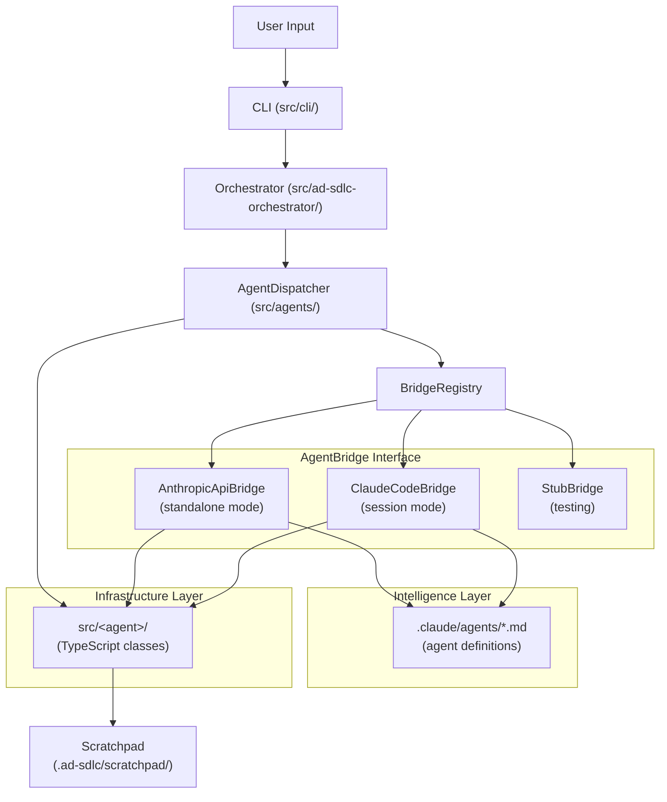
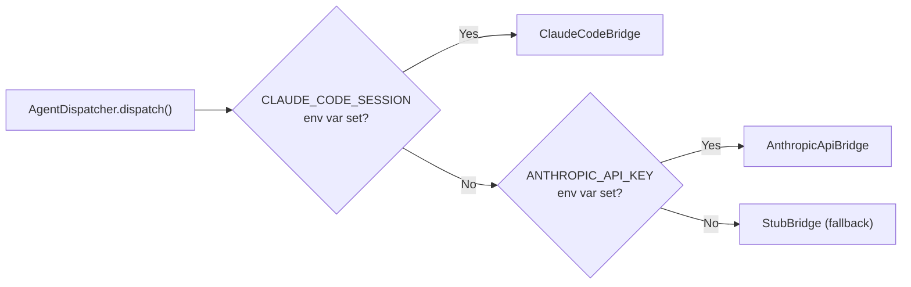
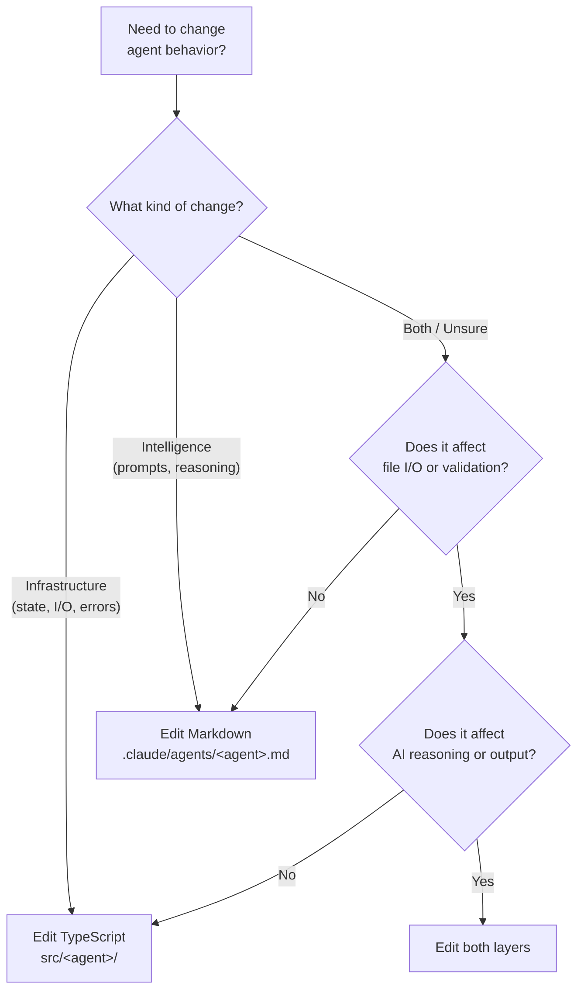

# Dual-Layer Architecture Design

> **Version**: 1.0.0
> **Last Updated**: 2026-02-26
> **Audience**: Developers, Architects, Contributors

---

## Overview

AD-SDLC uses a **dual-layer architecture** where each specialized agent exists in two complementary forms. This separation isolates deterministic infrastructure concerns from non-deterministic AI reasoning, making each layer independently testable and maintainable.

| Layer | Location | Responsibility |
|-------|----------|----------------|
| **Infrastructure** | `src/<agent>/` | State management, file I/O, validation, security, error handling |
| **Intelligence** | `.claude/agents/<agent>.md` | AI reasoning, content generation, decision making, prompt definitions |

### Why Two Layers?

The dual-layer design addresses a fundamental tension in AI-augmented systems:

- **Infrastructure code** must be deterministic, testable, and type-safe. It handles file operations, schema validation, state persistence, and error recovery -- concerns that benefit from TypeScript's type system and conventional unit testing.
- **Intelligence definitions** must be flexible, declarative, and model-aware. They define what an agent *should do* (its role, reasoning strategy, output format) rather than *how* the underlying system executes it.

By separating these concerns, a developer can modify AI behavior (adjusting prompts, changing reasoning strategies) without touching infrastructure code, and vice versa.

### Infrastructure Layer (`src/<agent>/`)

Each agent's TypeScript module provides:

- **IAgent interface implementation** -- `agentId`, `name`, `initialize()`, `dispose()`
- **Domain-specific methods** -- `collectFromText()`, `generateFromProject()`, `analyze()`, etc.
- **Input/output validation** -- Schema enforcement via Zod or custom validators
- **File I/O operations** -- Reading scratchpad state, writing artifacts (YAML, JSON, Markdown)
- **Error handling** -- Typed error hierarchies, retry logic, graceful degradation
- **Singleton/lifecycle management** -- Cached instances for agents with `lifecycle: singleton`

### Intelligence Layer (`.claude/agents/<agent>.md`)

Each agent's Markdown definition provides:

- **YAML frontmatter** -- `name`, `description`, `tools`, `model` configuration
- **Role description** -- What the agent does and its position in the pipeline
- **Input/output contract** -- Expected data formats and schemas
- **Reasoning instructions** -- Step-by-step procedures for the AI to follow
- **Quality criteria** -- Acceptance conditions for generated output
- **Examples** -- Sample inputs and expected outputs for few-shot guidance

---

## Data Flow

The following diagram shows how a user request flows through the system, crossing both layers at the AgentBridge boundary.

### Execution Paths

There are two primary execution paths, selected automatically by the `BridgeRegistry`:

**1. Standalone Mode (AnthropicApiBridge)**

Used when running via `npx ad-sdlc run` outside a Claude Code session:

1. CLI parses user input and creates a `PipelineRequest`
2. Orchestrator determines pipeline mode (Greenfield, Enhancement, Import)
3. AgentDispatcher resolves the agent type via `AgentTypeMapping`
4. BridgeRegistry selects `AnthropicApiBridge` (detects `ANTHROPIC_API_KEY`)
5. Bridge loads the agent's `.md` definition as a system prompt
6. Bridge calls the Anthropic Messages API with the constructed prompt
7. Response is passed back through the infrastructure layer for persistence

**2. Session Mode (ClaudeCodeBridge)**

Used when running inside a Claude Code session:

1. Same steps 1-3 as standalone mode
2. BridgeRegistry selects `ClaudeCodeBridge` (detects `CLAUDE_CODE_SESSION`)
3. Bridge writes agent input to the scratchpad as JSON
4. Claude Code's Task tool spawns a sub-agent using the `.md` definition
5. Sub-agent writes output to the scratchpad
6. Bridge polls for and reads the output file

### Bridge Selection Logic

---

## Responsibility Matrix

This matrix clarifies which layer owns each concern. When deciding where to make a change, consult this table.

| Concern | Infrastructure Layer | Intelligence Layer |
|---------|:-------------------:|:-----------------:|
| State management / persistence | X | |
| File I/O (read/write scratchpad) | X | |
| Input validation / schema enforcement | X | |
| Error handling / retry logic | X | |
| Security (path traversal, secrets) | X | |
| Agent lifecycle (init/dispose) | X | |
| Singleton caching | X | |
| Pipeline stage coordination | X | |
| AI reasoning strategy | | X |
| Content generation prompts | | X |
| Output format instructions | | X |
| Decision-making heuristics | | X |
| Tool selection (Read, Write, Bash, etc.) | | X |
| Few-shot examples | | X |
| Quality/acceptance criteria | | X |
| Model preference (opus/sonnet/haiku) | | X |

---

## Agent Mapping Table

All 25 dual-layer agents with their file locations in both layers:

| # | Agent | Infrastructure (`src/`) | Intelligence (`.claude/agents/`) |
|---|-------|------------------------|----------------------------------|
| 1 | ad-sdlc-orchestrator | `src/ad-sdlc-orchestrator/index.ts` | `.claude/agents/ad-sdlc-orchestrator.md` |
| 2 | analysis-orchestrator | `src/analysis-orchestrator/index.ts` | `.claude/agents/analysis-orchestrator.md` |
| 3 | ci-fixer | `src/ci-fixer/index.ts` | `.claude/agents/ci-fixer.md` |
| 4 | code-reader | `src/code-reader/index.ts` | `.claude/agents/code-reader.md` |
| 5 | codebase-analyzer | `src/codebase-analyzer/index.ts` | `.claude/agents/codebase-analyzer.md` |
| 6 | collector | `src/collector/index.ts` | `.claude/agents/collector.md` |
| 7 | controller | `src/controller/index.ts` | `.claude/agents/controller.md` |
| 8 | doc-code-comparator | `src/doc-code-comparator/index.ts` | `.claude/agents/doc-code-comparator.md` |
| 9 | document-reader | `src/document-reader/index.ts` | `.claude/agents/document-reader.md` |
| 10 | github-repo-setup | `src/github-repo-setup/index.ts` | `.claude/agents/github-repo-setup.md` |
| 11 | impact-analyzer | `src/impact-analyzer/index.ts` | `.claude/agents/impact-analyzer.md` |
| 12 | issue-generator | `src/issue-generator/index.ts` | `.claude/agents/issue-generator.md` |
| 13 | issue-reader | `src/issue-reader/index.ts` | `.claude/agents/issue-reader.md` |
| 14 | mode-detector | `src/mode-detector/index.ts` | `.claude/agents/mode-detector.md` |
| 15 | pr-reviewer | `src/pr-reviewer/index.ts` | `.claude/agents/pr-reviewer.md` |
| 16 | prd-updater | `src/prd-updater/index.ts` | `.claude/agents/prd-updater.md` |
| 17 | prd-writer | `src/prd-writer/index.ts` | `.claude/agents/prd-writer.md` |
| 18 | project-initializer | `src/project-initializer/index.ts` | `.claude/agents/project-initializer.md` |
| 19 | regression-tester | `src/regression-tester/index.ts` | `.claude/agents/regression-tester.md` |
| 20 | repo-detector | `src/repo-detector/index.ts` | `.claude/agents/repo-detector.md` |
| 21 | sds-updater | `src/sds-updater/index.ts` | `.claude/agents/sds-updater.md` |
| 22 | sds-writer | `src/sds-writer/index.ts` | `.claude/agents/sds-writer.md` |
| 23 | srs-updater | `src/srs-updater/index.ts` | `.claude/agents/srs-updater.md` |
| 24 | srs-writer | `src/srs-writer/index.ts` | `.claude/agents/srs-writer.md` |
| 25 | worker | `src/worker/index.ts` | `.claude/agents/worker.md` |

### Infrastructure-Only Modules

These `src/` modules provide shared infrastructure without corresponding `.md` definitions:

| Category | Modules |
|----------|---------|
| **Core dispatch** | `agents/` (Dispatcher, BridgeRegistry), `cli/`, `config/` |
| **Pipeline control** | `control-plane/`, `data-plane/`, `state-manager/`, `status/`, `completion/` |
| **Data and validation** | `schemas/`, `scratchpad/`, `agent-validator/` |
| **Cross-cutting** | `security/`, `logging/`, `monitoring/`, `telemetry/` |
| **Error handling** | `errors/`, `error-handler/` |
| **Utilities** | `utilities/`, `utils/` |
| **Generators** | `architecture-generator/`, `component-generator/` |

---

## When to Modify Which File

Use this decision guide when making changes to agent behavior:

### Common Scenarios

| Scenario | Layer to Modify | Example |
|----------|----------------|---------|
| Change how an agent reasons about input | Intelligence | Edit `.claude/agents/collector.md` to refine extraction instructions |
| Change output file format or location | Infrastructure | Edit `src/collector/CollectorAgent.ts` to change YAML output path |
| Add a new validation rule | Infrastructure | Add Zod schema check in `src/collector/InputParser.ts` |
| Change which tools an agent can use | Intelligence | Update `tools:` list in the `.md` frontmatter |
| Fix a file write bug | Infrastructure | Fix the write logic in `src/<agent>/` TypeScript code |
| Improve content quality | Intelligence | Refine instructions and examples in the `.md` definition |
| Add error recovery logic | Infrastructure | Add try/catch and retry in the TypeScript module |
| Change model preference | Intelligence | Update `model:` in the `.md` frontmatter |
| Add a new agent | Both | Create `src/<agent>/index.ts` AND `.claude/agents/<agent>.md` |
| Change pipeline stage order | Infrastructure | Update stage definitions in `src/ad-sdlc-orchestrator/types.ts` |
