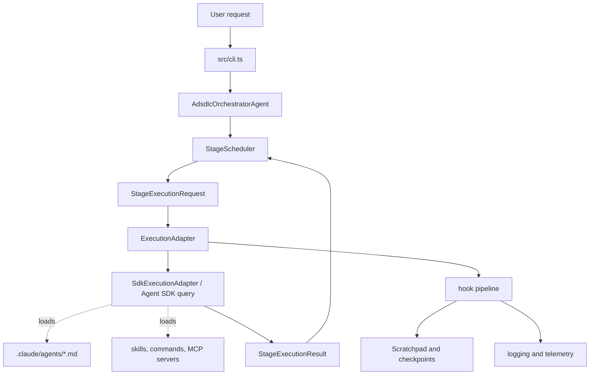

# Execution and Agent Definition Layers

> **Version**: 2.0.0
> **Last Updated**: 2026-08-01
> **Status**: Current
> **Audience**: Developers, architects, contributors

## Overview

AD-SDLC separates deterministic pipeline control from Agent SDK execution and
declarative agent knowledge. A prompt definition is not a second implementation
of a TypeScript class, and not every prompt has a one-to-one `src/<agent>/`
module. The current architecture has three cooperating tiers:

| Tier             | Responsibility                                                             | Authoritative location      |
| ---------------- | -------------------------------------------------------------------------- | --------------------------- |
| Pipeline control | Mode selection, stage DAGs, approval gates, checkpoints, scheduling        | `src/ad-sdlc-orchestrator/` |
| Agent execution  | One SDK execution seam, hooks, timeout/abort plumbing, session resume      | `src/execution/`            |
| Knowledge        | Agent prompts, skills, commands, and MCP configuration consumed by the SDK | `.claude/`, `.mcp.json`     |

The current counts for definition prompts, unique pipeline agent types, and
mode-specific stage slots are deliberately tracked as separate axes in the
[runtime inventory](runtime-inventory.md). CI derives those values from source;
documentation must not collapse them into a single “agent count.”

## Runtime data flow

```mermaid
flowchart TD
    User[User request] --> CLI[src/cli.ts]
    CLI --> Orchestrator[AdsdlcOrchestratorAgent]
    Orchestrator --> Scheduler[StageScheduler]
    Scheduler --> Request[StageExecutionRequest]
    Request --> Adapter[ExecutionAdapter]
    Adapter --> SDK[SdkExecutionAdapter / Agent SDK query]
    SDK -. loads .-> Definition[.claude/agents/*.md]
    SDK -. loads .-> Knowledge[skills, commands, MCP servers]
    Adapter --> Hooks[hook pipeline]
    Hooks --> Scratchpad[Scratchpad and checkpoints]
    Hooks --> Telemetry[logging and telemetry]
    SDK --> Result[StageExecutionResult]
    Result --> Scheduler
```

`AdsdlcOrchestratorAgent` chooses one of the three stage-definition arrays in
`src/ad-sdlc-orchestrator/types.ts`. For each runnable stage,
`StageScheduler` asks the orchestrator host to build a `StageExecutionRequest`.
The request is passed to an `ExecutionAdapter`; production uses
`SdkExecutionAdapter`, while tests can inject `MockExecutionAdapter` or a
purpose-built adapter without changing scheduling code.

The SDK consumes the named Markdown agent definition and any stage-level
`skills`, `mcpServers`, `maxTurns`, or `permissionMode` hints. Results return
through the same adapter boundary and are persisted in pipeline state and the
scratchpad.

## Responsibility matrix

| Concern                              | Pipeline control | Execution layer | Knowledge layer |
| ------------------------------------ | :--------------: | :-------------: | :-------------: |
| Stage order and dependencies         |        ✓         |                 |                 |
| Approval and resume semantics        |        ✓         |                 |                 |
| Stage timeout policy                 |        ✓         |        ✓        |                 |
| SDK invocation and session id        |                  |        ✓        |                 |
| Abort signal propagation             |                  |        ✓        |                 |
| Execution hooks and telemetry bridge |                  |        ✓        |                 |
| Role and reasoning instructions      |                  |                 |        ✓        |
| Tool and MCP guidance                |                  |                 |        ✓        |
| Output-format guidance               |                  |                 |        ✓        |
| Domain artifact persistence          |        ✓         |        ✓        |                 |

TypeScript agent modules still provide deterministic domain behavior such as
parsing, validation, state transitions, and artifact generation. They are
normal modules with constructors and, where useful, module-local `get*` and
`reset*` helpers. Their lifecycle is not managed by a global factory.

## Agent definitions and pipeline stages

The three inventories answer different questions:

- An **agent definition prompt** is a checked-in `.claude/agents/*.md` file.
- A **pipeline agent type** is a unique `agentType` referenced by a
  `PipelineStageDefinition`.
- A **stage slot** is one entry in a mode-specific stage array. A shared stage
  such as `implementation` occupies a slot in more than one mode.
- A **support/delegated definition** can be invoked outside the three direct
  arrays, such as CI repair or local-mode aliases.

Do not hand-maintain these numbers here. See
[`runtime-inventory.md`](runtime-inventory.md), whose generated block is checked
by `npm run docs:check-inventory`.

### Local mode

Local mode preserves the pipeline topology while replacing GitHub-dependent
knowledge definitions:

- `issue-reader` uses `local-issue-reader`.
- `pr-reviewer` uses `local-reviewer`.

Both aliases have checked-in agent definitions. The implementation stays behind
the same `ExecutionAdapter` request/result contract.

## Verification and validation boundary

The `validation-agent` is a real pipeline stage in all three modes. The
TypeScript `StageVerifierAgent` is also wired into the scheduler after every
completed stage. Its result is retained on `PipelineResult.verificationResults`;
with `vnv.rigor: strict` and `vnv.haltOnVerificationFailure: true`, a failed
verification marks the stage failed, cancels further scheduling, and makes the
pipeline fail. In standard and minimal modes, failed checks remain advisory.

`RtmBuilderAgent` remains an auxiliary traceability builder rather than a
blocking scheduler component. The document-producing SDP/SVP/threat-model/
technology-decision slots execute through their checked-in SDK agent
definitions, like every other live pipeline stage.

## Extension guide

When adding a direct pipeline stage:

1. Add or reuse a `StageName` and `PipelineStageDefinition` in
   `src/ad-sdlc-orchestrator/types.ts`.
2. Add a matching `.claude/agents/<agent-type>.md` definition with valid
   frontmatter.
3. Implement deterministic domain code only where the stage needs it; a new
   prompt does not require an empty TypeScript facade.
4. Route SDK work through `ExecutionAdapter`; do not add another execution
   bridge.
5. Update tests and run `npm run docs:check` so the runtime inventory and live
   symbol references remain aligned.

## Historical architecture

<!-- historical: AgentBridge, AgentDispatcher, AgentRegistry, BridgeRegistry, AnthropicApiBridge, ClaudeCodeBridge -->

Before v0.1, the repository selected among `AgentBridge` implementations via
dispatcher and registry infrastructure. That stack was removed by #798 after
all stage execution moved to `ExecutionAdapter`. Historical rationale remains
in the [v0.1 hybrid pipeline RFC](v0.1-hybrid-pipeline-rfc.md) and migration
details remain in the [v0.1 migration guide](v0.1-migration-guide.md); neither
document defines the current live API.

## References

- [Runtime inventory](runtime-inventory.md)
- [v0.1 hybrid pipeline RFC](v0.1-hybrid-pipeline-rfc.md)
- [v0.1 migration guide](v0.1-migration-guide.md)
- [ADR-0006: Keep-or-Kill Disposition](../adr/ADR-0006-keep-or-kill-orphaned-public-subsystems.md)
- `src/ad-sdlc-orchestrator/types.ts`
- `src/ad-sdlc-orchestrator/StageScheduler.ts`
- `src/execution/ExecutionAdapter.ts`
- `src/execution/SdkExecutionAdapter.ts`
