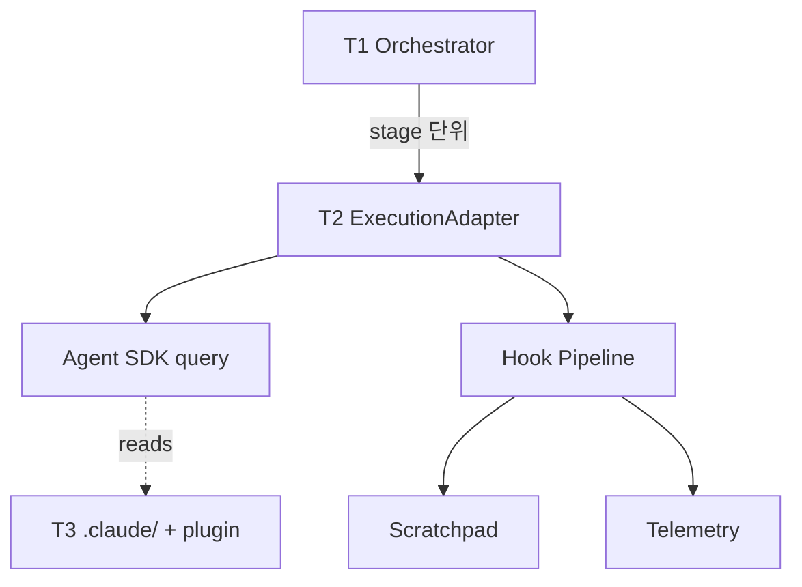

# AD-SDLC v0.1 Hybrid Pipeline Architecture (RFC)

> **Status**: Draft — open for review
> **Target release**: v0.1.0
> **Decision deadline**: TBD

## 1. 배경 (Why)

AD-SDLC v0.0.1은 README에서 "built with Claude Agent SDK"를 표방하지만 실제 의존성은 raw Client SDK(`@anthropic-ai/sdk@^0.92.0`) 단 하나이며, 도구 루프·세션·서브에이전트 위임을 자체 구현했습니다 (`src/agents/AgentBridge.ts` 외 ~2,000 LoC). 한편 같은 호스트의 `claude-config` v2.3.0은 정식 Claude Code plugin으로 8개 agents + 7개 skills + global hooks를 제공하지만, AD-SDLC와 코드 경로상 결합 지점이 없습니다.

세 가지 결과를 가져옵니다.

1. **진실성 갭** — README의 SDK 명칭이 의존성과 불일치
2. **자산 미활용** — claude-config의 plugin 자산을 coding standards 적용에 못 씀
3. **사양 위반 잠복** — `doc-code-comparator.md` frontmatter 누락 등 spec 위반이 빌드를 통과

## 2. 목표 (Goals) / 비목표 (Non-goals)

**Goals**

- G1. Claude Agent SDK(`@anthropic-ai/claude-agent-sdk`)를 단일 진입점으로 도입
- G2. 35단계 SDLC 파이프라인·V&V 게이트·트레이서빌리티 등 **도메인 자산은 보존**
- G3. claude-config plugin과 skill·MCP·hook 차원에서 **표준 메커니즘으로 결합**
- G4. `.claude/agents/*.md` 100% 사양 준수
- G5. 단일 SDK 진입점으로 테스트·관측·정책 일원화

**Non-goals**

- 단일 패키지 분리(monorepo 전환)
- 35 stage 시맨틱 변경
- writers/analyzers 도메인 로직 재작성
- 문서 스키마 변경

## 3. 3-Tier 아키텍처

| Tier | 책임 | 구현 |
|---|---|---|
| **T1 Pipeline Control Plane** | stage DAG, 체크포인트, V&V 게이트, 도메인 writers | 기존 `ad-sdlc-orchestrator/`, `*-writer/`, `vnv/` 등 (유지) |
| **T2 Agent Execution Layer** | 단일 SDK 진입점, hooks, telemetry bridge | `src/execution/` (신규) |
| **T3 Knowledge Layer** | 에이전트 정의, skill, command, MCP | `.claude/`, `.mcp.json`, claude-config plugin |



## 4. 핵심 인터페이스

### 4.1 ExecutionAdapter

```typescript
export interface StageExecutionRequest {
  readonly agentType: string;
  readonly workOrder: string;
  readonly priorOutputs: Record<string, string>;
  readonly skills?: readonly string[];
  readonly mcpServers?: Record<string, McpServerConfig>;
  readonly maxTurns?: number;
  readonly resume?: string;
  readonly signal?: AbortSignal;
}

export interface StageExecutionResult {
  readonly status: 'success' | 'failed' | 'aborted';
  readonly artifacts: readonly ArtifactRef[];
  readonly sessionId: string;
  readonly toolCallCount: number;
  readonly tokenUsage: { input: number; output: number; cache: number };
  readonly error?: SerializedError;
}

export interface ExecutionAdapter {
  execute(req: StageExecutionRequest): Promise<StageExecutionResult>;
  dispose(): Promise<void>;
}
```

### 4.2 PipelineStageDefinition 확장

```typescript
export interface PipelineStageDefinition {
  // 기존 필드 유지
  readonly name: StageName;
  readonly agentType: string;
  readonly mode: PipelineMode | 'all';
  readonly dependencies: readonly StageName[];
  readonly canParallelize?: boolean;
  readonly approvalGate?: 'auto' | 'manual';

  // 신규
  readonly skills?: readonly string[];
  readonly mcpServers?: Record<string, McpServerConfig>;
  readonly maxTurns?: number;
  readonly permissionMode?: 'default' | 'acceptEdits' | 'plan';
  readonly timeoutMs?: number;
}
```

## 5. 변경 영향 매트릭스

| 영역 | 변경 유형 | 추정 LoC 변화 |
|---|---|---|
| `src/agents/AgentBridge.ts` 외 3종 Bridge | 삭제 | -600 |
| `src/agents/AgentDispatcher.ts` | 삭제 | -400 |
| `src/agents/AgentRegistry.ts` + bootstrap + TypeMapping | 삭제 | -700 |
| `src/agents/ExecutionScaffoldGenerator.ts` | 삭제 | -200 |
| `src/execution/` (신규) | 추가 | +300 |
| `src/ad-sdlc-orchestrator/AdsdlcOrchestratorAgent.ts` | 슬림화 | -500 |
| `src/ad-sdlc-orchestrator/PipelineCheckpointManager.ts` | 확장 | +50 |
| `.claude/agents/*.md` | 표준화 | (frontmatter만) |
| `.claude/skills/`, `.claude/commands/`, `.mcp.json` | 신규 | (config만) |
| **순 변화** | | **약 -2,050 LoC** |

## 6. 마이그레이션 Phase

| Phase | 범위 | 게이트 |
|---|---|---|
| **P0 Docs** | RFC, 마이그레이션 가이드 게시 | 리뷰어 LGTM ≥ 1 |
| **P1 Foundation** | 의존성 추가, ExecutionAdapter 인터페이스, frontmatter 수정 | 기존 테스트 100% + Adapter 단위 테스트 |
| **P2 Pilot** | `worker` stage 1개만 신규 경로, feature flag로 토글 | 통합 테스트에서 산출물 동등 |
| **P3 Cutover** | 34 stage 전체 cutover, 자체 Bridge 코드 삭제 | E2E 시나리오 3종 통과, 코드 -2,000 LoC |
| **P4 Knowledge** | claude-config plugin 흡수, skills/commands/MCP 추가 | plugin enable 시 코딩 스타일 변화 측정 |

## 7. 위험 등록부 (Top 5)

| # | 위험 | 완화 |
|---|---|---|
| R1 | Agent SDK minor version 변동 | 정확 핀, peerDep 분리, 호환성 매트릭스 워크플로 |
| R2 | E2E 테스트가 SDK 실호출에 결합 | `MockExecutionAdapter` 단위·통합 격리, E2E만 실호출 |
| R3 | Hook silent failure | hook 실패 시 stage abort + structured error |
| R4 | 체크포인트 schema 호환성 | `schema_version` 필드 + 마이그레이션 매퍼 |
| R5 | claude-config plugin 미설치 환경 | `skills` 필드 옵셔널, 부재 시 경고 후 진행 |

## 8. 측정 지표

| 지표 | 베이스라인 | 목표 |
|---|---|---|
| 자체 에이전트 인프라 LoC | ~2,000 | ≤ 200 |
| `.claude/agents` frontmatter 준수율 | 33/34 (97%) | 35/35 (100%) |
| claude-config skill 활용 | 0 | ≥ 3 |
| MCP server 활용 | 0 | ≥ 1 |
| 단위 테스트 시간 | 베이스라인 측정 | 동등 또는 단축 |

## 9. 대안 검토

| 대안 | 채택 안 한 이유 |
|---|---|
| **A. 전면 재작성**: AD-SDLC를 Agent SDK + 얇은 오케스트레이터로 처음부터 | 도메인 자산(writers·V&V·트레이서빌리티) ~110k LoC가 본질 가치 — 재작성 불필요 |
| **B. 현상 유지**: README만 정정 | 진실성은 해결하나 자산 미활용·사양 위반 잠복은 그대로 |
| **C. AD-SDLC 자체를 plugin으로 패키징** | Phase 4 이후 검토 가치 있으나 plugin 시스템이 다단계 파이프라인을 지원하지 않음 — 본 RFC와 양립 가능 |

## 10. 의존 관계와 후속

- 본 RFC 승인 → `gh issue create` 일괄 생성 → develop 브랜치에서 phase별 PR
- 후속 RFC 후보: ARCH-RFC-002 (V&V 결과의 RTM 자동 첨부), ARCH-RFC-003 (Managed Agents 호환성)

---

*작성: 2026-05-07 KST · 검토자: TBD · 승인: TBD*
