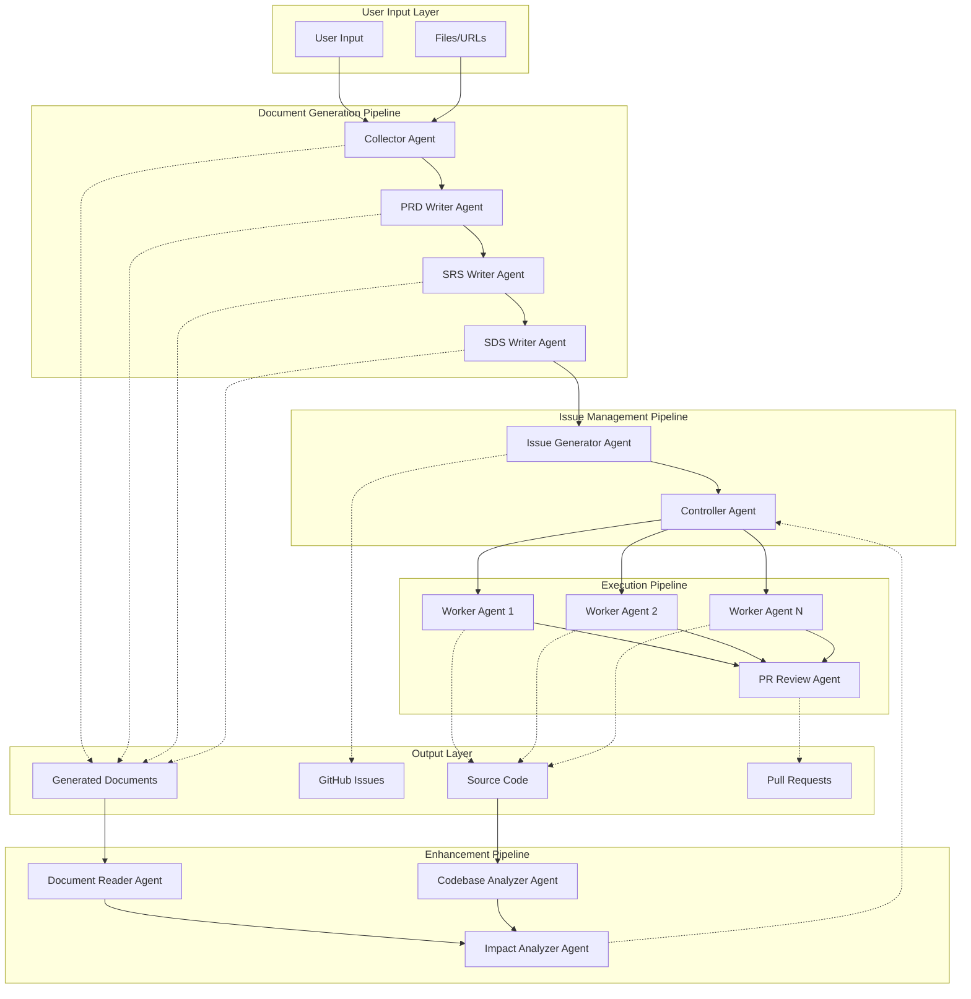
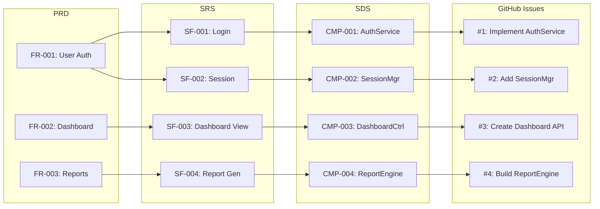
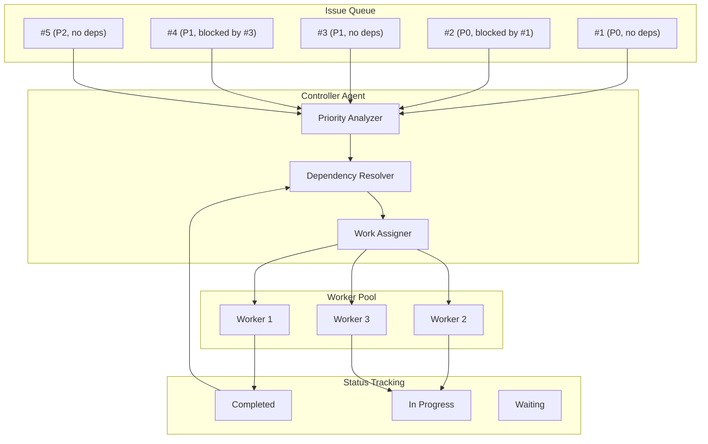
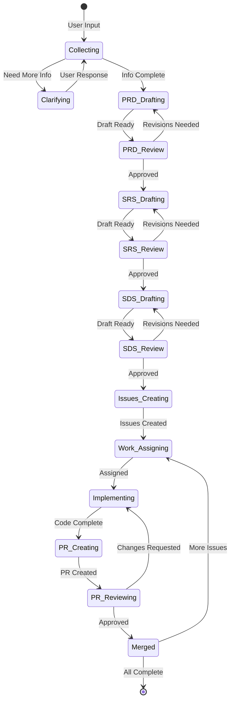
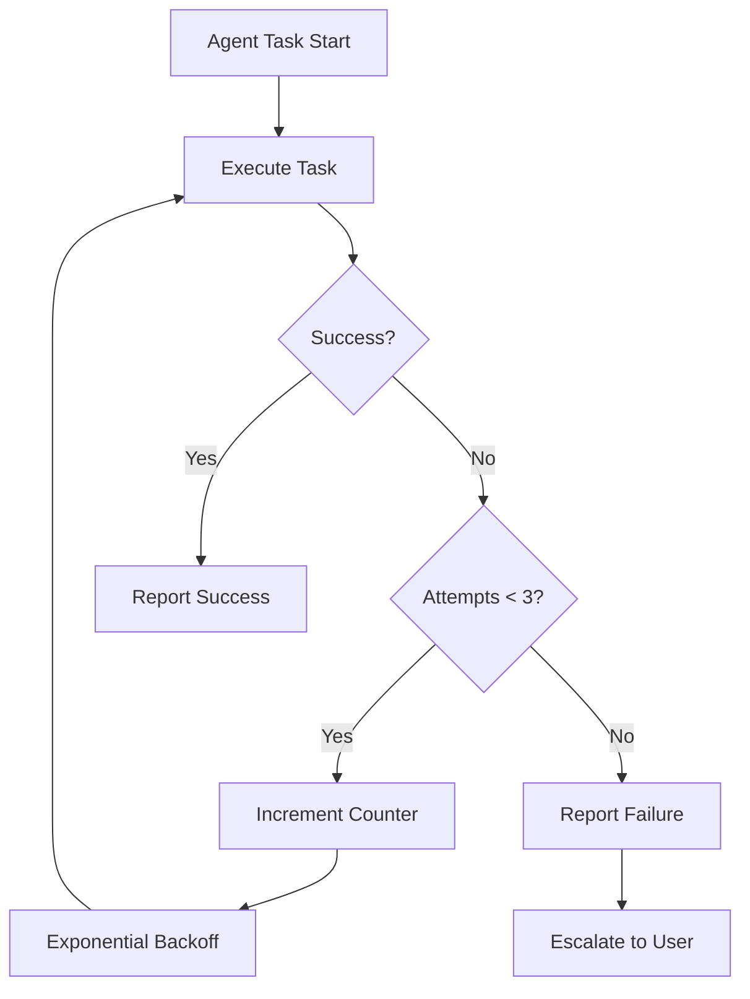
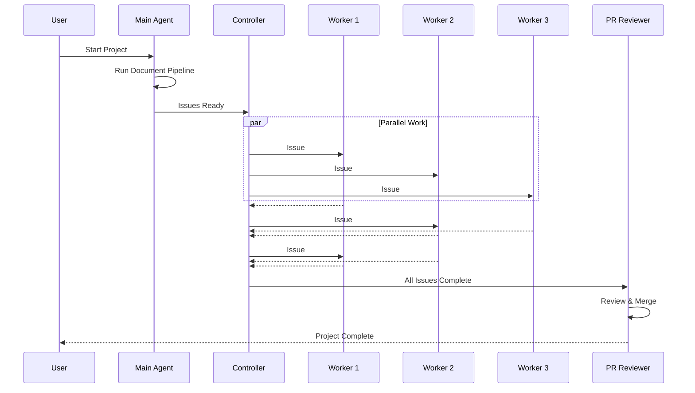

# AD-SDLC System Architecture

## 1. High-Level Agent Flow



## 2. Agent Communication Pattern

```mermaid
flowchart TB
    subgraph Orchestrator["Main Orchestrator"]
        MAIN[Main Claude Agent]
    end

    subgraph Subagents["Specialized Subagents"]
        A1[Collector]
        A2[PRD Writer]
        A3[SRS Writer]
        A4[SDS Writer]
        A5[Issue Generator]
        A6[Controller]
        A7[Worker]
        A8[PR Reviewer]
        A9[Document Reader]
        A10[Codebase Analyzer]
        A11[Impact Analyzer]
    end

    subgraph Scratchpad["File-based State (Scratchpad)"]
        S1[info/*.yaml]
        S2[docs/prd/*.md]
        S3[docs/srs/*.md]
        S4[docs/sds/*.md]
        S5[issues/*.json]
        S6[progress/*.yaml]
        S7[state/current_state.yaml]
        S8[analysis/architecture_overview.yaml]
        S9[analysis/dependency_graph.json]
        S10[impact/impact_report.yaml]
    end

    MAIN -->|spawn| A1
    MAIN -->|spawn| A2
    MAIN -->|spawn| A3
    MAIN -->|spawn| A4
    MAIN -->|spawn| A5
    MAIN -->|spawn| A6
    MAIN -->|spawn| A7
    MAIN -->|spawn| A8
    MAIN -->|spawn| A9
    MAIN -->|spawn| A10
    MAIN -->|spawn| A11

    A1 -->|write| S1
    A2 -->|read| S1
    A2 -->|write| S2
    A3 -->|read| S2
    A3 -->|write| S3
    A4 -->|read| S3
    A4 -->|write| S4
    A5 -->|read| S4
    A5 -->|write| S5
    A6 -->|read| S5
    A6 -->|write| S6
    A7 -->|read| S5
    A7 -->|read| S6
    A8 -->|read| S6

    %% Enhancement Pipeline file access
    A9 -->|read| S2
    A9 -->|read| S3
    A9 -->|read| S4
    A9 -->|write| S7
    A10 -->|write| S8
    A10 -->|write| S9
    A11 -->|read| S7
    A11 -->|read| S8
    A11 -->|read| S9
    A11 -->|write| S10

    A1 -.->|result| MAIN
    A2 -.->|result| MAIN
    A3 -.->|result| MAIN
    A4 -.->|result| MAIN
    A5 -.->|result| MAIN
    A6 -.->|result| MAIN
    A7 -.->|result| MAIN
    A8 -.->|result| MAIN
    A9 -.->|result| MAIN
    A10 -.->|result| MAIN
    A11 -.->|result| MAIN
```



## 3. Document Traceability Flow



## 4. Controller Agent Work Distribution



## 5. State Machine



## 6. Error Handling & Retry Flow



## 7. Parallel Execution Model



## 8. Directory Structure

```
claude_code_agent/
├── .claude/
│   └── agents/                    # Agent Definitions
│       ├── collector.md           # Information Collector Agent
│       ├── prd-writer.md          # PRD Writer Agent
│       ├── srs-writer.md          # SRS Writer Agent
│       ├── sds-writer.md          # SDS Writer Agent
│       ├── issue-generator.md     # Issue Generator Agent
│       ├── controller.md          # Controller Agent
│       ├── worker.md              # Worker Agent
│       ├── pr-reviewer.md         # PR Reviewer Agent
│       ├── document-reader.md     # Document Reader Agent
│       ├── codebase-analyzer.md   # Codebase Analyzer Agent
│       └── impact-analyzer.md     # Impact Analyzer Agent
│
├── .ad-sdlc/
│   ├── scratchpad/               # Inter-agent State
│   │   ├── info/                 # Collected information
│   │   ├── documents/            # Generated documents
│   │   ├── issues/               # Issue tracking
│   │   └── progress/             # Progress tracking
│   │
│   ├── templates/                # Document Templates
│   │   ├── prd-template.md
│   │   ├── srs-template.md
│   │   ├── sds-template.md
│   │   └── issue-template.md
│   │
│   └── config/                   # Configuration
│       ├── agents.yaml
│       └── workflow.yaml
│
├── docs/
│   ├── prd/                      # PRD Documents
│   ├── srs/                      # SRS Documents
│   ├── sds/                      # SDS Documents
│   └── architecture/             # Architecture Docs
│
└── src/                          # Generated Source Code
```
