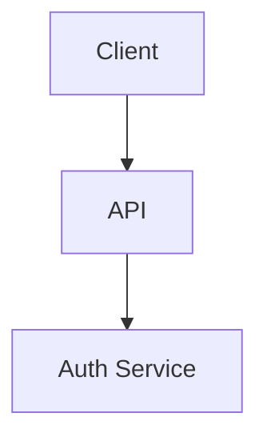

# 1. Introduction

SDS introduction.

# 2. Architecture

Layered architecture with service layer and repository layer.

# 3. Components

## CMP-001: AuthService

Realizes SF-001 by validating credentials against the user store.

## CMP-002: PasswordResetService

Realizes SF-002 by emailing a reset token.
